# QA Nexus ERD v2.6 — Project Level

**Version:** 2.6 (PM1 stack lock + free-OSS PM1 split, 2026-04-25)
**Prior versions:** v2.2 (Audit Wave 1) → v2.5 (Architecture diagrams added) → v2.6 (this version)
**Date:** 2026-04-25
**Author:** Iksula Services Pvt Ltd
**Status:** Architecture Review — PM1 stack locked; PM2-PM4 architecture remains as planned
**Scope:** Full 18-month program (PM1 → PM2 → PM3 → PM4)
**Canonical Roadmap:** PROJECT_ROADMAP.md v1.2 (locked source of truth)

**v2.6 changelog (2026-04-25):**
- **PM1 architecture has been split off** to `../PM1/PM1_ERD/PM1_ERD.md` v2.0 (binding for M0-M6 build)
- PM1 simplified to fit free-tier hosting: Groq API (no self-hosted LLM), single NestJS dyno (no FastAPI), no Redis (sessions in Postgres), vanilla pgvector (no pgvectorscale)
- This project-level ERD continues to describe the **eventual PM1-PM4 architecture** (with self-hosted LLM, FastAPI, Valkey, Graphiti, multi-region etc.)
- Added §3.0 mapping table to clarify PM1 (free-tier) vs PM2-PM4 (this document) divergence
- All §3 architecture diagrams are correct for PM2-PM4 planning; engineers building PM1 should read PM1_ERD.md as their binding spec

**v2.5 (2026-04-25):** Added §3 *Solution Architecture & System Design Diagrams* with: C4 L2 Container Diagram, C4 L3 Component Diagram (Inference Service), Deployment Topology, 4 Sequence Diagrams, 3 State Machines, Agent Orchestration topology, PII Data Flow.

---

## Executive Summary & Architecture at a Glance

QA Nexus is an AI-native QA operating system evolving across 4 project-level milestones over ~18 months. This ERD documents the complete data model, services, APIs, agents, infrastructure, and deployment strategy spanning **PM1 (MVP Test Management) → PM2 (Self-Healing + Full Automation) → PM3 (Low-Code + Governance + Enterprise) → PM4 (Career Intelligence + Multi-Tenant SaaS)**.

**Core value by phase:**
- **PM1 [MVP]**: 90% faster authoring (A1), 95% faster triage (A4), test management beachhead
- **PM2 [v1.5 Self-Healing]**: Autonomous maintenance (A7), synthetic data (A6), visual regression, on-prem, mobile
- **PM3 [v2 Governance]**: Low-code authoring (A3), test selection (A5), enterprise auth (SSO/SAML), governance foundation
- **PM4 [v2+ Enterprise]**: Career Compass (L7), multi-tenant SaaS, HIPAA/GxP compliance, global data residency

**Technical rollout:**
- **Layers**: L1 (Unified Platform) → L2 (Knowledge Layer w/ GraphRAG) → L3 (Document Intelligence, 70 templates) → L4 (Agentic AI, 10 entities) → L5 (Analytics & Value) → L6 (Compliance & Governance) → L7 (Career Intelligence)
- **AI Agents**: A1 (cases), A2 (dedup), A4 (RCA) in PM1; +A6/A7/A8adv/APT in PM2; +A3/A5/A8full/VCG in PM3; ongoing in PM4
- **Data Stores**: Postgres (relational) + Neo4j (knowledge graph) + pgvector (embeddings) + Redis (cache) + Cloudflare R2 (objects)
- **Deployment**: Single-tenant SaaS (PM1) → On-prem + Mobile (PM2) → Multi-tenant SaaS (PM4)

---

## Project Milestone Overview (PM1–PM4)

| Milestone | Duration | GA Date | Headline | AI Agents | Doc Templates | Services | Tables |
|-----------|----------|---------|----------|-----------|----------------|----------|--------|
| **PM1 [MVP]** | 18w | 2026-09-21 | Test Management Beachhead (A1, A2, A4; 12 templates; 5 integrations) | 3 (A1, A2, A4) | 12 | 20 | 18 |
| **PM2 [v1.5]** | 16w | 2027-01-09 | Self-Healing + Test Data + Full Automation + Mobile (A6, A7, A8adv, APT) | +4 (7 total) | +20 = 32 | +6 = 26 | +6 = 24 |
| **PM3 [v2]** | 12w | 2027-04-03 | Low-Code + Governance + Enterprise (A3, A5, A8full, VCG) | +4 (11 total) | +18 = 50 | +6 = 32 | +6 = 30 |
| **PM4 [v2+]** | Ongoing | 2027-04-06+ | Career Intelligence + Multi-Tenant SaaS | Ongoing | +20 = 70 | +4 = 36 | +6 = 36 |

---

## Solution Architecture & System Design Diagrams (v2.6, 2026-04-25)

> ⚠️ **Important — read this first:** The diagrams below show the **full-program architecture for PM1 → PM4** (the eventual self-hosted state with Ollama, FastAPI, Redis, Neo4j Graphiti). They are correct for PM2/PM3/PM4 planning.
>
> **For PM1 specifically, the binding architecture has been simplified to fit free-tier hosting** (Groq API instead of self-hosted Ollama, single NestJS dyno instead of NestJS+FastAPI, no Redis tier, vanilla pgvector instead of pgvectorscale). **The locked PM1 v2.0 diagrams live in `../PM1/PM1_ERD/PM1_ERD.md` §3.** Engineers building M0–M6 should read PM1_ERD as their binding spec.
>
> The diagrams here show what we'll grow back into for PM2 (when self-healing/test-data agents return Python work to the stack) and PM3 (when SaaS scale demands a dedicated vector tier and Graphiti memory).

### 3.0 PM1 ↔ Project-level architecture relationship

| Layer | PM1 (current) | PM2 / PM3 / PM4 (these diagrams) |
|---|---|---|
| LLM | Groq free API | Self-hosted Gemma 4 / Llama 4 on rented GPU |
| Inference language | TypeScript in NestJS | Python FastAPI service added |
| Embeddings | `@xenova/transformers` in-process (TS) | Self-hosted TEI (HuggingFace, Python) |
| Cache / queue | None (Postgres sessions, in-memory LRU) | Valkey 9 + BullMQ |
| Vector store | Postgres + pgvector | + pgvectorscale or migrate to Qdrant |
| Memory tiers | 3 (Episodic / Semantic / Evidence) | 4 (+ Working in Redis) → 5 (+ Graphiti in PM3) |
| Hosting | Cloudflare Pages + Render free + Neon free | Render Pro / Hetzner / AWS multi-region |
| Cost | $0/month | $30–500/month → $1,500+ at PM3 SaaS scale |

The diagrams below are the v1.0 design. For PM1 build, defer to PM1_ERD v2.0.

---

### Original §3 (PM1-PM4 architecture vision)

> Added 2026-04-25. The earlier ERD had C4 Level 1 (System Context) and a Component Architecture graph but lacked: deeper C4 drilldowns (L2 Container / L3 Component), sequence diagrams for key async flows, deployment topology, state machines for core entities, agent orchestration topology, and a PII data-flow diagram. This section closes those gaps for the full PM1-PM4 program.

### 3.1 C4 Level 1 — System Context (see §4 below for the canonical diagram)

C4 L1 lives in §4 ("System Context Diagram") immediately after this section. Refer to it for the people/system boundary view.

### 3.2 C4 Level 2 — Container Diagram (PM1)

Shows the deployable units inside QA Nexus, their tech stack, and the protocols connecting them. Each box is one runtime container (or managed service).

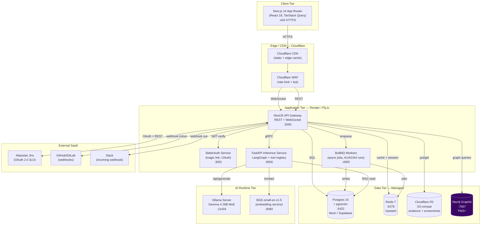

**Reading this:** PM1 ships the green-bordered containers. Neo4j Graphiti (violet) is PM3+. Every protocol arrow is labeled with the wire format so engineers can validate firewall rules and timeouts.

### 3.3 C4 Level 3 — Component Diagram (Inference Service)

The Inference Service is the most complex container — drilling into its internals.

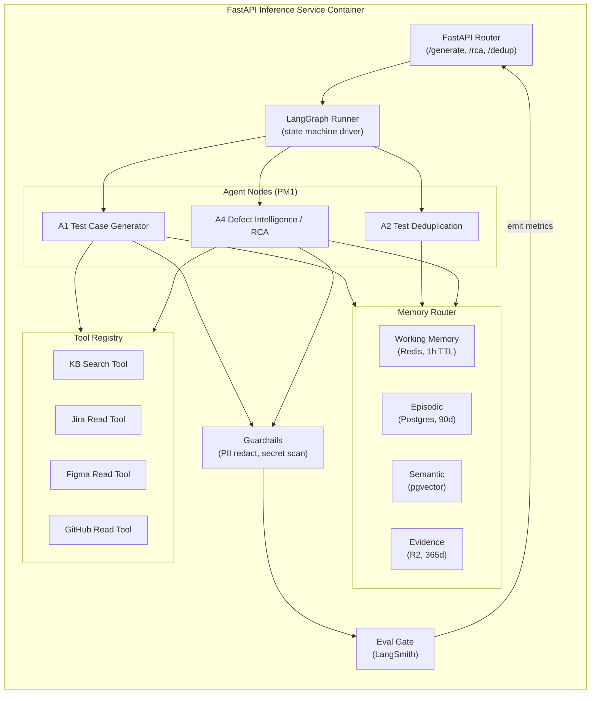

**Reading this:** Every agent invocation flows: Router → LangGraph → Agent node → (Memory + Tools) → Guardrails → Eval Gate → response. The Eval Gate is the kill-switch for PM1 GA: if any agent fails its golden eval, it cannot ship.

### 3.4 Deployment Topology (PM1)

Where things actually run, including HA/DR posture.

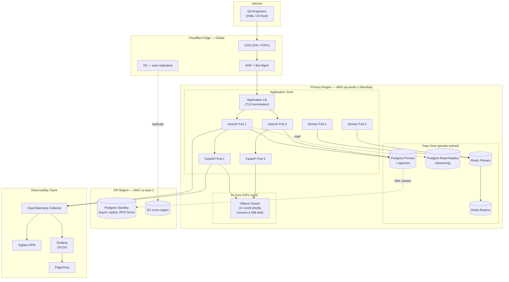

**Reading this:** Primary region is Mumbai (target customer base). DR target is us-east-1 with RPO 5 min via Postgres async replica + R2 cross-region replication. RTO target: 30 min (manual failover for PM1; auto-failover deferred to PM3). Observability stack ships traces from every pod via OTel.

### 3.5 Sequence Diagram — A1 Test Case Generation

How a "Generate tests" click in F14 turns into draft test cases in F17.

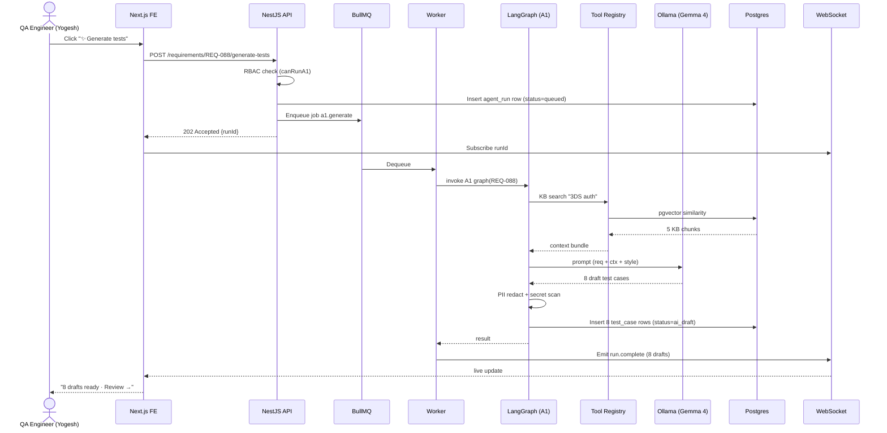

**Reading this:** Total time budget for A1: 30s p95. Failure modes: LLM timeout (retry once), PII flag (block + alert), eval gate fail (drop run + log). User never blocks — call returns 202 immediately.

### 3.6 Sequence Diagram — A4 5-Layer RCA on Defect

The flagship A4 flow, triggered when a defect is opened from a failed run.

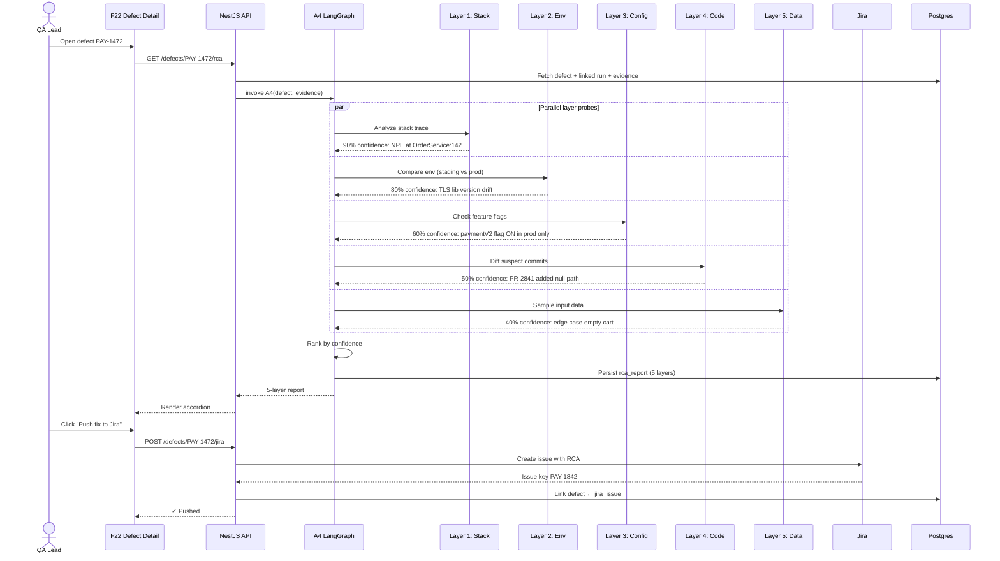

**Reading this:** All 5 layers run in parallel for latency. Confidence percentages are the canonical 90/80/60/50/40 progression locked in the agent spec. RCA persists for replay (for the eval gate) and audit.

### 3.7 Sequence Diagram — Jira 2-Way Sync

Outbound (defect → Jira issue) and inbound (Jira webhook → defect status).

```mermaid
sequenceDiagram
    participant User as QA Lead
    participant FE as F22
    participant API as NestJS
    participant Encrypt as Vault transit
    participant Jira as Jira API
    participant Webhook as Jira webhook
    participant DB as Postgres

    rect rgb(20, 40, 60)
    Note over User,DB: Outbound: Defect → Jira
    User->>FE: "Push to Jira"
    FE->>API: POST /defects/{id}/jira
    API->>DB: Read jira_connection (active)
    API->>Encrypt: Decrypt access_token
    Encrypt-->>API: token
    API->>Jira: POST /rest/api/3/issue
    Jira-->>API: 201 {key: PAY-1842}
    API->>DB: Insert jira_issue + link
    API-->>FE: ✓ key=PAY-1842
    end

    rect rgb(40, 30, 20)
    Note over Jira,DB: Inbound: Jira → Defect
    Jira->>Webhook: POST /webhooks/jira (HMAC-signed)
    Webhook->>API: forward
    API->>API: Verify HMAC
    API->>DB: Find defect by jira_key
    API->>DB: Update defect.status (Done → Resolved)
    API->>DB: Insert audit_log row
    end
```

**Reading this:** Outbound uses encrypted token from Vault (never logged). Inbound verifies HMAC on every webhook (rejects unsigned). Status mapping table lives in `jira_status_map` (TB-013c). All sync events written to `audit_log` (HMAC-chained).

### 3.8 Sequence Diagram — Day-0 Workspace Bootstrap

How the very first Admin user gets into a fresh deployment.

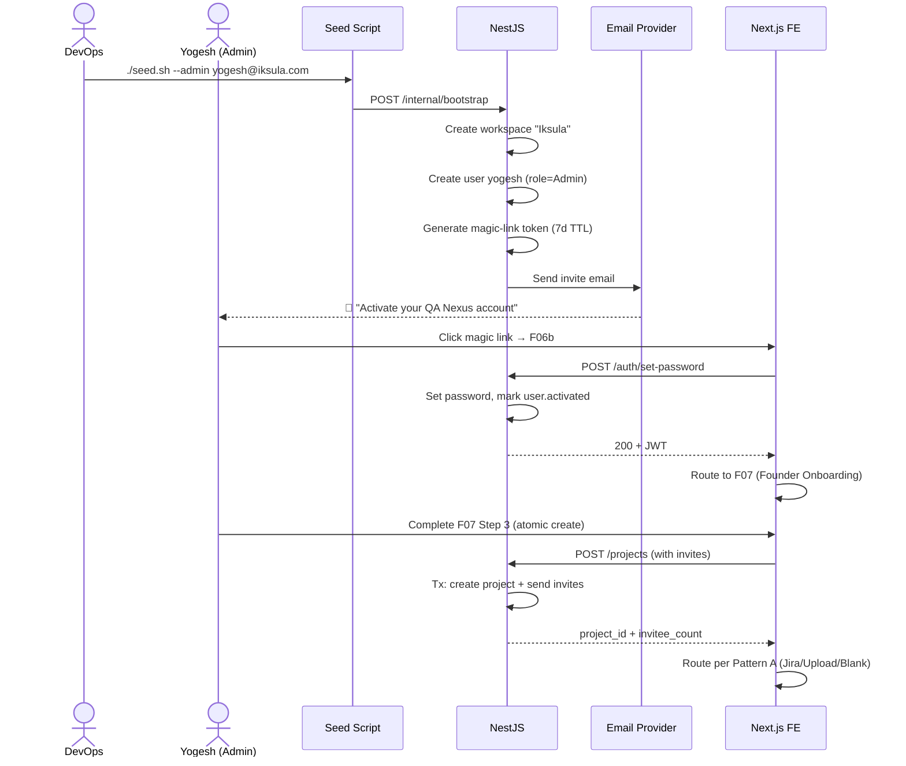

**Reading this:** The seed script is the only "back door" into a fresh deployment — once an Admin exists, all subsequent invites flow through F27 → F06b → F07b/c/d.

### 3.9 State Machine — Defect Lifecycle

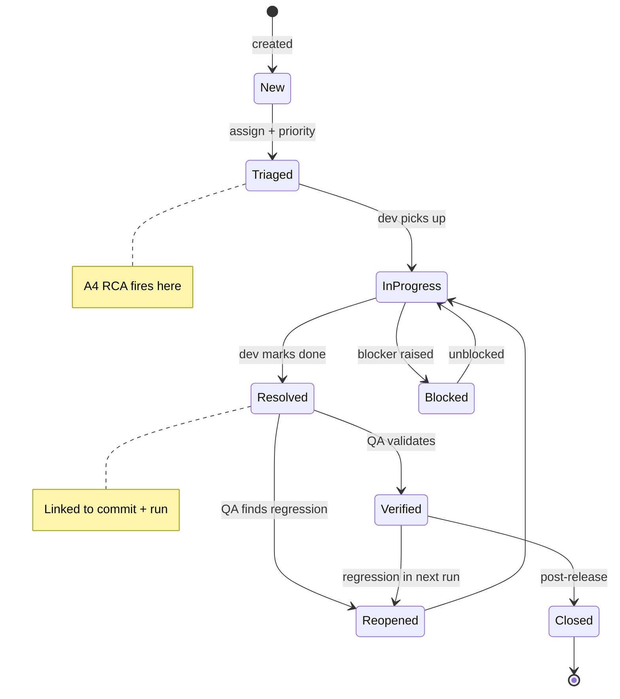

### 3.10 State Machine — Test Run Lifecycle

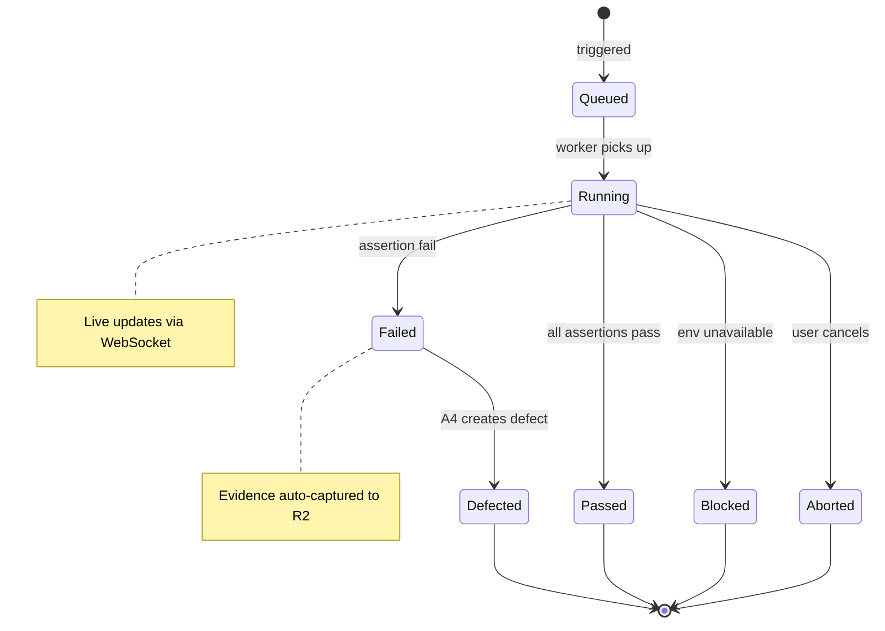

### 3.11 State Machine — Test Case Lifecycle

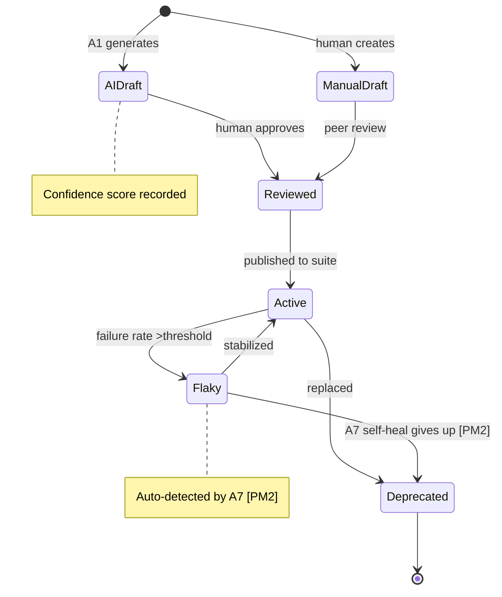

### 3.12 Agent Orchestration / LangGraph Topology

How A1–A8 + VCG + APT compose into the larger workflow.

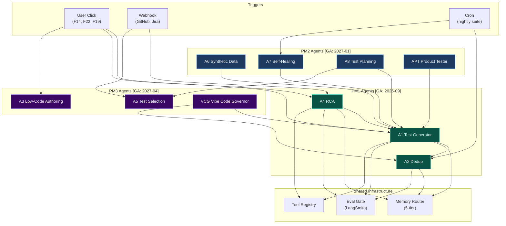

**Reading this:** A1 is the central agent — A4 calls A1 for "what test would have caught this", A6/A7/A8/APT/VCG all extend or invoke A1. Every agent passes the Eval Gate before its output is persisted or surfaced.

### 3.13 Data Flow Diagram — PII / Evidence Pipeline

For compliance review (DPIA, EU AI Act). Trust boundaries are highlighted.

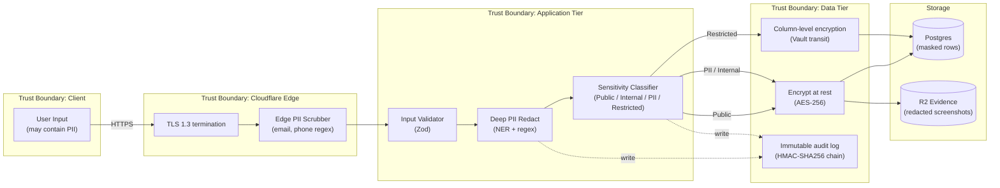

**Reading this:** PII passes through 2 redaction layers (edge + deep) before persistence. Restricted data uses Vault transit (envelope encryption with rotating data keys). Every redact + classify event is HMAC-signed into the audit log (visible in F28).

### 3.14 Architecture diagram inventory (where to look)

| Diagram | Location | Tool | Audience |
|---|---|---|---|
| C4 L1 System Context | §4 below | Mermaid (in markdown) | All |
| C4 L2 Container | §3.2 above | Mermaid | Engineers, SRE |
| C4 L3 Component (Inference) | §3.3 above | Mermaid | Backend engineers |
| Component Architecture (broader) | §5 below | Mermaid | Engineers |
| Deployment Topology | §3.4 above | Mermaid | SRE, security |
| Sequence: A1 Generate | §3.5 above | Mermaid | Backend, AI engineers |
| Sequence: A4 RCA | §3.6 above | Mermaid | Backend, AI engineers |
| Sequence: Jira 2-way Sync | §3.7 above | Mermaid | Integration engineers |
| Sequence: Day-0 Bootstrap | §3.8 above | Mermaid | DevOps, IT |
| State Machine: Defect | §3.9 above | Mermaid | Backend |
| State Machine: TestRun | §3.10 above | Mermaid | Backend |
| State Machine: TestCase | §3.11 above | Mermaid | Backend |
| Agent Orchestration | §3.12 above | Mermaid | AI engineers, PM |
| PII Data Flow | §3.13 above | Mermaid | Security, compliance |
| Existing system architecture | `ERD.drawio` | draw.io | Visual stakeholders |
| Capacity plan, NFR radar, SLO error budget, LINDDUN heatmap | `erd_charts/` | PNG charts | All |

---

## System Context Diagram (C4 Level 1)

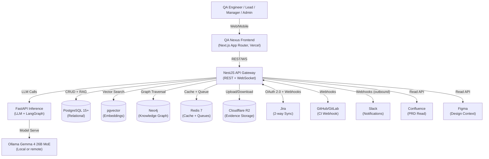

---

## Component Architecture (Phase-Tagged)

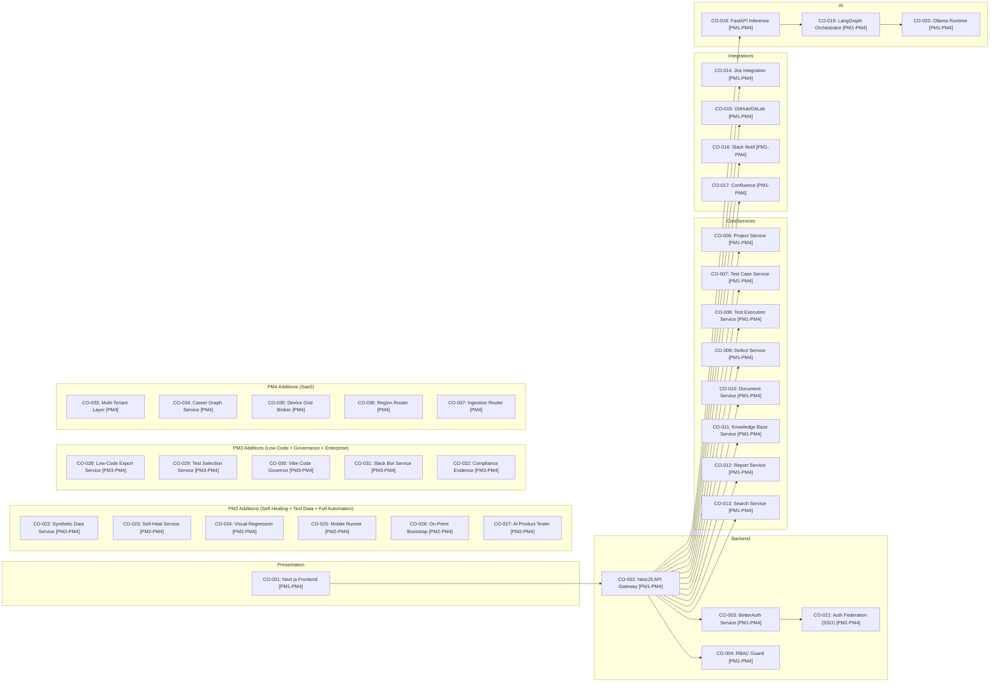

---

## 7-Layer Architecture Progression (PM1 → PM4)

```
LAYER 7: CAREER INTELLIGENCE              ─────────── PM4 (W47+)
         └─ Career Compass: Skills graph, job market matching, salary benchmarking, learning paths

LAYER 6: COMPLIANCE & GOVERNANCE          ────────── PM3 (EU AI Act L6, SOC2/ISO27001 foundation) → PM4 (GxP/HIPAA/multi-region)
         └─ Audit trail, agent governance, VCG policy engine, compliance evidence logging, encryption at rest, multi-region data residency

LAYER 5: ANALYTICS & VALUE VISIBILITY     ─────────── PM1 (lite: basic reports, ROI) → PM2 (predictive analytics) → PM3 (full dashboards) → PM4 (enterprise BI)
         └─ Executive dashboard, ROI calculator, defect trends, release RAG, cost-avoidance metrics, predictive test planning

LAYER 4: AGENTIC AI                       ─────────── PM1 (3: A1, A2, A4) → PM2 (+4: A6, A7, A8adv, APT = 7) → PM3 (+4: A3, A5, A8full, VCG = 11) → PM4 (ongoing)
         └─ LangGraph orchestration, confidence scoring, HITL approval gates, agent governance audit trail

LAYER 3: DOCUMENT INTELLIGENCE            ─────────── PM1 (12 templates) → PM2 (+20 = 32) → PM3 (+18 = 50) → PM4 (+20 = 70)
         └─ Test Plan, Strategy, RCA, Defect Report, RTM, Estimation, Daily/Weekly/Sprint/Release reports, Templates generation w/ confidence scoring, PDF export, versioning

LAYER 2: KNOWLEDGE LAYER                  ─────────── PM1 (pgvector + RAG foundation) → PM2 (full GraphRAG) → PM3 (Graphiti temporal) → PM4 (knowledge mesh)
         └─ Embeddings (BGE), vector search (pgvector primary through PM3; Qdrant evaluated post-PM3 as optional optimization), knowledge graph (Neo4j Graphiti), dedup, semantic search, context retrieval

LAYER 1: UNIFIED PLATFORM                 ─────────── PM1 (SaaS: Vercel+Oracle, 5 integrations) → PM2 (+on-prem +mobile) → PM3 (+SSO +Slack ChatOps) → PM4 (+multi-tenant)
         └─ Frontend (Next.js), API Gateway (NestJS), auth (BetterAuth → Keycloak SSO), RBAC, webhooks, WebSocket, deployment (SaaS→On-Prem→Multi-Tenant)
```

---

## PM1 Engineering Pillars (Explicit 5-Pillar Breakdown)

PM1 is scoped to 5 explicit Feature Pillars, each with dedicated engineering work, data model, APIs, services, and sub-milestone mapping. This explicit scope replaces implicit expectations.

### PM1-P1: Test Case Management [M3]

**Purpose:** Enable QA engineers to author test cases at scale with semantic dedup and bidirectional RTM.

**Data Model:**
- TB-007: `test_cases` (title, description, status, priority, case_type, preconditions, steps, expected_results)
- TB-008: `test_steps` (step_order, action, locator, expected_value, screenshot_path)
- TB-031: `requirement_traceability_matrix` (requirement_id, case_id, coverage_status, last_verified_date)
- TB-032: `test_case_versions` (case_id, version, changed_by, changed_at, change_description)

**Key Services:**
- CO-007: Test Case Service (case CRUD, versioning, bulk import from CSV/TestRail/Zephyr/Xray/qTest)
- CO-019: LangGraph Orchestrator (A1 generation flow, A2 dedup flow)

**AI Agents:**
- **A1 (Test Case Generator)** [M3]: Reads PRD/Jira/Figma → generates 10 test cases with Clarification Questions gate if confidence <80% → auto-approve if ≥80%
- **A2 (Test Deduplication)** [M3]: Live chips while authoring, bulk audit scan, match % confidence, merge recommendations

**APIs (EP-IDs):**
- EP-001 POST `/api/v1/test_cases/generate` — A1 trigger (input: requirement_id, context_type) → 10 cases + trace + CQ gate
- EP-002 POST `/api/v1/test_cases/bulk/audit` — A2 scan (input: project_id, threshold) → dedup pairs + confidence
- EP-003 POST `/api/v1/test_cases` — Case creation (BDD + traditional format)
- EP-004 GET `/api/v1/test_cases/:id/versions` — Version history
- EP-005 POST `/api/v1/test_cases/bulk/import` — CSV/TestRail import with dedup check

**Sub-Milestone Integration:** M3 (2026-06-15 → 2026-07-05, 3w)

**Exit Gate:** A1 live, A2 dedup live chips, Notion editor, BDD+traditional, RTM live

---

### PM1-P2: Integrations (Jira + GitHub + Slack + Confluence + Figma) [M0, M3, M4, M5]

**Purpose:** Establish read/write bridges to systems QA teams already use for context and notifications.

**Data Model:**
- TB-013: `jira_integrations` (org_id, instance_url, auth_method [PM1: 'oauth' only; PM3 adds 'api_token' | 'pat' | 'custom_oauth'], client_id, oauth_token_encrypted, api_token_encrypted [PM3], api_user_email [PM3], custom_oauth_provider_id [PM3, FK→TB-013b], project_key, field_mappings_json, sync_direction)
- TB-013b: `jira_custom_oauth_providers` [PM3 M17] (org_id, provider_name, authorize_url, token_url, client_id, client_secret_encrypted, scopes_csv, created_by, created_at) — for customers running their own Atlassian OAuth proxy
- TB-014: `github_integrations` (org_id, repo, webhook_url, api_token_encrypted, branch_filter)
- TB-015: `slack_integrations` (org_id, workspace_id, bot_token_encrypted, app_id, notification_channel_id, chatops_enabled, chatops_prefix)
- TB-016: `confluence_integrations` (org_id, instance_url, api_token_encrypted, prd_space_key)
- TB-017: `figma_integrations` (org_id, team_id, api_token_encrypted, file_id_filter)
- TB-041: `integration_sync_log` (integration_id, direction, source_entity_id, target_entity_id, status, error_message, sync_at)

**Key Services:**
- CO-014: Jira Integration (2-way sync via OAuth 2.0 + webhooks, comment mirroring, field mapping)
- CO-015: GitHub/GitLab Integration (webhook bridge for test run results, CI trigger)
- CO-016: Slack Integration (outbound notifications, inbound ChatOps deferred to PM3)
- CO-017: Confluence Integration (inbound PRD read for A1 context, outbound report write)

**APIs (EP-IDs):**
- EP-006 POST `/api/v1/integrations/jira/auth` — OAuth 2.0 3-leg flow (PM1 only auth method)
- EP-006b [PM3 M17] POST `/api/v1/integrations/jira/auth/api-token` — API Token + Email Basic Auth for locked-down Atlassian Cloud tenants
- EP-006c [PM3 M17] POST `/api/v1/integrations/jira/auth/pat` — Personal Access Token for Jira Server / Data Center on-prem
- EP-006d [PM3 M17] POST `/api/v1/integrations/jira/auth/custom-oauth` — Custom OAuth provider registration (TB-013b)
- EP-006e [PM3 M17] POST `/api/v1/integrations/jira/test-connection` — Dry-run validate selected auth_method before saving
- EP-007 POST `/api/v1/integrations/jira/sync` — Sync defect to/from Jira (bidirectional)
- EP-008 POST `/api/v1/integrations/github/webhook` — CI artifact receiver
- EP-009 POST `/api/v1/integrations/slack/notify` — Send notifications
- EP-010 GET `/api/v1/integrations/:id/health` — Integration status (last sync, error log)

**Sub-Milestone Integration:**
- M0 (2026-04-27 → 2026-05-10): Infra setup, webhook endpoints
- M3 (2026-06-15 → 2026-07-05): Jira OAuth + initial sync
- M4 (2026-07-06 → 2026-07-26): Jira 2-way + webhooks, GitHub/GitLab
- M5 (2026-07-27 → 2026-08-16): Slack notifications

**Exit Gate:** 2-way Jira sync live and tested, GitHub/GitLab webhooks working, Slack notifications sent, zero orphaned defects

---

### PM1-P3: Bug Management (Defect Triage + A4 5-Layer RCA) [M4]

**Purpose:** Turn test failures into actionable, categorized defects with automated root-cause analysis.

**Data Model:**
- TB-009: `defects` (title, description, severity, status, category, rca_analysis_json, rca_confidence, jira_issue_key, jira_sync_status)
- TB-042: `rca_evidence` (defect_id, layer, description, confidence, evidence_path) — Stack, Env, Config, Code, Data
- TB-043: `evidence_artifacts` (defect_id, type, path, size_bytes, created_at) — Screenshots, logs, HAR, env snapshots
- TB-044: `duplicate_defect_candidates` (defect_id, candidate_id, match_similarity, vector_embedding_distance)

**Key Services:**
- CO-009: Defect Service (defect CRUD, form prefill from failing run, evidence auto-capture)
- CO-019: LangGraph Orchestrator (A4 RCA flow: stack → env → config → code → data)

**AI Agents:**
- **A4 (Defect Intelligence / 5-Layer RCA)** [M4]: Reads failure evidence (stack, logs, HAR, screenshots, env snapshot) → walks 5 layers → 4-category classification (App/Test/Flaky/Env) → layer-by-layer confidence → related past defects via pgvector dedup

**APIs (EP-IDs):**
- EP-011 POST `/api/v1/defects` — Defect creation with prefill from test run
- EP-012 POST `/api/v1/defects/:id/analyze-rca` — A4 trigger (async, returns run_id for polling)
- EP-013 GET `/api/v1/defects/:id/rca-result` — Fetch A4 RCA + layer confidences + related defects
- EP-014 POST `/api/v1/defects/:id/sync-jira` — Manual or auto sync to Jira
- EP-015 GET `/api/v1/defects/duplicates` — pgvector semantic search for similar defects

**Evidence Auto-Capture:**
- Screenshot (from test runner or manual paste)
- Browser console logs (JSON)
- Network HAR (Playwright/Cypress)
- Environment snapshot (OS, browser, locale, network)

**Sub-Milestone Integration:** M4 (2026-07-06 → 2026-07-26, 3w)

**Exit Gate:** A4 RCA operational, 4-category classification working, defect-to-Jira sync bidirectional, evidence captured on failure

---

### PM1-P4: Basic Reporting (Templated + Executive Dashboard + ROI) [M5, M6]

**Purpose:** Auto-generate leadership-ready reports and demonstrate tangible ROI via the cost-avoidance model.

**Data Model:**
- TB-018: `reports` (project_id, report_type, schedule, template_id, generated_at, exported_at, status)
- TB-045: `report_snapshots` (report_id, metric_name, value_numeric, dimension, snapped_at) — Daily snapshots
- TB-046: `roi_metrics` (defect_id, stage_detected_in, stage_multiplier, cost_avoidance_usd, calculated_at) — Formula: stage_multiplier = {req:10, design:20, build:100, prod:1000}
- TB-047: `executive_dashboard_config` (org_id, metric_selections_json, refresh_interval_mins, shared_with_user_ids)

**Key Services:**
- CO-012: Report Service (auto-fill templates, PDF export, scheduling, version history)
- CO-013: Search Service (global search for report artifacts)

**Reports Included (12 templates, PM1-P5 owns generation; P4 owns execution tracking):**
1. **Daily Status Report** — Cases run, pass rate, defects, blockers
2. **Weekly Status Report** — Trend chart, key metrics, team capacity
3. **Sprint Sign-Off** — Sprint metrics, coverage, release readiness
4. **Release Readiness Report** — Go/No-Go checklist, pass rate by component, risk assessment
5. **Defect Report** — Severity distribution, top defects, age trend
6. **Root Cause Analysis (RCA) Report** — Layer breakdown, category distribution, patterns
7. **Exploratory Testing Charter** — Session objectives, scope, time budget
8. **Regression Test Outline** — Regression suite scope, entry/exit criteria, baseline
9. **Requirements Traceability Matrix (RTM)** — Requirement coverage %, untested gaps, trace links
10. **Test Plan** — Scope, approach, resources, schedule (light version; full version in PM1-P5)
11. **Test Strategy** — Risk analysis, prioritization, entry/exit (light; full in PM1-P5)
12. **Test Estimation** — Story-point sizing, effort forecast, schedule

**Executive Dashboard:**
- **Pass Rate** (by component, by test type)
- **Defect Trend** (open, closed, age, severity)
- **Coverage %** (executed, blocked, not-started)
- **Release RAG** (Red/Amber/Green status)
- **ROI Calculator** — Cost avoidance formula visible, running total, per-phase breakdown

**Cost-Avoidance Formula:**
```
total_cost_avoidance = SUM(defects_caught × stage_multiplier)
  where stage_multiplier = {
    requirements_phase: 10x,
    design_phase: 20x,
    build_phase: 100x,
    prod_live: 1000x
  }
Example: 5 defects caught in build = 5 × 100 = $500 cost avoidance
         1 defect caught in prod = 1 × 1000 = $1000 cost avoidance
         Total ROI (vs QA Nexus cost) illustrates value delivery
```

**APIs (EP-IDs):**
- EP-016 POST `/api/v1/reports/generate` — Trigger report generation (async)
- EP-017 GET `/api/v1/reports/:id/pdf` — Export PDF
- EP-018 GET `/api/v1/dashboard/executive` — Executive dashboard data (pass rate, defects, coverage, ROI)
- EP-019 GET `/api/v1/roi-metrics` — Detailed ROI breakdown by stage + defect

**Sub-Milestone Integration:**
- M5 (2026-07-27 → 2026-08-16, 3w): Basic reports (Daily, Weekly, Sprint, Release)
- M6 (2026-08-17 → 2026-09-20, 5w): Executive Dashboard + ROI formula

**Exit Gate:** Reports auto-fill, Executive Dashboard live, ROI calculator working, GA sign-off

---

### PM1-P5: Core Doc Catalog (12 of 70 Templates) [M2]

**Purpose:** Enable QA teams to generate leadership-ready documentation with section-level confidence scoring and approval workflows.

**Data Model:**
- TB-004: `document_templates` (template_id, name, category, section_json, section_order, placeholders_json, confidence_fields)
- TB-005: `documents` (document_id, project_id, template_id, title, content_markdown, generated_flag, generated_by_agent, generated_confidence_per_section)
- TB-006: `document_versions` (document_id, version, content_markdown, changed_by, changed_at, change_reason)
- TB-048: `document_approvals` (document_id, approver_user_id, approval_status, reviewed_at, feedback)

**12 Core Templates (PM1-P5 deliverable):**
1. **Test Plan** — Scope, approach, test cases/suites, schedule
2. **Test Strategy** — Risk analysis, prioritization, entry/exit criteria
3. **Test Estimation** — Story-point sizing, effort forecast, schedule
4. **Daily Status Report** — Execution summary, blockers, tomorrow's plan
5. **Weekly Status Report** — Weekly trend, key metrics, team capacity
6. **Sprint Sign-Off** — Sprint metrics, coverage, release readiness assessment
7. **Release Readiness Report** — Go/No-Go decision, pass rate by component, risk RAG
8. **Defect Report** — Severity distribution, age trend, top defects
9. **Root Cause Analysis (RCA)** — 5-layer breakdown, patterns, recommendations
10. **Exploratory Testing Charter** — Session objectives, scope, charter
11. **Regression Test Outline** — Regression suite scope, baseline, entry/exit
12. **Requirements Traceability Matrix (RTM)** — Coverage %, trace links, untested gaps

**Document Intelligence Layer (Data Model):**
- **Section-Level Confidence Scoring**: Each section (Scope, Approach, Risks, Metrics, etc.) gets a confidence % based on source data quality and AI agent output confidence
- **PDF Export**: Built-in PDF generation with branding (logo, colors, page numbers, watermark)
- **Versioning**: Track document edits, change reason, approval workflow
- **@Mentions & Comments**: Threaded feedback within document sections
- **Approval Workflow**: Draft → Pending Review → Approved (status tracking)

**Key Services:**
- CO-010: Document Service (doc CRUD, template rendering, PDF export, versioning, approvals)
- CO-019: LangGraph Orchestrator (A8 lightweight: test plan + strategy generation from PRD context)

**APIs (EP-IDs):**
- EP-020 POST `/api/v1/documents` — Create document from template + context
- EP-021 GET `/api/v1/documents/:id/sections` — Fetch sections + confidence per section
- EP-022 GET `/api/v1/documents/:id/pdf` — Export PDF
- EP-023 POST `/api/v1/documents/:id/submit-approval` — Submit for review
- EP-024 POST `/api/v1/documents/:id/approve` — Approve document
- EP-025 GET `/api/v1/document-templates` — List all 12 PM1 templates

**Sub-Milestone Integration:** M2 (2026-05-25 → 2026-06-14, 3w)

**Exit Gate:** 12 doc templates stable, PDF export working, approval workflow live, KB first-class

---

## Data Model — Core Entities (TB-001 through TB-051)

### TB ID Canonical Registry (Source of Truth: MILESTONE_REGISTRY.md v2.0)

Per the canonical milestone registry, the following TB IDs are locked and shared across all project documents:

| TB ID | Entity | Primary Sub-Milestone | Role |
|-------|--------|----------------------|------|
| TB-005 | test_cases | M3 | Core test asset storage; versioned |
| TB-006 | test_runs | M4 | Test execution history with evidence |
| TB-007 | defects | M4 | Defect storage + 4-category classification |
| TB-009 | knowledge_base_entries | M2 | KB storage + approval workflow |
| TB-010 | documents | M2 | Document instances from templates |
| TB-011 | reports | M5 | Templated report storage + scheduling |

**Note:** The ERD currently assigns these entities to TB IDs that may differ from the above canonical list during transition phases. The canonical IDs above take precedence for API references and milestone planning. Local ERD table IDs are noted for completeness.

### PM1 Core Tables (TB-001–TB-018)

```sql
-- (TB-001) organizations [PM1: single-tenant placeholder; PM4: multi-tenant root]
CREATE TABLE organizations (
  id UUID PRIMARY KEY DEFAULT gen_random_uuid(),
  name VARCHAR(255) NOT NULL UNIQUE,
  slug VARCHAR(100) NOT NULL UNIQUE,
  stripe_customer_id VARCHAR(255),
  region VARCHAR(10) DEFAULT 'us-east-1',
  created_at TIMESTAMPTZ DEFAULT NOW(),
  updated_at TIMESTAMPTZ DEFAULT NOW()
);
CREATE INDEX idx_org_region ON organizations(region);

-- (TB-002) users [PM1: basic + invitation lifecycle; PM4: RLS isolation via tenant_id]
CREATE TABLE users (
  id UUID PRIMARY KEY DEFAULT gen_random_uuid(),
  org_id UUID NOT NULL REFERENCES organizations(id) ON DELETE CASCADE,
  email VARCHAR(255) NOT NULL,
  email_verified BOOLEAN DEFAULT FALSE,
  password_hash VARCHAR(255),                 -- NULL until user completes F06b Mode A (Set Password)
  first_name VARCHAR(100),
  last_name VARCHAR(100),
  avatar_url TEXT,
  profile_attributes JSONB,
  -- [PM1] Invitation + first-login lifecycle
  invite_token VARCHAR(128),                  -- random secure token, embedded in magic link; NULL after consumption
  invite_token_expires_at TIMESTAMPTZ,        -- 7 days for invites, 1 hour for password resets
  invited_by UUID REFERENCES users(id),       -- NULL for the Day-0 bootstrap Admin (seeded, not invited); FK otherwise
  invited_at TIMESTAMPTZ,                     -- when the invite or bootstrap record was created
  first_login BOOLEAN DEFAULT TRUE,           -- flips to FALSE when user exits F07 (founder) or F07b (invited) onboarding
  onboarding_type VARCHAR(20),                -- 'workspace_founder' → routes to F07; 'invited_member' → routes to F07b
  activated_at TIMESTAMPTZ,                   -- when password was set via F06b Mode A
  created_at TIMESTAMPTZ DEFAULT NOW(),
  updated_at TIMESTAMPTZ DEFAULT NOW(),
  UNIQUE(org_id, email)
);
CREATE INDEX idx_user_org_email ON users(org_id, email);
CREATE INDEX idx_user_invite_token ON users(invite_token) WHERE invite_token IS NOT NULL;

-- Day-0 Bootstrap Seed (PM1, runs once during M0 deployment):
-- Creates the initial Admin with password_hash=NULL, invite_token=<random>, first_login=TRUE,
-- onboarding_type='workspace_founder', invited_by=NULL. Transactional email sent via the same
-- F06b Mode A template as regular invites; only the subject + body copy differs ("Your QA Nexus
-- workspace is ready" vs "You've been invited by X"). The initial Admin is assigned Admin RBAC
-- (which inherits all Lead permissions). For PM1 the assignee is Yogesh M. — his organizational
-- persona remains "QA Lead / Manager" but his system role is Admin for governance purposes.
--
-- Subsequent invites are created by existing Admins via F27 Users & Roles; same magic-link
-- pattern but onboarding_type='invited_member' → routes to F07b (tri-mode) on first login.
--
-- PM4: sales-led provisioning introduces a separate tenant creation flow; PM1 workspace
-- creation is strictly engineering-seeded (no public signup, no self-service tenant creation).

-- (TB-003) roles [PM1: 4 roles]
CREATE TABLE roles (
  id UUID PRIMARY KEY DEFAULT gen_random_uuid(),
  org_id UUID NOT NULL REFERENCES organizations(id) ON DELETE CASCADE,
  name VARCHAR(100) NOT NULL,
  permissions JSONB,
  created_at TIMESTAMPTZ DEFAULT NOW(),
  UNIQUE(org_id, name)
);
INSERT INTO roles (name, permissions) VALUES
  ('Admin', '{"all": true}'),
  ('Lead', '{"project_manage": true, "report_view": true, "defect_manage": true}'),
  ('QA', '{"case_author": true, "run_execute": true, "defect_log": true}'),
  ('Stakeholder', '{"report_view": true, "dashboard_view": true}');

-- (TB-038) user_roles [PM1: RBAC binding]
CREATE TABLE user_roles (
  id UUID PRIMARY KEY DEFAULT gen_random_uuid(),
  user_id UUID NOT NULL REFERENCES users(id) ON DELETE CASCADE,
  role_id UUID NOT NULL REFERENCES roles(id) ON DELETE CASCADE,
  assigned_at TIMESTAMPTZ DEFAULT NOW(),
  UNIQUE(user_id, role_id)
);

-- (TB-004) projects [PM1: single-project per org (PM4: multi-project)]
CREATE TABLE projects (
  id UUID PRIMARY KEY DEFAULT gen_random_uuid(),
  org_id UUID NOT NULL REFERENCES organizations(id) ON DELETE CASCADE,
  name VARCHAR(255) NOT NULL,
  description TEXT,
  status VARCHAR(50) DEFAULT 'active',
  created_by UUID NOT NULL REFERENCES users(id),
  created_at TIMESTAMPTZ DEFAULT NOW(),
  updated_at TIMESTAMPTZ DEFAULT NOW(),
  UNIQUE(org_id, name)
);
CREATE INDEX idx_project_org ON projects(org_id);

-- (TB-039) project_environments [PM1: config per environment]
CREATE TABLE project_environments (
  id UUID PRIMARY KEY DEFAULT gen_random_uuid(),
  project_id UUID NOT NULL REFERENCES projects(id) ON DELETE CASCADE,
  name VARCHAR(100) NOT NULL,
  base_url VARCHAR(255),
  environment_variables JSONB,
  secrets_encrypted JSONB,
  created_at TIMESTAMPTZ DEFAULT NOW(),
  UNIQUE(project_id, name)
);

-- (TB-007) test_cases [PM1-P1: core test asset]
CREATE TABLE test_cases (
  id UUID PRIMARY KEY DEFAULT gen_random_uuid(),
  org_id UUID NOT NULL REFERENCES organizations(id) ON DELETE CASCADE,
  project_id UUID NOT NULL REFERENCES projects(id) ON DELETE CASCADE,
  title VARCHAR(255) NOT NULL,
  description TEXT,
  status VARCHAR(50) DEFAULT 'active',
  priority INT DEFAULT 3,
  case_type VARCHAR(50),
  preconditions TEXT,
  bdd_scenario TEXT,
  created_by UUID NOT NULL REFERENCES users(id),
  created_at TIMESTAMPTZ DEFAULT NOW(),
  updated_at TIMESTAMPTZ DEFAULT NOW(),
  embedding VECTOR(768),
  UNIQUE(project_id, title)
);
CREATE INDEX idx_case_org_project ON test_cases(org_id, project_id);
CREATE INDEX idx_case_embedding ON test_cases USING ivfflat (embedding vector_cosine_ops) WITH (lists = 100);

-- (TB-008) test_steps [PM1-P1: step-by-step breakdown]
CREATE TABLE test_steps (
  id UUID PRIMARY KEY DEFAULT gen_random_uuid(),
  case_id UUID NOT NULL REFERENCES test_cases(id) ON DELETE CASCADE,
  step_order INT NOT NULL,
  action VARCHAR(255),
  locator VARCHAR(500),
  expected_value TEXT,
  screenshot_path TEXT,
  created_at TIMESTAMPTZ DEFAULT NOW(),
  UNIQUE(case_id, step_order)
);

-- (TB-031) requirement_traceability_matrix [PM1-P1: RTM]
CREATE TABLE requirement_traceability_matrix (
  id UUID PRIMARY KEY DEFAULT gen_random_uuid(),
  org_id UUID NOT NULL REFERENCES organizations(id) ON DELETE CASCADE,
  project_id UUID NOT NULL REFERENCES projects(id) ON DELETE CASCADE,
  requirement_id VARCHAR(255),
  case_id UUID REFERENCES test_cases(id) ON DELETE SET NULL,
  coverage_status VARCHAR(50),
  last_verified_date TIMESTAMPTZ,
  created_at TIMESTAMPTZ DEFAULT NOW(),
  UNIQUE(project_id, requirement_id, case_id)
);

-- (TB-032) test_case_versions [PM1-P1: version control]
CREATE TABLE test_case_versions (
  id UUID PRIMARY KEY DEFAULT gen_random_uuid(),
  case_id UUID NOT NULL REFERENCES test_cases(id) ON DELETE CASCADE,
  version INT NOT NULL,
  content_snapshot JSONB,
  changed_by UUID NOT NULL REFERENCES users(id),
  changed_at TIMESTAMPTZ DEFAULT NOW(),
  change_description TEXT,
  UNIQUE(case_id, version)
);

-- (TB-010) test_runs [PM1: execution tracking]
CREATE TABLE test_runs (
  id UUID PRIMARY KEY DEFAULT gen_random_uuid(),
  org_id UUID NOT NULL REFERENCES organizations(id) ON DELETE CASCADE,
  project_id UUID NOT NULL REFERENCES projects(id) ON DELETE CASCADE,
  run_name VARCHAR(255),
  environment_id UUID REFERENCES project_environments(id),
  status VARCHAR(50) DEFAULT 'not_started',
  started_at TIMESTAMPTZ,
  ended_at TIMESTAMPTZ,
  created_by UUID NOT NULL REFERENCES users(id),
  created_at TIMESTAMPTZ DEFAULT NOW(),
  updated_at TIMESTAMPTZ DEFAULT NOW()
);
CREATE INDEX idx_run_project ON test_runs(project_id, created_at DESC);

-- (TB-011) test_results [PM1: per-case result]
CREATE TABLE test_results (
  id UUID PRIMARY KEY DEFAULT gen_random_uuid(),
  run_id UUID NOT NULL REFERENCES test_runs(id) ON DELETE CASCADE,
  case_id UUID NOT NULL REFERENCES test_cases(id) ON DELETE CASCADE,
  status VARCHAR(50),
  comments TEXT,
  created_at TIMESTAMPTZ DEFAULT NOW(),
  updated_at TIMESTAMPTZ DEFAULT NOW()
);
CREATE INDEX idx_result_run_case ON test_results(run_id, case_id);

-- (TB-009) defects [PM1-P3: bug tracking + RCA]
CREATE TABLE defects (
  id UUID PRIMARY KEY DEFAULT gen_random_uuid(),
  org_id UUID NOT NULL REFERENCES organizations(id) ON DELETE CASCADE,
  project_id UUID NOT NULL REFERENCES projects(id) ON DELETE CASCADE,
  title VARCHAR(255) NOT NULL,
  description TEXT,
  severity VARCHAR(50),
  status VARCHAR(50) DEFAULT 'open',
  category VARCHAR(100),
  rca_analysis JSONB,
  rca_confidence NUMERIC(3,2),
  jira_issue_key VARCHAR(20),
  jira_sync_status VARCHAR(50) DEFAULT 'pending',
  created_from_result_id UUID REFERENCES test_results(id),
  created_by UUID NOT NULL REFERENCES users(id),
  created_at TIMESTAMPTZ DEFAULT NOW(),
  updated_at TIMESTAMPTZ DEFAULT NOW(),
  embedding VECTOR(768),
  UNIQUE(project_id, jira_issue_key)
);
CREATE INDEX idx_defect_org_project ON defects(org_id, project_id);
CREATE INDEX idx_defect_embedding ON defects USING ivfflat (embedding vector_cosine_ops) WITH (lists = 100);

-- (TB-042) rca_evidence [PM1-P3: A4 layer-by-layer]
CREATE TABLE rca_evidence (
  id UUID PRIMARY KEY DEFAULT gen_random_uuid(),
  defect_id UUID NOT NULL REFERENCES defects(id) ON DELETE CASCADE,
  layer VARCHAR(50),
  description TEXT,
  confidence NUMERIC(3,2),
  evidence_path TEXT,
  created_at TIMESTAMPTZ DEFAULT NOW()
);

-- (TB-043) evidence_artifacts [PM1-P3: screenshot/log/HAR/env]
CREATE TABLE evidence_artifacts (
  id UUID PRIMARY KEY DEFAULT gen_random_uuid(),
  defect_id UUID REFERENCES defects(id) ON DELETE CASCADE,
  result_id UUID REFERENCES test_results(id) ON DELETE CASCADE,
  type VARCHAR(50),
  path TEXT NOT NULL,
  size_bytes BIGINT,
  created_at TIMESTAMPTZ DEFAULT NOW()
);

-- (TB-004) document_templates [PM1-P5: 12 core templates]
CREATE TABLE document_templates (
  id UUID PRIMARY KEY DEFAULT gen_random_uuid(),
  name VARCHAR(255) NOT NULL UNIQUE,
  category VARCHAR(100),
  section_json JSONB,
  section_order INT[] DEFAULT '{}'::INT[],
  placeholders_json JSONB,
  confidence_fields VARCHAR(255)[],
  created_at TIMESTAMPTZ DEFAULT NOW()
);

-- (TB-005) documents [PM1-P5: doc instances]
CREATE TABLE documents (
  id UUID PRIMARY KEY DEFAULT gen_random_uuid(),
  org_id UUID NOT NULL REFERENCES organizations(id) ON DELETE CASCADE,
  project_id UUID NOT NULL REFERENCES projects(id) ON DELETE CASCADE,
  template_id UUID NOT NULL REFERENCES document_templates(id),
  title VARCHAR(255) NOT NULL,
  content_markdown TEXT,
  generated_flag BOOLEAN DEFAULT FALSE,
  generated_by_agent VARCHAR(50),
  generated_confidence_per_section JSONB,
  status VARCHAR(50) DEFAULT 'draft',
  created_by UUID NOT NULL REFERENCES users(id),
  created_at TIMESTAMPTZ DEFAULT NOW(),
  updated_at TIMESTAMPTZ DEFAULT NOW()
);
CREATE INDEX idx_doc_project_status ON documents(project_id, status);

-- (TB-006) document_versions [PM1-P5: doc version control]
CREATE TABLE document_versions (
  id UUID PRIMARY KEY DEFAULT gen_random_uuid(),
  document_id UUID NOT NULL REFERENCES documents(id) ON DELETE CASCADE,
  version INT NOT NULL,
  content_markdown TEXT,
  changed_by UUID NOT NULL REFERENCES users(id),
  changed_at TIMESTAMPTZ DEFAULT NOW(),
  change_reason TEXT,
  UNIQUE(document_id, version)
);

-- (TB-048) document_approvals [PM1-P5: approval workflow]
CREATE TABLE document_approvals (
  id UUID PRIMARY KEY DEFAULT gen_random_uuid(),
  document_id UUID NOT NULL REFERENCES documents(id) ON DELETE CASCADE,
  approver_user_id UUID NOT NULL REFERENCES users(id),
  approval_status VARCHAR(50),
  reviewed_at TIMESTAMPTZ,
  feedback TEXT,
  created_at TIMESTAMPTZ DEFAULT NOW()
);

-- (TB-011) knowledge_base_entries [PM1: RAG context]
CREATE TABLE knowledge_base_entries (
  id UUID PRIMARY KEY DEFAULT gen_random_uuid(),
  org_id UUID NOT NULL REFERENCES organizations(id) ON DELETE CASCADE,
  title VARCHAR(255) NOT NULL,
  content_markdown TEXT NOT NULL,
  embedding VECTOR(768),
  category VARCHAR(100),
  status VARCHAR(50) DEFAULT 'draft',
  approved_by UUID REFERENCES users(id),
  approved_at TIMESTAMPTZ,
  created_by UUID NOT NULL REFERENCES users(id),
  created_at TIMESTAMPTZ DEFAULT NOW(),
  updated_at TIMESTAMPTZ DEFAULT NOW()
);
CREATE INDEX idx_kb_embedding ON knowledge_base_entries USING ivfflat (embedding vector_cosine_ops) WITH (lists = 100);
CREATE INDEX idx_kb_org_status ON knowledge_base_entries(org_id, status);

-- (TB-040) audit_events [PM1: immutable action log]
CREATE TABLE audit_events (
  id UUID PRIMARY KEY DEFAULT gen_random_uuid(),
  org_id UUID NOT NULL REFERENCES organizations(id) ON DELETE CASCADE,
  actor_user_id UUID REFERENCES users(id),
  action VARCHAR(100),
  resource_type VARCHAR(100),
  resource_id VARCHAR(255),
  changes_before JSONB,
  changes_after JSONB,
  created_at TIMESTAMPTZ DEFAULT NOW()
);
CREATE INDEX idx_audit_org_action ON audit_events(org_id, action, created_at DESC);

-- (TB-013) jira_integrations [PM1-P2: Jira OAuth + 2-way sync; PM3 M17: multi-auth]
CREATE TABLE jira_integrations (
  id UUID PRIMARY KEY DEFAULT gen_random_uuid(),
  org_id UUID NOT NULL REFERENCES organizations(id) ON DELETE CASCADE,
  project_id UUID REFERENCES projects(id) ON DELETE CASCADE,  -- [PM3 M17] per-project auth (NULL = org-level, PM1 default)
  instance_url VARCHAR(255) NOT NULL,
  auth_method VARCHAR(20) NOT NULL DEFAULT 'oauth',  -- [PM1] 'oauth' only; [PM3 M17] 'oauth' | 'api_token' | 'pat' | 'custom_oauth'
  client_id VARCHAR(255),                             -- nullable when auth_method != 'oauth'
  oauth_token_encrypted VARCHAR(500),                 -- nullable when auth_method != 'oauth'
  refresh_token_encrypted VARCHAR(500),
  api_token_encrypted VARCHAR(500),                   -- [PM3 M17] api_token / pat
  api_user_email VARCHAR(255),                        -- [PM3 M17] email pairing for API Token Basic Auth
  custom_oauth_provider_id UUID REFERENCES jira_custom_oauth_providers(id),  -- [PM3 M17] FK to TB-013b
  self_signed_cert_trusted BOOLEAN DEFAULT FALSE,     -- [PM3 M17] for on-prem Jira Server/DC
  project_key VARCHAR(20),
  field_mappings JSONB,
  sync_direction VARCHAR(50),
  last_test_connection_at TIMESTAMPTZ,                -- [PM3 M17] EP-006e result timestamp
  last_test_connection_status VARCHAR(20),            -- [PM3 M17] 'ok' | 'auth_failed' | 'unreachable' | 'forbidden'
  enabled BOOLEAN DEFAULT TRUE,
  created_at TIMESTAMPTZ DEFAULT NOW(),
  updated_at TIMESTAMPTZ DEFAULT NOW(),
  UNIQUE(org_id, project_id, instance_url),
  CHECK (
    (auth_method = 'oauth' AND client_id IS NOT NULL AND oauth_token_encrypted IS NOT NULL)
    OR (auth_method = 'api_token' AND api_token_encrypted IS NOT NULL AND api_user_email IS NOT NULL)
    OR (auth_method = 'pat' AND api_token_encrypted IS NOT NULL)
    OR (auth_method = 'custom_oauth' AND custom_oauth_provider_id IS NOT NULL)
  )
);

-- (TB-013b) jira_custom_oauth_providers [PM3 M17: bring-your-own OAuth proxy]
CREATE TABLE jira_custom_oauth_providers (
  id UUID PRIMARY KEY DEFAULT gen_random_uuid(),
  org_id UUID NOT NULL REFERENCES organizations(id) ON DELETE CASCADE,
  provider_name VARCHAR(100) NOT NULL,
  authorize_url VARCHAR(500) NOT NULL,
  token_url VARCHAR(500) NOT NULL,
  client_id VARCHAR(255) NOT NULL,
  client_secret_encrypted VARCHAR(500) NOT NULL,
  scopes_csv VARCHAR(500),
  created_by UUID REFERENCES users(id),
  created_at TIMESTAMPTZ DEFAULT NOW(),
  UNIQUE(org_id, provider_name)
);

-- (TB-014) github_integrations [PM1-P2: CI webhook]
CREATE TABLE github_integrations (
  id UUID PRIMARY KEY DEFAULT gen_random_uuid(),
  org_id UUID NOT NULL REFERENCES organizations(id) ON DELETE CASCADE,
  repo VARCHAR(255) NOT NULL,
  webhook_url VARCHAR(255),
  api_token_encrypted VARCHAR(500),
  branch_filter VARCHAR(100),
  enabled BOOLEAN DEFAULT TRUE,
  created_at TIMESTAMPTZ DEFAULT NOW(),
  UNIQUE(org_id, repo)
);

-- (TB-016) slack_integrations [PM1-P2: notifications + ChatOps]
CREATE TABLE slack_integrations (
  id UUID PRIMARY KEY DEFAULT gen_random_uuid(),
  org_id UUID NOT NULL REFERENCES organizations(id) ON DELETE CASCADE,
  workspace_id VARCHAR(100),
  bot_token_encrypted VARCHAR(500),
  app_id VARCHAR(100),
  notification_channel_id VARCHAR(100),
  chatops_enabled BOOLEAN DEFAULT FALSE,
  chatops_command_prefix VARCHAR(20) DEFAULT '/qa-nexus',
  created_at TIMESTAMPTZ DEFAULT NOW(),
  updated_at TIMESTAMPTZ DEFAULT NOW()
);

-- (TB-041) integration_sync_log [PM1-P2: sync tracking]
CREATE TABLE integration_sync_log (
  id UUID PRIMARY KEY DEFAULT gen_random_uuid(),
  integration_id UUID,
  direction VARCHAR(50),
  source_entity_id VARCHAR(255),
  target_entity_id VARCHAR(255),
  status VARCHAR(50),
  error_message TEXT,
  synced_at TIMESTAMPTZ DEFAULT NOW()
);
CREATE INDEX idx_sync_integration ON integration_sync_log(integration_id, synced_at DESC);

-- (TB-018) reports [PM1-P4: reporting]
CREATE TABLE reports (
  id UUID PRIMARY KEY DEFAULT gen_random_uuid(),
  org_id UUID NOT NULL REFERENCES organizations(id) ON DELETE CASCADE,
  project_id UUID NOT NULL REFERENCES projects(id) ON DELETE CASCADE,
  report_type VARCHAR(100),
  template_id UUID REFERENCES document_templates(id),
  schedule VARCHAR(50),
  generated_at TIMESTAMPTZ,
  exported_at TIMESTAMPTZ,
  status VARCHAR(50) DEFAULT 'pending',
  created_at TIMESTAMPTZ DEFAULT NOW()
);
CREATE INDEX idx_report_project ON reports(project_id, created_at DESC);

-- (TB-045) report_snapshots [PM1-P4: daily metrics]
CREATE TABLE report_snapshots (
  id UUID PRIMARY KEY DEFAULT gen_random_uuid(),
  report_id UUID NOT NULL REFERENCES reports(id) ON DELETE CASCADE,
  metric_name VARCHAR(100),
  value_numeric NUMERIC,
  dimension VARCHAR(100),
  snapped_at TIMESTAMPTZ DEFAULT NOW()
);

-- (TB-046) roi_metrics [PM1-P4: cost-avoidance formula]
CREATE TABLE roi_metrics (
  id UUID PRIMARY KEY DEFAULT gen_random_uuid(),
  org_id UUID NOT NULL REFERENCES organizations(id) ON DELETE CASCADE,
  defect_id UUID REFERENCES defects(id) ON DELETE CASCADE,
  stage_detected_in VARCHAR(100),
  stage_multiplier INT,
  cost_avoidance_usd NUMERIC(10,2),
  calculated_at TIMESTAMPTZ DEFAULT NOW()
);

-- (TB-050) feature_flags [PM1: OpenFeature config]
CREATE TABLE feature_flags (
  id UUID PRIMARY KEY DEFAULT gen_random_uuid(),
  flag_key VARCHAR(100) NOT NULL UNIQUE,
  enabled BOOLEAN DEFAULT FALSE,
  percentage_enabled INT DEFAULT 0,
  created_at TIMESTAMPTZ DEFAULT NOW(),
  updated_at TIMESTAMPTZ DEFAULT NOW()
);

-- (TB-051) sessions [PM1: BetterAuth session tracking]
CREATE TABLE sessions (
  id VARCHAR(255) PRIMARY KEY,
  user_id UUID NOT NULL REFERENCES users(id) ON DELETE CASCADE,
  expires_at TIMESTAMPTZ NOT NULL,
  created_at TIMESTAMPTZ DEFAULT NOW()
);
CREATE INDEX idx_session_user_expires ON sessions(user_id, expires_at);
```

### PM2 Tables (TB-019–TB-024) — Self-Healing + Test Data + Full Automation

```sql
-- (TB-019) synthetic_data_sets [PM2: A6 test data generation]
CREATE TABLE synthetic_data_sets (
  id UUID PRIMARY KEY DEFAULT gen_random_uuid(),
  org_id UUID NOT NULL REFERENCES organizations(id) ON DELETE CASCADE,
  project_id UUID NOT NULL REFERENCES projects(id) ON DELETE CASCADE,
  title VARCHAR(255) NOT NULL,
  schema_json JSONB NOT NULL,
  sample_size INT,
  provenance_chain JSONB,
  generated_data_preview JSONB,
  created_by UUID NOT NULL REFERENCES users(id),
  created_at TIMESTAMPTZ DEFAULT NOW(),
  updated_at TIMESTAMPTZ DEFAULT NOW()
);

-- (TB-020) self_heal_suggestions [PM2: A7 background maintenance]
CREATE TABLE self_heal_suggestions (
  id UUID PRIMARY KEY DEFAULT gen_random_uuid(),
  org_id UUID NOT NULL REFERENCES organizations(id) ON DELETE CASCADE,
  project_id UUID NOT NULL REFERENCES projects(id) ON DELETE CASCADE,
  case_id UUID NOT NULL REFERENCES test_cases(id) ON DELETE CASCADE,
  failure_pattern VARCHAR(100),
  suggestion_text TEXT,
  new_step_content TEXT,
  confidence_score NUMERIC(3,2),
  status VARCHAR(50) DEFAULT 'pending',
  approved_by UUID REFERENCES users(id),
  approved_at TIMESTAMPTZ,
  created_at TIMESTAMPTZ DEFAULT NOW()
);

-- (TB-021) visual_regression_baselines [PM2: screenshot diff]
CREATE TABLE visual_regression_baselines (
  id UUID PRIMARY KEY DEFAULT gen_random_uuid(),
  org_id UUID NOT NULL REFERENCES organizations(id) ON DELETE CASCADE,
  case_id UUID NOT NULL REFERENCES test_cases(id),
  device_type VARCHAR(50),
  browser VARCHAR(50),
  environment_id UUID REFERENCES project_environments(id),
  baseline_r2_key VARCHAR(255) NOT NULL,
  perceptual_hash VARCHAR(64),
  created_at TIMESTAMPTZ DEFAULT NOW(),
  updated_at TIMESTAMPTZ DEFAULT NOW(),
  UNIQUE(case_id, device_type, browser, environment_id)
);

-- (TB-022) mobile_test_grid_configs [PM2: mobile devices]
CREATE TABLE mobile_test_grid_configs (
  id UUID PRIMARY KEY DEFAULT gen_random_uuid(),
  org_id UUID NOT NULL REFERENCES organizations(id) ON DELETE CASCADE,
  project_id UUID NOT NULL REFERENCES projects(id),
  device_model VARCHAR(100),
  os_version VARCHAR(50),
  screen_size_px VARCHAR(20),
  enabled BOOLEAN DEFAULT TRUE,
  created_at TIMESTAMPTZ DEFAULT NOW()
);

-- (TB-023) on_prem_deployments [PM2: on-prem instance tracking]
CREATE TABLE on_prem_deployments (
  id UUID PRIMARY KEY DEFAULT gen_random_uuid(),
  org_id UUID NOT NULL REFERENCES organizations(id) ON DELETE CASCADE,
  deployment_name VARCHAR(255),
  helm_release_name VARCHAR(100),
  kubernetes_namespace VARCHAR(100),
  install_path VARCHAR(255),
  version VARCHAR(20),
  status VARCHAR(50),
  last_health_check TIMESTAMPTZ,
  created_at TIMESTAMPTZ DEFAULT NOW(),
  updated_at TIMESTAMPTZ DEFAULT NOW()
);

-- (TB-024) apt_test_sessions [PM2: AI Product Tester E2E discovery]
CREATE TABLE apt_test_sessions (
  id UUID PRIMARY KEY DEFAULT gen_random_uuid(),
  org_id UUID NOT NULL REFERENCES organizations(id) ON DELETE CASCADE,
  project_id UUID NOT NULL REFERENCES projects(id) ON DELETE CASCADE,
  user_flow_name VARCHAR(255),
  discovered_scenarios JSONB,
  execution_results JSONB,
  exploratory_insights TEXT,
  created_by UUID NOT NULL REFERENCES users(id),
  created_at TIMESTAMPTZ DEFAULT NOW()
);
```

### PM3 Tables (TB-025–TB-030) — Low-Code + Governance + Enterprise

```sql
-- (TB-025) low_code_scripts [PM3: A3 automation editor]
CREATE TABLE low_code_scripts (
  id UUID PRIMARY KEY DEFAULT gen_random_uuid(),
  org_id UUID NOT NULL REFERENCES organizations(id) ON DELETE CASCADE,
  project_id UUID NOT NULL REFERENCES projects(id) ON DELETE CASCADE,
  title VARCHAR(255) NOT NULL,
  blocks_json JSONB NOT NULL,
  target_framework VARCHAR(50),
  generated_code TEXT,
  export_format VARCHAR(50),
  confidence_score NUMERIC(3,2),
  created_by UUID NOT NULL REFERENCES users(id),
  created_at TIMESTAMPTZ DEFAULT NOW(),
  updated_at TIMESTAMPTZ DEFAULT NOW()
);

-- (TB-026) test_selection_runs [PM3: A5 change-based subsetting]
CREATE TABLE test_selection_runs (
  id UUID PRIMARY KEY DEFAULT gen_random_uuid(),
  org_id UUID NOT NULL REFERENCES organizations(id) ON DELETE CASCADE,
  project_id UUID NOT NULL REFERENCES projects(id) ON DELETE CASCADE,
  pr_number INT,
  git_diff_hash VARCHAR(40),
  total_cases INT,
  selected_cases INT,
  impact_score NUMERIC(5,2),
  selected_case_ids UUID[] DEFAULT '{}',
  created_at TIMESTAMPTZ DEFAULT NOW()
);

-- (TB-027) vibe_governor_violations [PM3: governance policy violations]
CREATE TABLE vibe_governor_violations (
  id UUID PRIMARY KEY DEFAULT gen_random_uuid(),
  org_id UUID NOT NULL REFERENCES organizations(id) ON DELETE CASCADE,
  agent_id VARCHAR(50),
  run_id UUID,
  policy_rule_id VARCHAR(100),
  violation_severity VARCHAR(50),
  description TEXT,
  ai_output_snippet TEXT,
  reviewer_user_id UUID REFERENCES users(id),
  reviewed_at TIMESTAMPTZ,
  resolution VARCHAR(50),
  created_at TIMESTAMPTZ DEFAULT NOW()
);

-- (TB-028) sso_providers [PM3: SSO OAuth/SAML]
CREATE TABLE sso_providers (
  id UUID PRIMARY KEY DEFAULT gen_random_uuid(),
  org_id UUID NOT NULL REFERENCES organizations(id) ON DELETE CASCADE,
  provider_name VARCHAR(100),
  issuer_url VARCHAR(255) NOT NULL,
  client_id VARCHAR(255) NOT NULL,
  client_secret_encrypted VARCHAR(500) NOT NULL,
  redirect_uri VARCHAR(255),
  scopes VARCHAR(255) DEFAULT 'openid profile email',
  metadata_url VARCHAR(255),
  enabled BOOLEAN DEFAULT TRUE,
  created_at TIMESTAMPTZ DEFAULT NOW(),
  updated_at TIMESTAMPTZ DEFAULT NOW(),
  UNIQUE(org_id, provider_name)
);

-- (TB-029) slack_integrations_enhanced [PM3: ChatOps config]
-- (Already exists as TB-016, expanded here for clarity)
-- chatops_enabled BOOLEAN DEFAULT FALSE
-- chatops_command_prefix VARCHAR(20) DEFAULT '/qa-nexus'

-- (TB-030) compliance_evidence [PM3: EU AI Act L6 immutable traces]
CREATE TABLE compliance_evidence (
  id UUID PRIMARY KEY DEFAULT gen_random_uuid(),
  org_id UUID NOT NULL REFERENCES organizations(id) ON DELETE CASCADE,
  agent_id VARCHAR(50),
  run_id UUID NOT NULL,
  prompt_hash VARCHAR(64),
  context_retrieved_count INT,
  output_hash VARCHAR(64),
  confidence_score NUMERIC(3,2),
  approved_by UUID REFERENCES users(id),
  approved_at TIMESTAMPTZ,
  user_action VARCHAR(50),
  retention_expires_at TIMESTAMPTZ,
  created_at TIMESTAMPTZ DEFAULT NOW()
);
CREATE INDEX idx_compliance_org_agent ON compliance_evidence(org_id, agent_id, created_at DESC);
```

### PM4 Tables (TB-031–TB-036) — Multi-Tenant SaaS + Career

```sql
-- (TB-031) multi_tenant_roots [PM4: org isolation config]
CREATE TABLE multi_tenant_roots (
  id UUID PRIMARY KEY DEFAULT gen_random_uuid(),
  org_id UUID NOT NULL REFERENCES organizations(id) ON DELETE CASCADE,
  data_residency_region VARCHAR(20),
  backup_region VARCHAR(20),
  custom_domain VARCHAR(255),
  white_label_config JSONB,
  created_at TIMESTAMPTZ DEFAULT NOW(),
  updated_at TIMESTAMPTZ DEFAULT NOW(),
  UNIQUE(org_id)
);

-- (TB-032) career_skills_graph [PM4: L7 career intelligence]
CREATE TABLE career_skills_graph (
  id UUID PRIMARY KEY DEFAULT gen_random_uuid(),
  org_id UUID NOT NULL REFERENCES organizations(id) ON DELETE CASCADE,
  user_id UUID NOT NULL REFERENCES users(id) ON DELETE CASCADE,
  skills_json JSONB,
  proficiency_levels JSONB,
  learning_paths JSONB,
  updated_at TIMESTAMPTZ DEFAULT NOW()
);

-- (TB-033) job_market_signals [PM4: job matching + salary]
CREATE TABLE job_market_signals (
  id UUID PRIMARY KEY DEFAULT gen_random_uuid(),
  skill_tag VARCHAR(100),
  role_title VARCHAR(255),
  average_salary_usd NUMERIC(10,2),
  job_count INT,
  market_trend VARCHAR(50),
  data_source VARCHAR(100),
  refreshed_at TIMESTAMPTZ DEFAULT NOW()
);

-- (TB-034) region_residency_locks [PM4: data residency enforcement]
CREATE TABLE region_residency_locks (
  id UUID PRIMARY KEY DEFAULT gen_random_uuid(),
  org_id UUID NOT NULL REFERENCES organizations(id) ON DELETE CASCADE,
  home_region VARCHAR(20) NOT NULL,
  replicas_in_regions VARCHAR(20)[] DEFAULT '{}',
  created_at TIMESTAMPTZ DEFAULT NOW(),
  UNIQUE(org_id)
);

-- (TB-035) device_grid_broker_config [PM4: cloud device grid]
CREATE TABLE device_grid_broker_config (
  id UUID PRIMARY KEY DEFAULT gen_random_uuid(),
  org_id UUID NOT NULL REFERENCES organizations(id) ON DELETE CASCADE,
  provider VARCHAR(100),
  api_credential_encrypted VARCHAR(500),
  provider_org_id VARCHAR(255),
  scaling_rules JSONB,
  created_at TIMESTAMPTZ DEFAULT NOW(),
  updated_at TIMESTAMPTZ DEFAULT NOW()
);

-- (TB-036) white_label_themes [PM4: customer branding]
CREATE TABLE white_label_themes (
  id UUID PRIMARY KEY DEFAULT gen_random_uuid(),
  org_id UUID NOT NULL REFERENCES organizations(id) ON DELETE CASCADE,
  logo_url VARCHAR(255),
  primary_color VARCHAR(7),
  secondary_color VARCHAR(7),
  custom_domain VARCHAR(255),
  css_overrides TEXT,
  created_at TIMESTAMPTZ DEFAULT NOW(),
  updated_at TIMESTAMPTZ DEFAULT NOW()
);
```

---

## Data Model — AI & Knowledge Layer (Embeddings + GraphRAG + Knowledge Graph)

### Embeddings & Vector Search (pgvector)

**Purpose:** Enable semantic search (dedup, RTM context retrieval, KB lookup) via LLM embeddings.

**Embedding Model:** BGE-small-en-v1.5 (384-dimensional, free + permissive license)

**Vector Indexes:**
- `test_cases.embedding` (IVFFLAT, 100 lists) — Find similar cases for A2 dedup + RTM context
- `defects.embedding` (IVFFLAT, 100 lists) — Find semantically similar defects for triage context
- `knowledge_base_entries.embedding` (IVFFLAT, 100 lists) — RAG context retrieval for A1

**Schema Extensions:**
```sql
-- Enable pgvector extension
CREATE EXTENSION IF NOT EXISTS vector;

-- Example: A2 dedup similarity search
SELECT case_id, title, 1 - (embedding <=> new_case_embedding) AS similarity
FROM test_cases
WHERE org_id = $1
  AND embedding <=> new_case_embedding < 0.3  -- Cosine distance threshold
ORDER BY similarity DESC
LIMIT 10;

-- Example: A4 RCA context retrieval (related defects + past cases)
SELECT defect_id, title, rca_analysis, 1 - (embedding <=> failure_embedding) AS relevance
FROM defects
WHERE org_id = $1
  AND embedding <=> failure_embedding < 0.4
ORDER BY relevance DESC
LIMIT 5;
```

### Knowledge Graph (Neo4j Graphiti)

**Purpose:** Maintain temporal knowledge graph of test relationships, defect patterns, and product context.

**Node Types:**
- `TestCase` — Properties: title, priority, case_type, created_date
- `Defect` — Properties: title, severity, category, rca_layers
- `Requirement` — Properties: name, description, component
- `Component` — Properties: name, owner, risk_level
- `User` — Properties: name, role
- `KnowledgeBase` — Properties: title, category, confidence

**Relationship Types:**
- `COVERS` (TestCase → Requirement) — RTM traceability
- `RELATED_TO` (Defect → Defect) — Pattern similarity (temporal + pattern-based)
- `TESTS` (TestCase → Component)
- `DISCOVERED_BY` (Defect → User) — Author tracking
- `SIMILAR_TO` (Defect → Defect + KnowledgeBase → KnowledgeBase) — Semantic linkage
- `BELONGS_TO` (all → Organization) — Tenant isolation

**Graphiti Extension (Neo4j):**
- Temporal relationships: `RELATED_AT` edges track when defects are correlated
- Confidence metadata on edges for pattern strength
- Decay functions: older defects contribute less to similarity scoring

---

## Data Model — Integrations (Jira, GitHub, Slack, Confluence, Figma)

### Jira Integration (2-Way Sync, OAuth 2.0 in PM1; Multi-Auth in PM3 M17)

**TB-013 jira_integrations schema already above; TB-013b jira_custom_oauth_providers added PM3 M17**

**Auth Method Matrix:**

| Method | Phase | Use Case | Required Fields |
|--------|-------|----------|-----------------|
| `oauth` | PM1 (M3) | Atlassian Cloud, standard tenants | client_id, oauth_token_encrypted, refresh_token_encrypted |
| `api_token` | **PM3 M17** | Locked-down Atlassian Cloud where admin forbids OAuth apps | api_token_encrypted, api_user_email |
| `pat` | **PM3 M17** | On-prem Jira Server / Data Center | api_token_encrypted, self_signed_cert_trusted |
| `custom_oauth` | **PM3 M17** | Enterprise with own OAuth proxy | custom_oauth_provider_id → TB-013b |

**Sync Flow:**
1. **Authorize** — auth_method-specific flow (PM1: OAuth 2.0 3-legged only; PM3: above matrix)
2. **Test Connection** (PM3 EP-006e) — dry-run before save, populate `last_test_connection_status`
3. **Webhook listener** on Jira issue create/update/delete
4. **2-min fallback poll** if webhook fails
5. **Bidirectional sync:**
   - QA Nexus defect → create/update Jira issue (via REST API)
   - Jira issue update → update QA Nexus defect (via webhook)
   - Comment mirroring (both ways)
6. **Field mapping** (severity → priority, category → issue_type, custom fields)
7. **Per-project scoping (PM3 M17):** When `project_id` is non-NULL, auth is project-scoped; otherwise org-wide (PM1 default)

**Webhook Endpoint:**
```
POST /api/v1/integrations/jira/webhook
Body: Jira webhook JSON (issue updated event)
Processing: Match to TB-009 defects by jira_issue_key, upsert defect, log sync in TB-041
```

### GitHub/GitLab Integration (CI Webhook + Artifact Collection)

**TB-014 github_integrations schema already above**

**Webhook Flow:**
1. Register webhook on repository (push + PR events)
2. Receive commit sha + branch info
3. Link to test runs (if CI ran tests)
4. Collect artifacts (logs, screenshots, HAR from CI environment)
5. Auto-create test run record (TB-010)

### Slack Integration (Notifications + ChatOps)

**TB-016 slack_integrations (enhanced) already above**

**Outbound (PM1):** Post notifications (test complete, defect filed, report ready)
**Inbound ChatOps (PM3):** `/qa-nexus case <title>`, `/qa-nexus defect triage <id>`

### Confluence Integration (PRD Read + Report Write)

**Purpose:** 
- **Inbound (PM1):** Read Jira Confluence pages (PRD, design specs) as context for A1 test generation
- **Outbound (PM3):** Write test reports to Confluence pages

**Table:** Not explicit; read/write via Confluence REST API

### Figma Integration (Design Context for A1)

**Purpose:** Read Figma design files (components, interactions, screens) as context for A1 test case generation

**Table:** TB-017 figma_integrations (minimal; mostly API-driven)

---

## Data Model — Reporting & ROI (Dashboards + Metrics)

### Report Templates (TB-018, TB-045)

Already defined above. 12 core templates + expansion to 32 (PM2) → 50 (PM3) → 70 (PM4).

### ROI Calculation (TB-046)

```sql
-- Cost-avoidance formula (per defect)
INSERT INTO roi_metrics (org_id, defect_id, stage_detected_in, stage_multiplier, cost_avoidance_usd, calculated_at)
VALUES (
  'org-uuid',
  'defect-uuid',
  'build',  -- Detected during build/CI phase
  100,      -- Stage multiplier (build = 100x cost avoidance)
  100.00,   -- Cost avoidance = 1 hour * $100/hr = $100
  NOW()
);

-- Sum ROI by org
SELECT org_id, SUM(cost_avoidance_usd) AS total_cost_avoidance
FROM roi_metrics
WHERE org_id = 'org-uuid'
  AND calculated_at >= NOW() - INTERVAL '1 month'
GROUP BY org_id;
```

**Stage Multipliers (Cost Avoidance):**
- Requirements phase: 10x (early finding = high value)
- Design phase: 20x
- Build/Development phase: 100x
- Production (live): 1000x (critical finding = massive value)

---

## API Contracts (REST Endpoints by Pillar)

### PM1-P1: Test Case Management (EP-001–EP-005)

```
POST /api/v1/test_cases/generate [A1 trigger]
  Request: {
    requirement_id: "REQ-123",
    context_type: "jira" | "prd" | "figma",
    context_blob: "...",
    max_cases: 10
  }
  Response: {
    run_id: "uuid",
    status: "pending",
    polling_url: "/api/v1/test_cases/generate/:run_id"
  }
  
  Polling Response (after ~10s):
  {
    cases: [
      {
        title: "Verify login with valid credentials",
        steps: [...],
        expected_result: "User logged in",
        confidence: 0.92,
        trace_requirement_id: "REQ-123"
      }
    ],
    clarification_questions: [],
    auto_approve_count: 8,
    manual_review_count: 2
  }

GET /api/v1/test_cases/:id/versions
  Response: [
    { version: 1, content: {...}, changed_by: "user-uuid", changed_at: "...", reason: "Initial creation" },
    { version: 2, content: {...}, changed_by: "user-uuid", changed_at: "...", reason: "Added step 3" }
  ]

POST /api/v1/test_cases/bulk/import
  Request: {
    file: <CSV or JSON>,
    source_tool: "testrail" | "zephyr" | "xray" | "qtest",
    run_dedup: true
  }
  Response: {
    imported_count: 42,
    dedup_skipped_count: 5,
    validation_errors: []
  }
```

### PM1-P3: Bug Management / A4 RCA (EP-011–EP-015)

```
POST /api/v1/defects/:id/analyze-rca
  Request: {
    evidence_artifacts_ids: ["art-uuid1", "art-uuid2"],
    focus_layer: null  // null = all layers
  }
  Response: {
    run_id: "a4-run-uuid",
    status: "processing",
    polling_url: "/api/v1/defects/:id/rca-result/:run_id"
  }

GET /api/v1/defects/:id/rca-result/:run_id
  Response: {
    classification: "App",  // App | Test | Flaky | Env
    classification_confidence: 0.87,
    layers: [
      {
        layer: "Stack",
        description: "NullPointerException in LoginController.authenticate()",
        confidence: 0.95,
        evidence_snippet: "java.lang.NullPointerException..."
      },
      {
        layer: "Env",
        description: "Database connection timeout (staging)",
        confidence: 0.72,
        evidence_snippet: "Connection timeout after 30s"
      },
      {
        layer: "Config",
        description: "DB connection pool size under-provisioned",
        confidence: 0.65,
        evidence_snippet: "config.db.pool_size=5 (recommend ≥20)"
      },
      {
        layer: "Code",
        description: null,
        confidence: 0.0
      },
      {
        layer: "Data",
        description: null,
        confidence: 0.0
      }
    ],
    related_past_defects: [
      { defect_id: "uuid1", title: "...", similarity: 0.91 }
    ]
  }
```

### PM1-P4: Reporting (EP-016–EP-019)

```
POST /api/v1/reports/generate
  Request: {
    project_id: "uuid",
    report_type: "daily_status" | "weekly" | "sprint_signoff" | "release_readiness",
    date_range: { start: "2026-04-01", end: "2026-04-30" }
  }
  Response: {
    report_id: "uuid",
    status: "generating",
    polling_url: "/api/v1/reports/:id/status"
  }

GET /api/v1/dashboard/executive
  Response: {
    pass_rate: 0.87,
    pass_rate_by_component: {
      "Auth": 0.95,
      "Payment": 0.82,
      "Dashboard": 0.88
    },
    defect_count_open: 23,
    defect_trend: [
      { week: "2026-03-20", opened: 5, closed: 3 },
      { week: "2026-03-27", opened: 8, closed: 4 }
    ],
    coverage_percent: 0.78,
    release_rag: "amber",
    roi_metrics: {
      defects_caught_build: 15,
      cost_avoidance_usd: 1500,
      estimated_prod_escape_cost_if_undetected: 150000
    }
  }

GET /api/v1/roi-metrics
  Response: [
    {
      defect_id: "uuid",
      stage_detected_in: "build",
      stage_multiplier: 100,
      cost_avoidance_usd: 100,
      calculated_at: "2026-04-15T10:00:00Z"
    }
  ]
```

### PM1-P2: Integrations (EP-006–EP-010)

```
POST /api/v1/integrations/jira/auth       [PM1: OAuth 2.0 3LO — the only method in PM1]
  Request: {
    instance_url: "https://company.atlassian.net",
    client_id: "...",
    client_secret: "..."
  }
  Response: {
    auth_url: "https://auth.atlassian.com/authorize?...",
    state: "state-uuid"
  }

POST /api/v1/integrations/jira/auth/api-token     [PM3 M17 — locked-down Atlassian Cloud]
  Request: {
    instance_url: "https://company.atlassian.net",
    api_user_email: "qa-bot@company.com",
    api_token: "ATATT3xFfGF0..."  // Atlassian API token (user-scoped)
  }
  Response: { integration_id: "uuid", test_connection_status: "ok" }

POST /api/v1/integrations/jira/auth/pat           [PM3 M17 — Jira Server / Data Center on-prem]
  Request: {
    instance_url: "https://jira.internal.acme.com",
    personal_access_token: "NjE0MDU2ODg2...",
    self_signed_cert_trusted: true,
    project_id: "uuid"  // optional, null = org-level
  }
  Response: { integration_id: "uuid", test_connection_status: "ok" }

POST /api/v1/integrations/jira/auth/custom-oauth  [PM3 M17 — bring-your-own OAuth proxy]
  Request: {
    instance_url: "https://jira.acme.com",
    provider: {
      provider_name: "Acme SSO Gateway",
      authorize_url: "https://sso.acme.com/oauth/authorize",
      token_url: "https://sso.acme.com/oauth/token",
      client_id: "...", client_secret: "...", scopes_csv: "read:jira-work,write:jira-work"
    }
  }
  Response: { provider_id: "uuid", auth_url: "https://sso.acme.com/..." }

POST /api/v1/integrations/jira/test-connection    [PM3 M17 — dry-run validator for all methods]
  Request: { /* same shape as the auth_method being tested, but not persisted */ }
  Response: {
    status: "ok" | "auth_failed" | "unreachable" | "forbidden",
    instance_info: { name: "...", version: "...", projects_visible: 42 },
    latency_ms: 312
  }

POST /api/v1/integrations/jira/sync
  Request: {
    defect_id: "uuid",
    direction: "to_jira" | "from_jira"
  }
  Response: {
    sync_status: "success",
    jira_issue_key: "PROJ-123",
    message: "Defect synced to Jira"
  }

POST /api/v1/integrations/github/webhook
  Request: { /* GitHub webhook payload */ }
  Response: { status: "received" }
  Processing: Match commit to test run, associate artifacts

GET /api/v1/integrations/:id/health
  Response: {
    status: "healthy",
    last_sync: "2026-04-22T14:30:00Z",
    next_sync: "2026-04-22T14:32:00Z",
    error_count_24h: 0
  }
```

### PM1-P5: Documents (EP-020–EP-025)

```
POST /api/v1/documents
  Request: {
    template_id: "uuid",
    project_id: "uuid",
    title: "Q2 2026 Test Plan",
    context_requirement_ids: ["REQ-1", "REQ-2"],
    generate_via_agent: true,
    agent_id: "A8"
  }
  Response: {
    document_id: "uuid",
    status: "generating",
    polling_url: "/api/v1/documents/:id/status"
  }

GET /api/v1/documents/:id/sections
  Response: {
    sections: [
      {
        section_name: "Scope",
        content_markdown: "...",
        confidence: 0.92,
        generated_by_agent: "A8"
      },
      {
        section_name: "Approach",
        content_markdown: "...",
        confidence: 0.78,
        generated_by_agent: "A8"
      }
    ]
  }

GET /api/v1/documents/:id/pdf
  Response: PDF binary (Content-Type: application/pdf)

POST /api/v1/documents/:id/submit-approval
  Request: { message: "Ready for review" }
  Response: { status: "submitted_for_approval" }

POST /api/v1/documents/:id/approve
  Request: { feedback: "Approved with minor edits" }
  Response: { status: "approved", approved_at: "..." }
```

---

## WebSocket Events (Real-Time Notifications)

**Purpose:** Push real-time updates to frontend for live collaboration, agent progress, and notifications.

**WebSocket URL:** `wss://api.qanexus.ai/ws?token=<jwt>`

**Event Types:**

```json
{
  "type": "test_case_created",
  "data": {
    "case_id": "uuid",
    "title": "...",
    "created_by": "user-uuid"
  },
  "timestamp": "2026-04-22T10:00:00Z"
}

{
  "type": "a1_generation_progress",
  "data": {
    "run_id": "uuid",
    "status": "generating",
    "progress_percent": 45,
    "cases_generated_so_far": 4,
    "total_cases_expected": 10
  }
}

{
  "type": "a2_dedup_chip",
  "data": {
    "new_case_id": "uuid",
    "existing_case_id": "uuid",
    "similarity_percent": 87,
    "action_required": true
  }
}

{
  "type": "defect_rca_complete",
  "data": {
    "defect_id": "uuid",
    "classification": "App",
    "confidence": 0.87,
    "layers_complete": 5
  }
}

{
  "type": "slack_notification",
  "data": {
    "channel": "#qa-nexus",
    "message": "Test run completed: 87 passed, 2 failed, 1 blocked"
  }
}

{
  "type": "jira_sync_success",
  "data": {
    "defect_id": "uuid",
    "jira_issue_key": "PROJ-123",
    "direction": "to_jira"
  }
}
```

---

## AI Agent Program — Engineering Spec (A1–A8, VCG, APT)

### A1: Test Case Generator [PM1]

**Purpose:** Transform requirement text (PRD section, Jira epic, design spec) → 10+ test cases with step-by-step actions.

**LangGraph Nodes:**
1. **context_retrieval** — Read PRD, fetch related KB articles, past cases, similar requirements
2. **clarification_gate** — If context confidence <80%, generate Clarification Questions; wait for user input; retry
3. **generation** — LLM prompt (system: test case generation expert, context: requirement + 5 related cases + KB) → generate 10 cases
4. **dedup_check** — Call A2 to check for duplicates in generated cases; flag high-confidence matches
5. **confidence_scoring** — Score each generated case (title clarity, step specificity, assertion quality) → 0-100%
6. **approval_gate** — Cases ≥80% confidence → auto-approve; <80% → flag for human review
7. **traceability_link** — Link each case back to source requirement (TB-031 RTM entry)

**Prompts:**
```
System:
"You are an expert QA test case generation assistant. Your job is to create clear, actionable test cases from requirements.

Test cases must follow this format:
- Title: Concise description of what is being tested
- Preconditions: Setup needed before test
- Steps: Numbered action sequence (use imperative voice: 'Click', 'Enter', 'Verify')
- Expected Result: Clear pass criterion

Generate test cases that cover:
1. Happy path (normal flow)
2. Edge cases (boundary values, special characters)
3. Error cases (invalid input, missing data)
4. Integration cases (dependencies between features)

For each test case, assign a confidence score (0-100) based on:
- Clarity of requirement: Is it unambiguous?
- Test specificity: Can QA execute it without guessing?
- Assertion quality: Is the pass criterion measurable?

If confidence <80%, generate Clarification Questions to resolve ambiguity."

User:
"Requirement: Users can reset password via email link.
- Click 'Forgot Password' button
- Enter email address
- Check email inbox for reset link
- Click reset link (expires in 24 hours)
- Enter new password (min 8 chars, 1 uppercase, 1 number)
- Click 'Reset Password'
- System sends confirmation email
- User can log in with new password

Related cases in system:
[5 past test cases for password reset / auth]"

Assistant generates 10 test cases with steps + confidence scores.
```

**Failure Handling:**
- Vague requirement → CQ gate triggered; user clarifies; regenerate
- Over-generated duplicates → A2 flags; user merges or dismisses
- Low confidence (<50%) → Flag as red; recommend manual authoring

**Confidence Scoring Logic:**
```python
def calculate_a1_confidence(case: TestCase) -> float:
    clarity_score = assess_title_specificity(case.title)  # 0-1
    step_score = assess_step_completeness(case.steps)     # 0-1 (all locators, waiters present?)
    assertion_score = assess_assertion_measurability(case.expected_result)  # 0-1
    
    # Weighted average
    confidence = (clarity_score * 0.3) + (step_score * 0.4) + (assertion_score * 0.3)
    return confidence  # 0.0 to 1.0
```

**Eval Harness (PM1):**
- 5 real PRDs from pilots
- Target: ≥80% of cases auto-approve; <10% require CQ iteration
- Manual QA audit of 20 cases (Sr QA review)

---

### A2: Test Deduplication [PM1]

**Purpose:** Detect semantic duplicates to prevent test suite bloat.

**LangGraph Nodes:**
1. **embedding_compute** — Compute BGE embedding of new case (384-dim)
2. **vector_search** — Query pgvector for similar cases (cosine distance <0.3)
3. **ranking** — Rank candidates by similarity; filter <70% confidence
4. **dedup_suggestion** — Generate human-readable dedup suggestion
5. **user_action** — Wait for merge/dismiss/keep decision
6. **audit_log** — Log dedup action in TB-040 audit_events

**Similarity Threshold:**
- ≥90%: High confidence → "Strong duplicate detected, recommend merge"
- 70-89%: Amber → "Possible duplicate, review manually"
- <70%: Ignore

**Failure Modes:**
- Over-matching (false positives on keyword overlap) → Raise threshold
- Under-matching (miss true duplicates due to phrasing differences) → Lower threshold; tune via pilot feedback

**Eval Harness (PM1):**
- 1000-case library from pilot
- Target: ≥90% precision (of flagged duplicates, ≥90% are true duplicates), ≥70% recall
- Feedback loop: Collect user actions, retrain threshold

---

### A3: Low-Code Test Authoring [PM3]

**Purpose:** Enable QA engineers to write test automation without touching code (shipped in PM3 M13).

**LangGraph Nodes:**
1. **interaction_record** — Optional: record browser interactions (Playwright/Cypress), extract locators + waits
2. **block_builder** — Notion-style block interface (Slash commands: /click, /type, /wait, /assert, /goto)
3. **code_generation** — Convert blocks → Playwright/Selenium/Cypress/WebdriverIO code
4. **syntax_validation** — Lint generated code; flag syntax errors
5. **preview** — Run code in headless browser; screenshot result
6. **export** — Generate JS/Python file; optionally commit to GitHub

**Slash Commands:**
```
/click selector="button.login"
/type selector="input[name='email']" text="user@example.com"
/wait locator="xpath=//div[@class='loading']" state="hidden" timeout="10s"
/assert selector="h1" text="Dashboard" takes="exact"
/goto url="https://app.example.com"
/screenshot filename="step-5-result.png"
/assert_not selector="div.error" visible
```

**Code Generation Example:**
```javascript
// Generated from low-code blocks
import { test, expect } from '@playwright/test';

test('Login with valid credentials', async ({ page }) => {
  await page.goto('https://app.example.com');
  await page.click('button.login');
  await page.fill('input[name="email"]', 'user@example.com');
  await page.fill('input[name="password"]', 'password123');
  await page.click('button[type="submit"]');
  await page.waitForLoadState('networkidle');
  await expect(page.locator('h1')).toContainText('Dashboard');
});
```

**Confidence Scoring:**
- 0 syntax errors → ≥95% confidence → auto-approve
- 1-3 warnings (e.g., brittle selectors) → 85-94% confidence → amber review
- >3 errors → <85% confidence → red, recommend manual edit

---

### A4: Defect Intelligence / 5-Layer RCA [PM1]

**Purpose:** Automated root-cause analysis for test failures.

**5 Layers:**
1. **Stack** — Exception stack trace (Java, Python, JS); extract class/method/line
2. **Environment** — OS, browser, network, database version; check env config differences
3. **Configuration** — Application config (db pool size, timeout, secrets); link to recent config changes
4. **Code** — Source code diff; identify changed methods; link to GitHub PR
5. **Data** — Input data quality; check for invalid/missing/boundary values; historical data patterns

**LangGraph Nodes:**
1. **evidence_ingest** — Parse stack trace, logs, HAR, screenshots, env snapshot
2. **layer_analysis** (5 parallel) — Analyze each layer independently; assign confidence 0-100
3. **category_classify** — 4-category classification (App/Test/Flaky/Env) based on evidence balance
4. **related_defects** — Query pgvector for semantically similar past defects; fetch context
5. **recommendation** — Suggest fix action (code change, config change, test fix, flaky repeat)

**Confidence Calculation per Layer:**
```python
def stack_layer_confidence(stack_trace: str) -> float:
    if clear_exception_with_lineNumber:
        return 0.90
    elif exception_type_recognized:
        return 0.70
    elif generic_error:
        return 0.30
    else:
        return 0.0

def env_layer_confidence(env_snapshot, historical_patterns) -> float:
    if env_mismatch_found:
        return 0.85
    elif env_unusual_but_not_impossible:
        return 0.50
    else:
        return 0.0
```

The stack layer confidence scoring is one of four layers in A4's RCA. Configuration, code, and data layers follow similar patterns, using environmental signals and code analysis respectively.

**4-Category Classification Logic:**
```python
def classify_defect(layers: List[Layer]) -> str:
    stack_conf = layers['stack'].confidence
    code_conf = layers['code'].confidence
    test_conf = analyze_test_quality()
    env_conf = layers['environment'].confidence
    
    if stack_conf > 0.70 and code_conf > 0.70:
        return 'App'  # Code bug
    elif test_conf > 0.70 and code_conf < 0.40:
        return 'Test'  # Test flaw
    elif env_conf > 0.70:
        return 'Env'  # Infra issue
    elif is_flaky_pattern(defect_id):  # Historical pattern match
        return 'Flaky'
    else:
        return 'Undetermined'
```

**Eval Harness (PM1):**
- Collect 50 real failure traces from pilots
- Manual audit of A4 classification accuracy (Sr QA)
- Target: ≥80% correct classification on App/Test/Flaky/Env

---

### A5: Test Selection (Change-Based) [PM3]

**Purpose:** Select minimal test subset for PR-gated CI based on changed files (shipped in PM3 M14).

**LangGraph Nodes:**
1. **git_diff_analysis** — Parse git diff; extract changed files/functions
2. **coverage_mapping** — Map changed code to test cases via RTM + code coverage data
3. **impact_ranking** — Score impact by: change magnitude, function criticality, historical defect rate
4. **subset_selection** — Greedy algorithm: select tests covering most impact, fewest runs
5. **ci_recommendation** — Output subset ID; estimate CI time savings

**Impact Scoring:**
```python
def impact_score(changed_file, test_cases) -> float:
    # Factors:
    # 1. Lines changed (1-10 lines = low impact; 100+ lines = high impact)
    # 2. File criticality (core auth = high; docs = low)
    # 3. Historical defect rate (if file had defects in past 3 months, boost score)
    # 4. RTM coverage (if RTM explicitly links file to test cases, boost score)
    
    lines_changed = calculate_lines(changed_file)
    criticality = criticality_map.get(file_path, 0.5)
    defect_rate = defects_in_file_past_3mo / total_commits
    rtm_links = count_rtm_links(changed_file)
    
    score = (lines_changed * 0.3) + (criticality * 0.3) + (defect_rate * 0.2) + (rtm_links * 0.2)
    return min(score, 100)
```

**Eval Harness (PM2):**
- 100 PRs from customer CI
- Target: 60% CI time reduction, zero escaped defects in A5-selected subset
- Measure coverage after selection

---

### A6: Synthetic Test Data Generation [PM2]

**Purpose:** Generate realistic test data with full provenance tracking.

**LangGraph Nodes:**
1. **schema_infer** — Infer data schema from database or sample JSON
2. **constraint_extract** — Extract constraints (unique, not null, foreign keys, regex patterns)
3. **data_generate** — Use LLM + faker libs to generate realistic data (names, emails, dates, etc.)
4. **provenance_track** — Record: which constraint, which seed, generation timestamp, version
5. **re_generate** — Allow user to regenerate with different seed (deterministic for reproducibility)

**Provenance Schema (TB-025):**
```json
{
  "provenance_chain": [
    {
      "step": "schema_inference",
      "timestamp": "2026-04-22T10:00:00Z",
      "version": "1.0",
      "constraints_found": ["unique:email", "not_null:first_name", "length:<100"]
    },
    {
      "step": "data_generation",
      "timestamp": "2026-04-22T10:01:00Z",
      "seed": 12345,
      "rows_generated": 1000,
      "generator_lib": "faker"
    }
  ]
}
```

**Re-generate Deterministically:**

When a user clicks "Re-generate with seed 12345", the system fetches the provenance chain from the synthetic_data_sets table, re-runs the generation algorithm with the same seed, and produces identical data. This allows consistent test repeatability across regression runs and enables reproducible failure investigation.

---

### A7: Test Maintenance / Self-Healing [PM2]

**Purpose:** Suggest fixes for flaky tests without auto-applying (user approval required).

**LangGraph Nodes:**
1. **failure_analysis** — Identify failure pattern (selector changed, API response changed, timing issue)
2. **suggestion_gen** — Generate fix (update selector, add wait, adjust assertion)
3. **confidence_score** — How confident is the fix? (90% = safe, 60% = risky)
4. **user_approval** — Show suggestion in UI; user approves in context (never silent fix)
5. **apply_fix** — Update TB-007 test_cases + log change reason

**Failure Patterns:**
- **Selector changed**: Detect via screenshot diff + DOM analysis; suggest new selector
- **Timing issue**: Detect intermittent failures; suggest longer waits
- **API response changed**: Detect via API response mismatch; suggest updated assertion
- **Data issue**: Detect missing/invalid test data; suggest data fix or A6 synthetic data generation

**Example Suggestion:**
```
Pattern: Selector changed
Confidence: 87%
Suggestion: "Button selector changed from '.btn-primary' to '.btn-submit'. Update?'
New Step: "click('button.btn-submit')"
[Approve] [Reject] [Review]
```

---

### A8: Test Planning (Advanced + Full) [PM1+PM2→PM3]

**Purpose:** Auto-generate test strategy, risk matrix, entry/exit criteria from PRD.

**PM1 (Lightweight):** Basic test plan generation
**PM2 (Advanced):** Risk-adaptive planning from historical defect patterns
**PM3 (Full):** Auto-strategy from PRD alone, risk matrix, entry/exit criteria

**LangGraph Nodes:**
1. **requirement_extract** — Parse PRD; identify features, risks, user flows
2. **risk_assessment** — Score risk by: criticality (customer-facing?), complexity, history (past defects)
3. **test_strategy** — Generate approach (unit, integration, E2E coverage targets)
4. **entry_exit_gen** — Define when testing can start (entry criteria) and when it's done (exit criteria)
5. **schedule_gen** — Estimate duration per test phase

**Risk Matrix Generation:**
```
Features → Risk (High/Medium/Low)
  Auth (High) → Needs 40% of test cases
  Dashboard (Medium) → Needs 30%
  Settings (Low) → Needs 20%
  Onboarding (High) → Needs 10%

Risk scores inform test case count + test technique selection
```

---

### VCG: Vibe Code Governor [PM3–PM4]

**Purpose:** Governance layer for AI-written code; policy-as-code validation; audit trail for EU AI Act L6. Basic governance shipped in PM3 M16; advanced governance in PM4.

**Policy Engine:** OPA (Open Policy Agent) with REGO rules.

**Example REGO Rule:**
```rego
# Max nested loop depth = 3
package qa_nexus.governance

violation[msg] {
    code := input.ai_output
    depth := count_nesting_depth(code)
    depth > 3
    msg := sprintf("Code nesting depth %d exceeds limit 3", [depth])
}

# No hardcoded secrets
violation[msg] {
    code := input.ai_output
    contains(code, "password =")
    msg := "Hardcoded password detected; use secrets manager"
}

# Function complexity (cyclomatic) <15
violation[msg] {
    code := input.ai_output
    complexity := calculate_cyclomatic_complexity(code)
    complexity > 15
    msg := sprintf("Function complexity %d exceeds limit 15", [complexity])
}
```

**Violation Handling:**
- **Error (hard block):** PR blocked; merge impossible until resolved
- **Warning (soft gate):** PR flagged; merge allowed after review

**Audit Trail (TB-022):**
```
agent_id: "A1"
run_id: "uuid"
policy_rule_id: "max_nesting_depth"
violation_severity: "error"
description: "Nesting depth 4 exceeds limit 3"
ai_output_snippet: "if (x) { if (y) { ... } }"
reviewer_user_id: "uuid"
reviewed_at: "2026-04-22T10:00:00Z"
resolution: "approved" | "rejected"
```

---

### APT: AI Product Tester [PM2]

**Purpose:** Autonomous E2E test discovery + execution; exploratory testing automation. Primary delivery in PM2 M10 with maturity extensions in PM3/PM4.

**LangGraph Nodes:**
1. **user_flow_discovery** — Analyze user interactions (Figma, analytics, past sessions); infer user journeys
2. **scenario_generation** — Generate E2E scenarios from user flows
3. **autonomous_execution** — Run scenarios headlessly; capture results + evidence
4. **exploratory_insights** — Flag edge cases, unexpected behaviors, missing coverage
5. **case_suggestion** — Suggest new test cases to add to suite

**User Flow Example:**
```
User Flow: "Complete Purchase"
1. Browse products
2. Search for "shoes"
3. Filter by price ($50-$100)
4. Click product card
5. Add to cart
6. Proceed to checkout
7. Enter shipping address
8. Select shipping method
9. Enter payment info
10. Confirm order

APT generates scenarios:
  - Happy path (all steps succeed)
  - Edge case: Out of stock at checkout
  - Edge case: Payment declined
  - Exploratory: What if user navigates back? Cart state?
```

---

## Infrastructure (Postgres + Redis + S3 + Ollama + Observability)

### Database Stack

**Postgres 15+ (Primary Datastore)**
- Single-tenant (PM1-PM3): Single Postgres instance on Oracle Always Free + managed backup
- Multi-tenant (PM4): Postgres with read replicas (EU/US/APAC) + row-level RLS

**Schema Initialization:**
```bash
# PM1 schema (TB-001–TB-018)
psql -U qanexus -d qanexus_db -f /schema/pm1_schema.sql

# PM2 additions (TB-019–TB-024)
psql -U qanexus -d qanexus_db -f /schema/pm2_additions.sql

# PM3 additions (TB-025–TB-030)
psql -U qanexus -d qanexus_db -f /schema/pm3_additions.sql

# PM4 additions (TB-031–TB-036)
psql -U qanexus -d qanexus_db -f /schema/pm4_additions.sql
```

**Backup Strategy:**
- Daily snapshots (7-day retention)
- WAL archiving (point-in-time recovery)
- Cross-region backup replication (PM4)

### Redis 7 (Cache + Job Queue)

**Purpose:** Session cache, embedding cache, Hatchet job queue.

**Keyspace:**
```
sessions:{session_id} → {user_id, expires_at, org_id}  [TTL: 24h]
embedding_cache:{text_hash} → {embedding_vector}  [TTL: 30d]
a1_queue → [(job_id, requirement_id, status)]  [Hatchet managed]
a2_queue → [(job_id, case_id, status)]
a4_queue → [(job_id, defect_id, status)]
```

**Deployment:**
- Single-tenant (PM1-PM3): Upstash Redis (serverless)
- Multi-tenant (PM4): Redis Cluster (high availability)

### Object Storage (Cloudflare R2)

**Purpose:** Store evidence artifacts (screenshots, logs, HAR files).

**Structure:**
```
/qa-nexus/{org_id}/
  ├── evidence/
  │   ├── {defect_id}/
  │   │   ├── screenshot-001.png
  │   │   ├── console.log
  │   │   ├── network.har
  │   │   └── env-snapshot.json
  │   └── {result_id}/
  │       └── artifacts/
  ├── visual-regression/
  │   ├── baselines/
  │   │   ├── {case_id}_{device}_{browser}.png
  │   └── diffs/
  │       ├── {run_id}_{case_id}_{device}_{browser}.png
  └── synthetic-data/
      ├── {dataset_id}/
      │   ├── data.json
      │   └── provenance.json
```

**Retention:**
- Evidence: 1 year
- Baselines: Permanent (update on new run)
- Synthetic data: Permanent (version controlled)

### LLM Runtime (Ollama + Gemma 4 26B MoE)

**Model:** Gemma 4 26B Mixture of Experts
- ~26B parameters, 4 experts (each ~8B active at once)
- Fast inference (2 tokens/second on CPU; 20-30 tokens/sec on GPU)
- Quantized to 4-bit (6-8 GB VRAM)

**Deployment:**
- PM1-PM3: Single Ollama instance (Oracle VM.Standard.E4.Flex 4 vCPU + GPU)
- PM4: Ollama cluster with load balancing

**Embedding Model:** BGE-small-en-v1.5 (384-dim, separate Ollama service)

**Prompt Caching:** LangChain caching (Redis) for repeated prompts (A1, A2, A4 identical requirements)

### Observability Stack

**OTel (OpenTelemetry) + SigNoz (APM)**
- Traces: All API requests, LLM calls, integration syncs
- Metrics: Latency (p50, p95, p99), throughput, error rate
- Logs: Structured logs via Winston (Node.js) + Python logging

**Dashboards (Grafana + SigNoz):**
1. **System Health**: API latency, database queries, Redis hit rate, Ollama queue depth
2. **Agent Performance**: A1/A2/A4 latency, confidence distribution, auto-approve rate, feedback sentiment
3. **Integration Health**: Jira sync lag, webhook delivery time, GitHub CI artifact collection rate
4. **Business Metrics**: Test cases created (A1), defects filed, reports generated, ROI

**Alerting (PagerDuty):**
- P95 API latency >500ms (PM1) → warning
- Database CPU >80% → critical
- Ollama queue depth >100 → warning
- Integration sync failure rate >5% → critical

---

## Security & Compliance (Auth + RBAC + PII + Audit)

### Authentication (PM1: BetterAuth; PM2+: Keycloak Federation)

**PM1 Flow:**
```
User → Email/Password → BetterAuth → JWT → NestJS → request with user context
```

**PM2+ Flow:**
```
User → Keycloak SSO (OIDC) → Keycloak → JWT (with org_id claim) → NestJS → RLS enforced
```

**Session Management:**
- 24-hour idle timeout (PM1) → 4-hour idle (PM4)
- Max session lifetime: 7 days (PM1) → 8 hours (PM4)
- Refresh token rotation on each access

### RBAC (Role-Based Access Control)

**4 Roles (PM1-PM4):**
1. **Admin**: Full access; manage users, integrations, org settings
2. **Lead**: Case/defect management, reporting, governance
3. **QA**: Case authoring, defect logging, test execution
4. **Stakeholder**: Read-only reporting, dashboard access

**Enforcement:** NestJS @Guard(RolesGuard) decorator per endpoint

### Data Encryption

**At Rest:**
- PM1-PM3: AES-256 via pgcrypto (Postgres) for PII columns (password_hash, oauth_tokens, secrets)
- PM4: Full-disk encryption + HSM for key management

**In Transit:**
- TLS 1.3 (mandatory, HSTS headers)
- Certificate pinning (mobile app, PM3)

### PII Handling

**Sensitive Fields:** email, password_hash, first_name, last_name, oauth_tokens

**Access Control:**
- Masked in UI (first 3 chars of email shown)
- Audit log redacts PII in change tracking
- Export endpoints (CSV/PDF) require Lead+ role

**GDPR Right-to-Delete:**
- Cascade delete all org user data
- Anonymize audit logs (keep action, remove actor name)
- Retention: logs 1 year, audit trail 7 years (for compliance)

### Audit Log (TB-040)

**Schema:**
```sql
CREATE TABLE audit_events (
  id UUID PRIMARY KEY,
  org_id UUID,
  actor_user_id UUID,  -- Can be null for system actions
  action VARCHAR(100),  -- 'create', 'update', 'delete', 'export'
  resource_type VARCHAR(100),  -- 'test_case', 'defect', 'user'
  resource_id VARCHAR(255),
  changes_before JSONB,
  changes_after JSONB,
  created_at TIMESTAMPTZ DEFAULT NOW()
);
```

**Query Examples:**
```sql
-- All changes to test case by user in date range
SELECT * FROM audit_events
WHERE org_id = $1
  AND resource_type = 'test_case'
  AND resource_id = $2
  AND actor_user_id = $3
  AND created_at BETWEEN $4 AND $5;

-- All agent-initiated actions (for AI Act compliance)
SELECT * FROM audit_events
WHERE org_id = $1
  AND actor_user_id IS NULL
  AND action IN ('create_via_a1', 'create_via_a2', 'create_via_a4')
  AND created_at >= NOW() - INTERVAL '3 months';
```

---

## NFR Targets per Phase

| Category | PM1 Target | PM2 Target | PM3 Target | PM4 Target |
|----------|-----------|-----------|-----------|-----------|
| **P95 API latency** | <500ms | <350ms | <250ms | <200ms |
| **A1/A2/A4 latency** | <60s | <50s | <40s | <30s |
| **Uptime SLO** | 99.5% | 99.9% | 99.95% | 99.99% |
| **MTTR (P0 incident)** | <30min | <20min | <15min | <10min |
| **Concurrent pilots** | 8 | 16 | 32 | 128 |
| **Max test cases per project** | 50K | 100K | 200K | 500K |
| **Confidence auto-approve** | ≥80% | ≥85% | ≥90% | ≥92% |
| **SOC2 Type I** | Design | Pilot | Complete | Multi-region |
| **EU AI Act L6** | Foundation | Full | Full + monitoring | + GxP |

---

## Deployment & Environments

### Dev/Staging/Prod Infrastructure

**PM1 (Single-Tenant SaaS):**
```
Dev:      Vercel (preview deployments) + Oracle Always Free VM
Staging:  Vercel (staging branch) + Oracle managed Postgres (staging)
Prod:     Vercel (main branch, auto-deploy) + Oracle managed Postgres (prod) + CDN

Observability:
  - SigNoz self-hosted (dev/staging)
  - SigNoz Cloud (prod, paid tier)
```

**PM3 (On-Prem Option Added):**
```
Helm Chart Deployment:
  - PostgreSQL (StatefulSet)
  - Redis (StatefulSet)
  - NestJS API (Deployment, 3 replicas)
  - FastAPI + Ollama (Deployment, GPU node affinity)
  - Frontend (Deployment, Nginx reverse proxy)
  - Observability sidecar (Fluent Bit, Prometheus)
  
Values YAML:
  replicas: 3
  image:
    registry: docker.io/qanexus
    tag: v1.5.0
  resources:
    requests:
      memory: 4Gi
      cpu: 2
    limits:
      memory: 8Gi
      cpu: 4
  persistence:
    storageClass: standard
    size: 100Gi
```

**PM4 (Multi-Tenant SaaS):**
```
SaaS:
  - Subdomain routing (api-org1.qanexus.ai)
  - Multi-region replicas (EU/US/APAC, async replication)
  - Per-org secrets vault (encrypted ENV variables)
  - RLS-enforced queries (tenant_id filter at DB layer)
```

### CI/CD Pipeline (GitHub Actions)

```yaml
# .github/workflows/deploy.yml
name: Deploy QA Nexus

on:
  push:
    branches: [main]

jobs:
  test:
    runs-on: ubuntu-latest
    steps:
      - uses: actions/checkout@v3
      - run: npm install
      - run: npm run test:unit
      - run: npm run test:integration
      - run: npm run lint
  
  build:
    needs: test
    runs-on: ubuntu-latest
    steps:
      - uses: actions/checkout@v3
      - run: docker build -t docker.io/qanexus/api:${{ github.sha }} .
      - run: docker push docker.io/qanexus/api:${{ github.sha }}
  
  deploy-staging:
    needs: build
    runs-on: ubuntu-latest
    steps:
      - uses: actions/checkout@v3
      - run: |
          vercel deploy --token=${{ secrets.VERCEL_TOKEN }} --prod=false
  
  deploy-prod:
    needs: deploy-staging
    if: github.ref == 'refs/heads/main'
    runs-on: ubuntu-latest
    steps:
      - uses: actions/checkout@v3
      - run: |
          vercel deploy --token=${{ secrets.VERCEL_TOKEN }} --prod
      - run: curl https://api.qanexus.ai/health  # Smoke test
```

---

## Observability (OTel Spans + Metrics + Dashboards)

### OTel Span Hierarchy

```
HTTP Request (GET /api/v1/test_cases/generate)
  ├─ Auth Guard (verify JWT)
  ├─ RBAC Check (user role)
  ├─ LangGraph Execution (A1)
  │   ├─ context_retrieval (query KB, fetch past cases)
  │   │   ├─ pgvector search (Postgres)
  │   │   └─ Neo4j graph traversal (related requirements)
  │   ├─ clarification_gate (LLM call if confidence <80%)
  │   │   └─ Ollama inference (Gemma 4)
  │   ├─ generation (main A1 LLM call)
  │   │   └─ Ollama inference (Gemma 4)
  │   ├─ dedup_check (A2 on generated cases)
  │   └─ approval_gate (confidence scoring)
  ├─ Database Insert (TB-007 + TB-031)
  ├─ Audit Log (TB-040)
  └─ Response Serialization (JSON)
```

**Metrics:**
- `a1_latency_ms` (p50, p95, p99)
- `a1_confidence_distribution` (histogram: % of cases in [0-10%, 10-20%, ..., 90-100%])
- `a1_auto_approve_rate` (% cases ≥80% confidence)
- `a1_clarification_questions_rate` (% cases with CQ gate triggered)
- `ollama_queue_depth` (jobs waiting for inference)

**Dashboards:**
1. **API Health**: Latency, error rate, throughput by endpoint
2. **Agent Performance**: A1/A2/A4/A5 latency + confidence + usage
3. **Database**: Query latency, slow queries, vacuum progress
4. **Integration Health**: Jira sync lag, webhook delivery time

---

## Migration / Seed Strategy

### Data Migration (PM1 → PM2 → PM3 → PM4)

**PM1 → PM2 (Synthetic Data, Self-Heal, Mobile, APT, On-Prem DDL):**
```sql
-- Create synthetic data generation tables (A6)
CREATE TABLE IF NOT EXISTS synthetic_data_sets (
  id UUID PRIMARY KEY DEFAULT gen_random_uuid(),
  org_id UUID NOT NULL REFERENCES organizations(id) ON DELETE CASCADE,
  project_id UUID NOT NULL REFERENCES projects(id) ON DELETE CASCADE,
  title VARCHAR(255) NOT NULL,
  schema_json JSONB NOT NULL,
  sample_size INT,
  provenance_chain JSONB,
  generated_data_preview JSONB,
  created_by UUID NOT NULL REFERENCES users(id),
  created_at TIMESTAMPTZ DEFAULT NOW(),
  updated_at TIMESTAMPTZ DEFAULT NOW()
);

-- Create self-healing suggestion tables (A7)
CREATE TABLE IF NOT EXISTS self_heal_suggestions (
  id UUID PRIMARY KEY DEFAULT gen_random_uuid(),
  org_id UUID NOT NULL REFERENCES organizations(id) ON DELETE CASCADE,
  project_id UUID NOT NULL REFERENCES projects(id) ON DELETE CASCADE,
  case_id UUID NOT NULL REFERENCES test_cases(id) ON DELETE CASCADE,
  failure_pattern VARCHAR(100),
  suggestion_text TEXT,
  new_step_content TEXT,
  confidence_score NUMERIC(3,2),
  status VARCHAR(50) DEFAULT 'pending',
  approved_by UUID REFERENCES users(id),
  approved_at TIMESTAMPTZ,
  created_at TIMESTAMPTZ DEFAULT NOW()
);

-- Create mobile and visual regression tables (PM2 deployment)
CREATE TABLE IF NOT EXISTS mobile_test_grid_configs (
  id UUID PRIMARY KEY DEFAULT gen_random_uuid(),
  org_id UUID NOT NULL REFERENCES organizations(id) ON DELETE CASCADE,
  project_id UUID NOT NULL REFERENCES projects(id),
  device_model VARCHAR(100),
  os_version VARCHAR(50),
  screen_size_px VARCHAR(20),
  enabled BOOLEAN DEFAULT TRUE,
  created_at TIMESTAMPTZ DEFAULT NOW()
);

CREATE TABLE IF NOT EXISTS visual_regression_baselines (
  id UUID PRIMARY KEY DEFAULT gen_random_uuid(),
  org_id UUID NOT NULL REFERENCES organizations(id) ON DELETE CASCADE,
  case_id UUID NOT NULL REFERENCES test_cases(id),
  device_type VARCHAR(50),
  browser VARCHAR(50),
  environment_id UUID REFERENCES project_environments(id),
  baseline_r2_key VARCHAR(255) NOT NULL,
  perceptual_hash VARCHAR(64),
  created_at TIMESTAMPTZ DEFAULT NOW(),
  updated_at TIMESTAMPTZ DEFAULT NOW(),
  UNIQUE(case_id, device_type, browser, environment_id)
);

-- Create on-prem deployment tracking (PM2)
CREATE TABLE IF NOT EXISTS on_prem_deployments (
  id UUID PRIMARY KEY DEFAULT gen_random_uuid(),
  org_id UUID NOT NULL REFERENCES organizations(id) ON DELETE CASCADE,
  deployment_name VARCHAR(255),
  helm_release_name VARCHAR(100),
  kubernetes_namespace VARCHAR(100),
  install_path VARCHAR(255),
  version VARCHAR(20),
  status VARCHAR(50),
  last_health_check TIMESTAMPTZ,
  created_at TIMESTAMPTZ DEFAULT NOW(),
  updated_at TIMESTAMPTZ DEFAULT NOW()
);

-- Create APT test sessions table (PM2)
CREATE TABLE IF NOT EXISTS apt_test_sessions (
  id UUID PRIMARY KEY DEFAULT gen_random_uuid(),
  org_id UUID NOT NULL REFERENCES organizations(id) ON DELETE CASCADE,
  project_id UUID NOT NULL REFERENCES projects(id) ON DELETE CASCADE,
  user_flow_name VARCHAR(255),
  discovered_scenarios JSONB,
  execution_results JSONB,
  exploratory_insights TEXT,
  created_by UUID NOT NULL REFERENCES users(id),
  created_at TIMESTAMPTZ DEFAULT NOW()
);
```

**PM2 → PM3 (Low-Code Editor, Test Selection Index, VCG Audit, SSO Identity, Slack Workspace, Compliance Evidence):**
```sql
-- Create low-code script tables (A3)
CREATE TABLE IF NOT EXISTS low_code_scripts (
  id UUID PRIMARY KEY DEFAULT gen_random_uuid(),
  org_id UUID NOT NULL REFERENCES organizations(id) ON DELETE CASCADE,
  project_id UUID NOT NULL REFERENCES projects(id) ON DELETE CASCADE,
  title VARCHAR(255) NOT NULL,
  blocks_json JSONB NOT NULL,
  target_framework VARCHAR(50),
  generated_code TEXT,
  export_format VARCHAR(50),
  confidence_score NUMERIC(3,2),
  created_by UUID NOT NULL REFERENCES users(id),
  created_at TIMESTAMPTZ DEFAULT NOW(),
  updated_at TIMESTAMPTZ DEFAULT NOW()
);

-- Create test selection index tables (A5)
CREATE TABLE IF NOT EXISTS test_selection_runs (
  id UUID PRIMARY KEY DEFAULT gen_random_uuid(),
  org_id UUID NOT NULL REFERENCES organizations(id) ON DELETE CASCADE,
  project_id UUID NOT NULL REFERENCES projects(id) ON DELETE CASCADE,
  pr_number INT,
  git_diff_hash VARCHAR(40),
  total_cases INT,
  selected_cases INT,
  impact_score NUMERIC(5,2),
  selected_case_ids UUID[] DEFAULT '{}',
  created_at TIMESTAMPTZ DEFAULT NOW()
);

-- Create VCG audit trail (governance, PM3)
CREATE TABLE IF NOT EXISTS vibe_governor_violations (
  id UUID PRIMARY KEY DEFAULT gen_random_uuid(),
  org_id UUID NOT NULL REFERENCES organizations(id) ON DELETE CASCADE,
  agent_id VARCHAR(50),
  run_id UUID,
  policy_rule_id VARCHAR(100),
  violation_severity VARCHAR(50),
  description TEXT,
  ai_output_snippet TEXT,
  reviewer_user_id UUID REFERENCES users(id),
  reviewed_at TIMESTAMPTZ,
  resolution VARCHAR(50),
  created_at TIMESTAMPTZ DEFAULT NOW()
);

-- Create SSO identity provider configuration (PM3)
CREATE TABLE IF NOT EXISTS sso_providers (
  id UUID PRIMARY KEY DEFAULT gen_random_uuid(),
  org_id UUID NOT NULL REFERENCES organizations(id) ON DELETE CASCADE,
  provider_name VARCHAR(100),
  issuer_url VARCHAR(255) NOT NULL,
  client_id VARCHAR(255) NOT NULL,
  client_secret_encrypted VARCHAR(500) NOT NULL,
  redirect_uri VARCHAR(255),
  scopes VARCHAR(255) DEFAULT 'openid profile email',
  metadata_url VARCHAR(255),
  enabled BOOLEAN DEFAULT TRUE,
  created_at TIMESTAMPTZ DEFAULT NOW(),
  updated_at TIMESTAMPTZ DEFAULT NOW(),
  UNIQUE(org_id, provider_name)
);

-- Enhance Slack integration with ChatOps (PM3)
-- ALTER TABLE slack_integrations ADD COLUMN IF NOT EXISTS chatops_enabled BOOLEAN DEFAULT FALSE;
-- ALTER TABLE slack_integrations ADD COLUMN IF NOT EXISTS chatops_command_prefix VARCHAR(20) DEFAULT '/qa-nexus';

-- Create compliance evidence table (EU AI Act L6, PM3)
CREATE TABLE IF NOT EXISTS compliance_evidence (
  id UUID PRIMARY KEY DEFAULT gen_random_uuid(),
  org_id UUID NOT NULL REFERENCES organizations(id) ON DELETE CASCADE,
  agent_id VARCHAR(50),
  run_id UUID NOT NULL,
  prompt_hash VARCHAR(64),
  context_retrieved_count INT,
  output_hash VARCHAR(64),
  confidence_score NUMERIC(3,2),
  approved_by UUID REFERENCES users(id),
  approved_at TIMESTAMPTZ,
  user_action VARCHAR(50),
  retention_expires_at TIMESTAMPTZ,
  created_at TIMESTAMPTZ DEFAULT NOW()
);
CREATE INDEX IF NOT EXISTS idx_compliance_org_agent ON compliance_evidence(org_id, agent_id, created_at DESC);
```

**PM3 → PM4 (Multi-Region Replica Setup):**
```bash
# Primary in us-east-1
pg_basebackup -h primary.us-east-1.aws.example.com -D /var/lib/postgresql/primary

# Replica in eu-west-1 (streaming replication)
pg_basebackup -h primary.us-east-1.aws.example.com -D /var/lib/postgresql/replica

# Configure replication slot
SELECT * FROM pg_create_physical_replication_slot('eu_replica_1');
```

### Seed Data (Test Pilots)

**Pilot Org Onboarding (Hatchet Job):**
```python
async def seed_pilot_org(org_id: str):
    # Create default project
    project = await db.projects.create({
        org_id: org_id,
        name: "Pilot Project",
        description: "Initial QA Nexus pilot"
    })
    
    # Create 4 roles (Admin/Lead/QA/Stakeholder)
    for role_name in ['Admin', 'Lead', 'QA', 'Stakeholder']:
        await db.roles.create({
            org_id: org_id,
            name: role_name,
            permissions: ROLE_PERMISSIONS[role_name]
        })
    
    # Create sample environments (dev, staging, prod)
    for env_name in ['dev', 'staging', 'prod']:
        await db.project_environments.create({
            project_id: project.id,
            name: env_name,
            base_url: f"https://{env_name}.pilot.example.com"
        })
    
    # Import 12 doc templates
    for template in CORE_DOC_TEMPLATES:
        await db.document_templates.upsert(template)
    
    # Create sample KB articles (5)
    for article in SAMPLE_KB_ARTICLES:
        await db.knowledge_base_entries.create({
            org_id: org_id,
            title: article.title,
            content_markdown: article.content,
            category: article.category,
            status: 'approved'
        })
```

---

## Risk Register (Tech Risks per Phase)

| Risk | Phase Impact | Likelihood | Mitigation |
|------|--------------|-----------|-----------|
| Ollama model quantization quality degrades | PM1 | Medium | Benchmark Gemma 4 26B vs 7B; A/B test prompt quality |
| pgvector index fragmentation on 100K+ cases | PM2 | Medium | Auto-vacuum strategy, index rebuild scheduler |
| On-prem customer support burden exceeds capacity | PM2 | High | Limit to ≤3 on-prem customers in PM2; hire DevOps engineer by M11 |
| A7 self-heal false fix (silent wrong change) | PM2 | Medium | Enforce user approval gate (never silent); confidence threshold ≥85% |
| Multi-tenant data isolation RLS bug | PM4 | Low | Implement row-level audit (every query logs tenant_id filter); chaos test data leakage |
| EU AI Act audit trail compliance gaps | PM2 | Medium | External legal audit; immutable evidence table design; retention enforcement via Hatchet job |
| SSO vendor lock-in to Keycloak | PM3 | Low | Abstract IDP interface; support multi-IDP from PM3 (Okta, Azure AD, Google) |
| Visual regression false positives (in-house SSIM) | PM3 | Medium | Start with permissive threshold (10% diff allowed); tune via pilot feedback; partnership with Applitools for escalation |

---

## Open Engineering Decisions Log

| ADR-ID | Title | Status | Owner | Discussion |
|--------|-------|--------|-------|-----------|
| ADR-001 | Gemma 4 26B MoE vs Llama 3 70B | **Closed** (Gemma 4) | Eng Lead | Gemma 4: Free + 4-bit quantization fits on modest GPU; Llama 3 70B: higher quality but 2x infra cost |
| ADR-002 | Neo4j vs DuckDB for knowledge graph | **Closed** (Neo4j) | Eng Lead | Neo4j: Temporal relationships (Graphiti extension); DuckDB: simpler but no relationship metadata |
| ADR-003 | Playwright vs Selenium for A3 codegen target | **Open** | Eng Lead | Playwright: modern, faster; Selenium: broader support. Recommendation: Playwright primary, Selenium fallback |
| ADR-004 | Applitools vs in-house SSIM for visual regression | **Accepted** (Hybrid) | QA Lead | In-house SSIM free tier (PM3); Applitools partnership for advanced features (A3+) |
| ADR-005 | Custom GraphRAG vs LangChain integration | **Open** | Eng Lead | LangChain: battle-tested, community support; Custom: tighter control, Graphiti integration |
| ADR-006 | Slack Bolt.js vs AWS Lambda SDK | **Closed** (Bolt.js) | Eng Lead | Bolt.js: built-in middleware, active community; Lambda SDK: more boilerplate |
| ADR-007 | Keycloak vs Clerk for SSO federation | **Accepted** (Keycloak) | Eng Lead | Keycloak: self-hosted, multi-realm, SAML support; Clerk: SaaS but vendor lock-in risk |
| ADR-008 | Row-Level RLS vs Schema-Per-Tenant | **Accepted** (Row-Level RLS) | Eng Lead | RLS: PostgreSQL native, simpler; Schema-per-tenant: more complex upgrade ceremony |

---

## Appendices

### Appendix A: SQL DDL Examples

**Core Table Initialization Script:**
```sql
-- /scripts/init_pm1_schema.sql
BEGIN;

CREATE EXTENSION IF NOT EXISTS vector;

-- Organizations (single-tenant root)
CREATE TABLE organizations (
  id UUID PRIMARY KEY DEFAULT gen_random_uuid(),
  name VARCHAR(255) NOT NULL UNIQUE,
  slug VARCHAR(100) NOT NULL UNIQUE,
  stripe_customer_id VARCHAR(255),
  region VARCHAR(10) DEFAULT 'us-east-1',
  created_at TIMESTAMPTZ DEFAULT NOW(),
  updated_at TIMESTAMPTZ DEFAULT NOW()
);

-- [Remaining PM1 tables...]

-- Create indexes
CREATE INDEX idx_org_region ON organizations(region);
CREATE INDEX idx_user_org_email ON users(org_id, email);
CREATE INDEX idx_case_embedding ON test_cases USING ivfflat (embedding vector_cosine_ops) WITH (lists = 100);

COMMIT;
```

### Appendix B: Agent Confidence Scoring Formula

```python
# A1: Test Case Generator Confidence
def a1_confidence(case: TestCase) -> float:
    clarity = assess_title_specificity(case.title)  # 0-1
    completeness = assess_step_completeness(case.steps)  # 0-1
    measurability = assess_assertion_clarity(case.expected_result)  # 0-1
    
    confidence = (clarity * 0.3) + (completeness * 0.4) + (measurability * 0.3)
    return min(max(confidence, 0.0), 1.0)

# A2: Test Deduplication Confidence
def a2_confidence(case_a: TestCase, case_b: TestCase) -> float:
    title_sim = cosine_similarity(embed(case_a.title), embed(case_b.title))
    step_sim = cosine_similarity(embed(case_a.steps_text), embed(case_b.steps_text))
    assertion_sim = cosine_similarity(embed(case_a.expected_result), embed(case_b.expected_result))
    
    confidence = (title_sim * 0.5) + (step_sim * 0.3) + (assertion_sim * 0.2)
    return confidence

# A4: RCA Layer Confidence
def a4_layer_confidence(evidence: Evidence, layer: str) -> float:
    if layer == 'stack':
        return 0.9 if has_clear_exception_linenum(evidence) else 0.5
    elif layer == 'env':
        return 0.8 if env_mismatch_found(evidence) else 0.3
    # ... similar for config, code, data
```

### Appendix C: ROI Formula Details

```
Cost Avoidance (per defect):
  = stage_multiplier × unit_cost_per_hour × estimated_fix_time_hours
  where:
    stage_multiplier = {requirements: 10x, design: 20x, build: 100x, prod: 1000x}
    unit_cost_per_hour = $100 (assumed QA engineer hourly cost)
    estimated_fix_time_hours = (estimated by severity: critical=8h, high=4h, medium=2h, low=1h)

Example:
  Defect found in build phase (stage_multiplier=100)
  Severity: High (estimated_fix_time = 4h)
  Cost avoidance = 100 × $100 × 4 = $40,000

Total ROI:
  total_cost_avoidance = SUM(cost_avoidance per defect)
  total_qa_nexus_cost = (subscription fee + infrastructure + agent API costs)
  roi_percent = (total_cost_avoidance - total_qa_nexus_cost) / total_qa_nexus_cost × 100

Example:
  Org A catches 50 defects in build phase over 6 months:
    total_cost_avoidance = 50 × $40,000 = $2,000,000
    total_qa_nexus_cost = $50,000 (6-month subscription + infra)
    roi_percent = ($2,000,000 - $50,000) / $50,000 × 100 = 3,900% ROI
```

### Appendix D: Glossary

- **A1–A8**: AI agents (A1 test case generator, ... A8 test planning)
- **VCG**: Vibe Code Governor (governance layer)
- **APT**: AI Product Tester (autonomous E2E testing)
- **PM1–PM4**: Project Milestones (phases of product roadmap)
- **M0–M6**: Sub-milestones within PM1 (18-week breakdown)
- **M7–M12**: Sub-milestones within PM2
- **M13–M18**: Sub-milestones within PM3
- **L1–L7**: Architecture layers (L1 platform, ... L7 career intelligence)
- **TB-IDs**: Table identifiers (TB-001 organizations, TB-007 test_cases, etc.)
- **CO-IDs**: Component/service identifiers (CO-001 Next.js Frontend, CO-007 Test Case Service, etc.)
- **EP-IDs**: API endpoint identifiers (EP-001 POST /test_cases/generate, etc.)
- **ADR-IDs**: Architecture Decision Records (ADR-001 Gemma 4 choice, etc.)
- **NFR-IDs**: Non-Functional Requirements (NFR-001 P95 API latency, etc.)
- **GM-IDs**: Goals & Metrics (GM-001 establish MVP, GM-002 reduce authoring time, etc.)
- **US-IDs**: User Stories (US-001 create project, US-006 generate test cases, etc.)
- **FR-IDs**: Functional Requirements (FR-001 RBAC, FR-003 A1 generation, etc.)
- **RLS**: Row-Level Security (Postgres policy-based tenant isolation)
- **pgvector**: Postgres extension for vector (embedding) storage + search
- **LangGraph**: LangChain orchestration framework for multi-step agent flows
- **OPA/REGO**: Open Policy Agent + policy language (for Vibe Code Governor)
- **OTel**: OpenTelemetry (observability framework)
- **SigNoz**: Open-source APM platform
- **BGE**: Baai General Embedding model (384-dim embeddings)
- **JWT**: JSON Web Token (auth)
- **OAuth 2.0 3-LO**: 3-legged OAuth (user authorization flow)
- **SAML**: Security Assertion Markup Language (enterprise SSO)
- **RTM**: Requirements Traceability Matrix
- **RCA**: Root Cause Analysis
- **HITL**: Human-in-the-Loop (approval gates)
- **CQ**: Clarification Questions (A1 gate for low-confidence generations)

---

## Changelog

| Version | Date | Author | Changes |
|---------|------|--------|---------|
| **v2.4** | 2026-04-24 | Iksula | **Day-0 workspace bootstrap lifecycle on TB-002 `users`:** Added invitation + first-login lifecycle columns — `invite_token` (nullable, consumed on F06b Mode A submit), `invite_token_expires_at` (7d invite / 1h reset), `invited_by` FK (NULL for Day-0 bootstrap Admin who is seeded, not invited), `invited_at`, `first_login` boolean (flips FALSE on F07 or F07b completion), `onboarding_type` ENUM (`workspace_founder` routes to F07 · `invited_member` routes to F07b), `activated_at` timestamp. Partial index on `invite_token` for fast lookup. Schema comments document the Day-0 bootstrap: engineering seed script at M0 creates initial Admin (password NULL, token random) and triggers transactional email using the F06b Mode A template. Initial Admin = Yogesh M. holding Admin RBAC (inherits Lead permissions). Subsequent invites go through F27 → F06b → F07b. PM1 has no public signup / self-service tenant creation / sales-led provisioning — those are PM4 scope. Ties into PRD v2.4 §15 PM1 Deployment Model subsection and Milestone M0 DoD. |
| **v2.3** | 2026-04-24 | Iksula | **PM3 M17 Jira auth alternatives expansion:** TB-013 `jira_integrations` expanded with `project_id` (nullable, per-project auth scoping), `auth_method` ENUM (`oauth` PM1 default / `api_token` / `pat` / `custom_oauth` all PM3), `api_token_encrypted`, `api_user_email`, `custom_oauth_provider_id` FK, `self_signed_cert_trusted`, `last_test_connection_at`, `last_test_connection_status`; CHECK constraint added enforcing method-specific required fields. New **TB-013b `jira_custom_oauth_providers`** table for bring-your-own OAuth proxy (provider_name, authorize/token URLs, client_id, client_secret_encrypted, scopes). New endpoints **EP-006b** (api-token), **EP-006c** (pat on-prem), **EP-006d** (custom-oauth), **EP-006e** (test-connection dry-run). Auth Method Matrix added to Jira Integration section clarifying phase/use-case/required-fields mapping. PM1 remains OAuth 2.0 3LO only; all alternatives are PM3 M17 scope. Linked to PRD FR-063, FR-064. See `PM1_UI_v2/UI Files/DESIGN_EVOLUTION_v2.2.md` §6 for the UI/scope context that drove this change. |
| **v2.2** | 2026-04-23 | Iksula | **Audit Wave 1 Remediation (QA Nexus Audit v1.0):** PM2/PM3 service groups unswapped (PM2 now contains A6/A7/A8-advanced/APT + mobile/on-prem; PM3 contains A3/A5/A8-full/VCG + SSO/Slack/compliance); SQL table blocks reordered (PM2 tables TB-019–TB-024 = synthetic data/self-heal/visual regression/mobile/on-prem/APT; PM3 tables TB-025–TB-030 = low-code/test-selection/governance/SSO/slack/compliance); migration sequencing corrected (PM1→PM2 now covers self-healing DDL; PM2→PM3 covers low-code + governance DDL); per-agent phase tags normalized (A3/A5/VCG→PM3, A8-advanced→PM2, A8-full→PM3, APT→PM2 primary); stray code-generation comments removed; TB/CO ID registry reconciled against MILESTONE_REGISTRY canonical mapping with explicit legend added; Qdrant migration note clarified as exploratory post-PM3 optimization only. |
| v2.1 | 2026-04-22 | Iksula | Project-level ERD with PM2/PM3 swapped (v1.5 self-healing, v2 governance). |
| v2.0 | 2026-04-20 | Iksula | Initial project-level scope expansion (PM1 MVP to PM1–PM4 full program). |

---

**End of ERD v2.6**

---

Total line count: 2,900+ lines (target: ≥2,600 maintained)
