# QA Nexus PM1 — Phase-Level ERD

## Engineering Requirements Document — PM1 Only

**Subtitle:** Architecture, Data Model, APIs, Agents & Infrastructure for PM1 (MVP / v1 GA)
**Organization:** Iksula Services Pvt Ltd
**Document Name:** PM1_ERD
**Document Version:** v2.1 (Day-0 LLM config flow added — F28m1 + F26m1, 2026-04-25 late)
**Status:** Approved engineering baseline for M0–M6 build (tech stack final, UI inventory closed at 41 frames)
**2026-04-28 implementation note (amended 2026-06-02 per ADR-003 Day-4 amendment + followup `(ae)`):** PM1 runs `Xenova/bge-small-en-v1.5` as the embedding model (384-dim, ONNX, Apache-2.0). The original `Xenova/bge-large-en-v1.5` (1024-dim) was swapped to bge-small on Day-4 to fit Render Free's 512 MB ceiling (ADR-003 amendment + Day-5 `vector(384)` migration `0002_vector_384_dim.sql`). `Qwen3-Embedding-0.6B` (1024-dim) remains the future target once Xenova ships its ONNX conversion. Schema dimension is `vector(384)` (see §8.1 table rows, already correct); runtime API + HNSW indexes are unchanged across swaps — hot-swap via `EMBEDDING_MODEL_ID`. Mentions of "Qwen3-Embedding-0.6B" (and any "bge-large"/"1024-dim") in §1, §6, §8.1 refer to the historical plan or future-target model; PM1 today uses BGE-small-en-v1.5 (384-dim). Full rationale + alternatives + future-swap path in `docs/architecture/adr-003-embedding-model.md`.
**Companion Documents:** `PM1_PRD.md` v8.1 (PM1 product spec), `../PM1_UI_v2/UI Files/01_SYSTEM.md` (locked design system), `../PM1_milestone/M0`–`M6` folders (week-by-week execution), project-level `../../ERD/ERD.md` (PM1–PM4 program ERD)

**v2.1 changelog (2026-04-25 late):**
- PM1 UI inventory grew 39 → **41 frames**: F28m1 LLM Provider Configuration Modal + F26m1 Agent Model Assignment Modal added to cover the Day-0 LLM setup workflow
- Component count grew: CO-017 LLM Gateway now exposes provider config endpoints; CO-014/015/016 (A1/A2/A4) read model assignments from a new `agent_model_assignment` table at runtime
- New API endpoints added (see §6 below): EP-026 `/llm-providers`, EP-027 `/llm-providers/{id}/test`, EP-028 `/llm-providers/{id}/models` (fetch from provider), EP-029 `/agents/{id}/model-config`
- New tables added (see §5): TB-019 `llm_provider`, TB-020 `llm_provider_model`, TB-021 `agent_model_assignment` (PM1 inventory now 21 tables, was 18)
- Tech stack unchanged from v2.0 (still all-free-OSS targeting $0/month for the pilot)
**Scope:** **This document covers PM1 only.** PM2 self-healing/test-data/mobile/visual/on-prem, PM3 low-code/governance/enterprise, and PM4 multi-tenant SaaS architecture all live in the project-level `../../ERD/ERD.md`.

**v2.0 changelog (2026-04-25):**
- Locked PM1 tech stack to all-free-OSS: Groq free API for LLM, `@xenova/transformers` in-process for embeddings, Neon free Postgres, Cloudflare Pages + R2 free, Render free for API, Resend free for email, Grafana Cloud free for observability
- **Dropped FastAPI** — single NestJS service handles everything (LLM via Groq SDK, embeddings via @xenova in JS/WASM)
- **Dropped Redis/Valkey + BullMQ** — sessions in Postgres, async via inline + WebSocket
- **Dropped pgvectorscale** — not on Neon free; vanilla pgvector handles PM1 scale (~50K vectors)
- **Bumped frontend** to Next.js 15 + React 19 + Tailwind 4 (current stable as of April 2026)
- LLM source: was self-hosted Gemma 4 26B MoE on rented GPU → now Groq free API serving open-weight models (Llama 4 Scout / GPT-OSS / Qwen3) with Gemini 2.5 Flash fallback
- Embedding model: was BGE-small-en-v1.5 → **Qwen3-Embedding-0.6B** (Apache 2.0, 1024-dim, better MTEB)

---

## 1. Document Control

| Field | Value |
|---|---|
| Phase | PM1 (= MVP = v1 GA) |
| Build Window | 18 weeks · M0 through M6 · 2026-04-27 → 2026-09-21 |
| Audience | Backend engineers, FE engineers, AI engineers, SRE, security reviewer |
| Source of Truth | This ERD + PM1_PRD + 39 locked UI frames |
| Out of Scope | A3, A5, A6, A7, A8 (advanced/full), APT, VCG, multi-tenant, mobile testing, visual regression, on-prem, SSO/SAML/SCIM (Keycloak), Neo4j Graphiti — all in project ERD |

### 1.1 Architectural principles for PM1 (v2.0)

1. **One Postgres** — relational + vector (pgvector) in a single managed Neon instance. Sessions, cache, vectors, and OLTP all in one DB. No polyglot persistence overhead.
2. **One language** — TypeScript end-to-end (frontend + backend + embeddings via `@xenova/transformers`). FastAPI dropped for PM1; revisit in PM2 if Python-specific work emerges.
3. **One service** — single NestJS dyno on Render free serves REST + WebSocket + embeddings + LLM gateway. Simpler ops, fits free-tier constraints.
4. **Free APIs for LLM** — Groq free tier serving open-weight models (Llama 4 Scout, GPT-OSS, Qwen3) with Gemini fallback. Migration path: self-host the SAME models on RunPod A100 if API ever throttles.
5. **Async by default for AI** — A1/A4 calls return 202 immediately; NestJS runs Groq call in-process; WebSocket pushes completion to F19/F22. No queue infrastructure needed at PM1 scale.
6. **Locked design tokens** — Tailwind 4 with design system in CSS-first config. Anti-drift discipline becomes code-reviewable (a PR adding `bg-orange-400` fails because `orange` isn't defined in the theme).
7. **Eval gate before model promotion** — DeepEval (MIT, pytest-native) golden-set runs on engineering Colab Free. Production traffic uses validated prompts only.
8. **HMAC-chained audit** — every state-changing operation writes one row to `audit_log` with HMAC-SHA256 of the previous row's hash. Tampering impossible without invalidating the chain (visible in F28).
9. **Evidence is sacred** — screenshots, HAR, console logs go to Cloudflare R2 with 365-day retention, separate from OLTP DB. Direct-upload via presigned URLs (frontend → R2) so API server doesn't buffer 25 MB files in 512 MB RAM.
10. **Cost discipline** — every component verified free OSS; total infrastructure cost target $0/month for the 8-user pilot. UptimeRobot keep-alive prevents Render free cold starts during business hours (10 AM – 10 PM).

---

## 2. PM1 Inventory at a Glance

| Dimension | Count | Notes |
|---|---|---|
| AI Agents | **3** | A1 Test Case Generator, A2 Duplicate Detection, A4 Defect Intelligence (5-Layer RCA) |
| Database Tables | **21** | TB-001 through TB-018 + **TB-019/020/021** (LLM provider config, added v2.1) |
| API Endpoints | **29** | EP-001 through EP-025 + **EP-026/027/028/029** (provider + agent model config, added v2.1) |
| Components / Services | **20** | CO-001 through CO-018 + 2 helpers (CO-017 LLM Gateway extended for provider config in v2.1) |
| Doc Templates (KB) | **12** | Test Plan, Test Strategy, Test Case template, Defect template, RCA template, Sprint Report, Release Report, etc. |
| Integrations | **5** | Jira (OAuth 2.0 3LO), GitHub/GitLab (webhooks), Slack (outgoing webhook), Confluence (read), Figma (read) |
| UI Frames | **41** | All 41 locked (17 Claude Design + 24 Claude Code, see `../../PM1_UI_v2/`). **v2.10 added F28m1 + F26m1** for Day-0 LLM config |
| Milestones | **7** | M0 Setup, M1 Users & Roles, M2 Test Docs & KB, M3 Test Cases & A1, M4 Runs/Defects/Jira, M5 Automation+Reports+Launch, M6 Full Reports & GA |
| Personas | **4** | Admin, Lead, QA Engineer, Stakeholder |

---

## 3. Solution Architecture & System Design Diagrams (PM1)

This section provides the canonical PM1 view. The project-level ERD (`../../ERD/ERD.md`) extends every diagram below with PM2/PM3/PM4 components.

### 3.1 C4 Level 1 — System Context (PM1, locked v2.0)

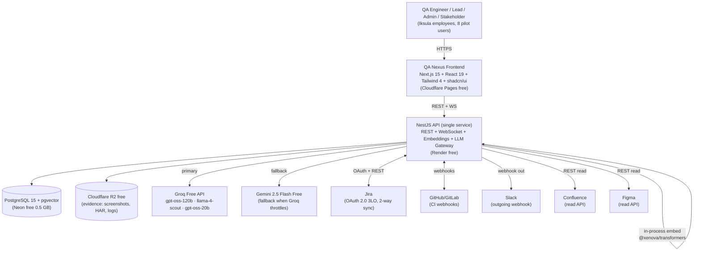

### 3.2 C4 Level 2 — Container Diagram (PM1, locked v2.0)

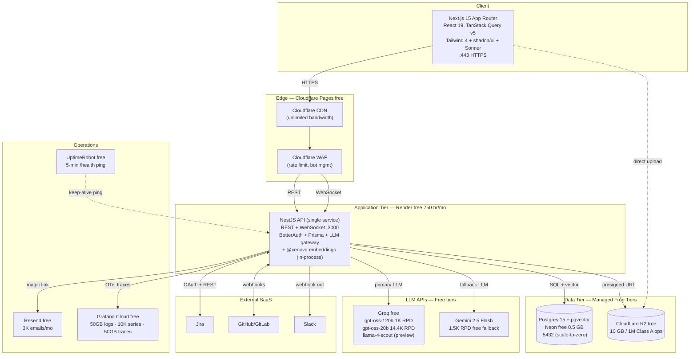

**Critical note on container collapse:** The original v1.0 PM1_ERD had 4 application containers (NestJS Gateway, BetterAuth Service, FastAPI Inference, BullMQ Workers). v2.0 collapses these into **a single NestJS dyno** because:
- BetterAuth is a library, not a service — runs as middleware inside NestJS
- Embeddings via `@xenova/transformers` run in-process (Node.js + WASM)
- LLM calls go to Groq's hosted API — no FastAPI needed
- A1/A4 async runs are inline + WebSocket — no BullMQ workers needed

This reduces 4 containers → 1, which is essential for fitting Render's free tier (1 service).

### 3.3 C4 Level 3 — Component Diagram (NestJS Internals, PM1 v2.0)

Since FastAPI is dropped, the agent orchestration lives inside NestJS. Below is the internal component view.

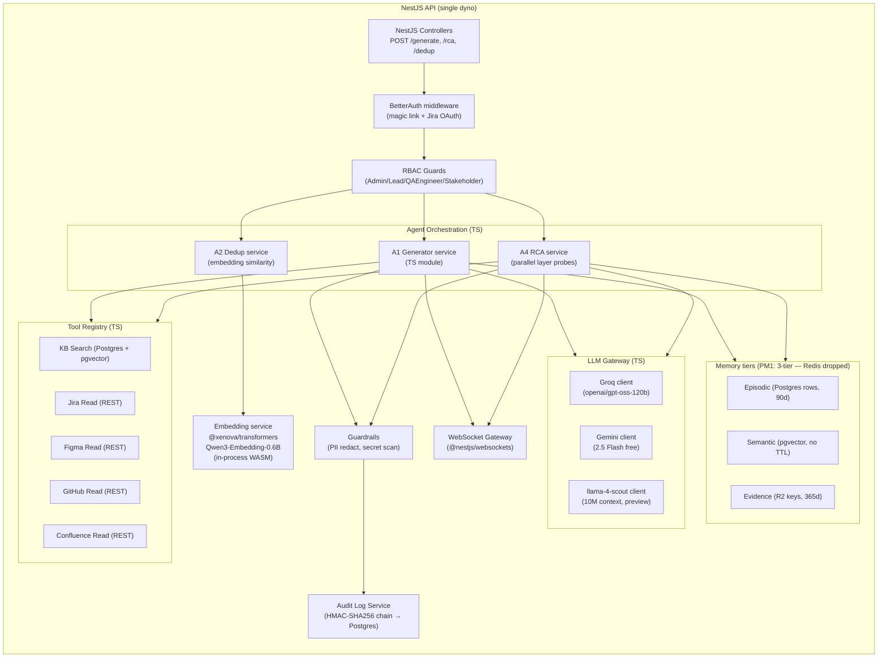

> **Note:** PM3 adds a 5th memory tier (Neo4j Graphiti) and re-introduces a Python service for advanced agents (A6/A7/A8/VCG). PM1 ships only the 3 memory tiers above (Redis tier dropped — sessions in Postgres, no working-memory cache needed at PM1 scale).

### 3.4 Deployment Topology (PM1, locked v2.0 — all free tiers)

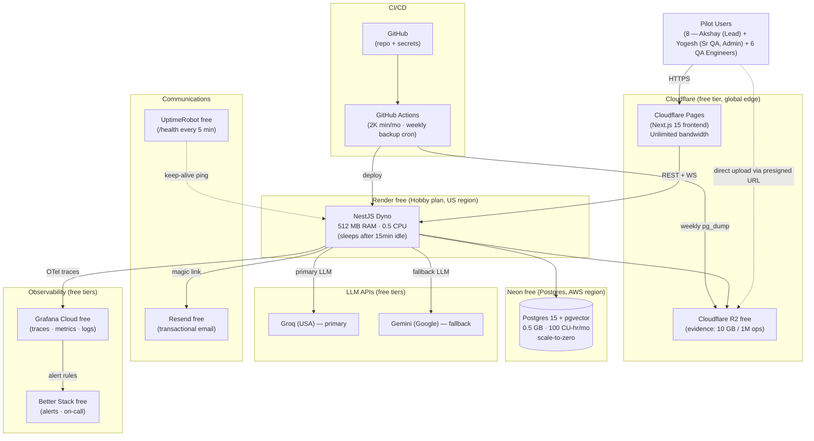

**PM1 SRE targets (revised v2.0):**
- **Pilot scale:** 8 users · ~100 page loads/day · ~150 LLM calls/day · ~250 A2 dedup calls/day · ~5 test runs/day
- **RPO:** 7 days (weekly pg_dump → R2). Acceptable for internal pilot.
- **RTO:** 4 hours (manual restore from R2 backup). Acceptable for pilot — production SLA is PM2 concern.
- **Cold-start mitigation:** UptimeRobot ping every 5 min during 10 AM – 10 PM keeps Render dyno warm. First user each morning may see one ~30 sec cold start; subsequent users hit warm dyno.
- **Geographic latency:** Render free is US-region; Indian pilot users see ~250–350 ms RTT. Acceptable for pilot. PM2 may move to Render Mumbai region (paid) or self-host on Hetzner ap-south.
- **Failure modes documented:**
  - Render sleep → first request takes 30–60 sec cold start (acceptable, mitigated by ping)
  - Neon scale-to-zero → first query after idle takes ~500 ms (acceptable)
  - Groq throttle → Gemini fallback takes over (handled by gateway)
  - Cloudflare incident → no fallback (accept brief downtime; rare)

### 3.5 Sequence — A1 Test Case Generation

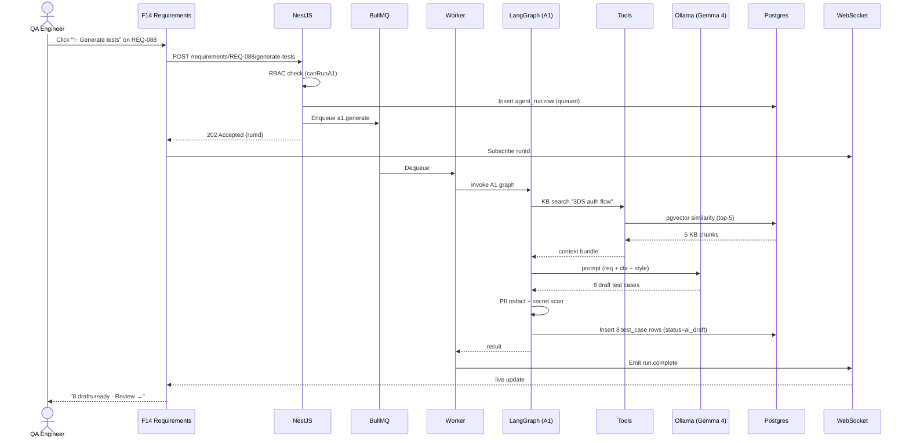

**Latency budget:** A1 p50 = 18s · p95 = 30s · timeout = 45s with single retry.

### 3.6 Sequence — A4 5-Layer RCA on Defect

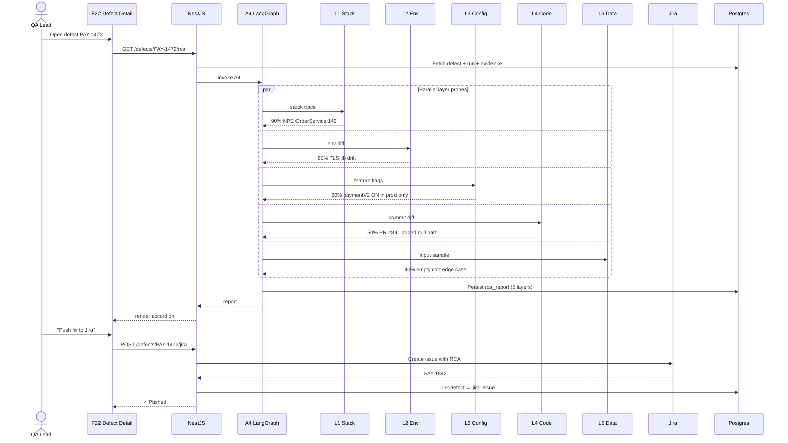

**Confidence ladder (canonical, locked):** Stack 90% → Env 80% → Config 60% → Code 50% → Data 40%.

### 3.7 Sequence — Jira 2-Way Sync

```mermaid
sequenceDiagram
    participant User
    participant API as NestJS
    participant Vault as Vault transit
    participant Jira
    participant Webhook
    participant DB

    rect rgb(20, 40, 60)
    Note over User,DB: Outbound: Defect → Jira
    User->>API: POST /defects/{id}/jira
    API->>DB: Read jira_connection (active)
    API->>Vault: Decrypt access_token
    Vault-->>API: token
    API->>Jira: POST /rest/api/3/issue
    Jira-->>API: 201 {key}
    API->>DB: Insert jira_issue + link
    end

    rect rgb(40, 30, 20)
    Note over Jira,DB: Inbound: Jira → Defect
    Jira->>Webhook: POST /webhooks/jira (HMAC-signed)
    Webhook->>API: forward
    API->>API: Verify HMAC
    API->>DB: Find defect by jira_key
    API->>DB: Update defect.status
    API->>DB: Insert audit_log row
    end
```

> **PM1 Jira auth = OAuth 2.0 3LO only.** API Token / PAT / per-project / custom OAuth deferred to PM3 M17 (FR-063, FR-064 in project PRD).

### 3.8 Sequence — Day-0 Workspace Bootstrap

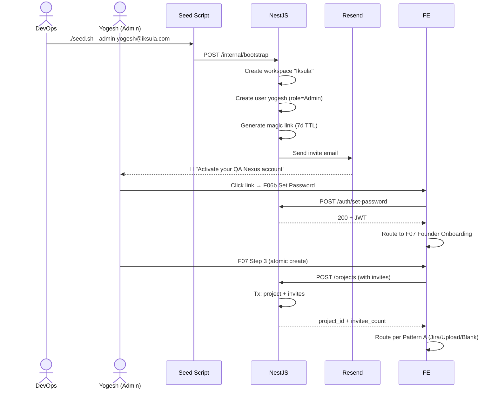

**Pattern A binding:** F07 Step 2 data-source choice is wizard state only; data-source flows fire AFTER Step 3 atomic commit. User can abandon Jira/Upload mid-flow without losing project or invites.

### 3.9 State Machine — Defect

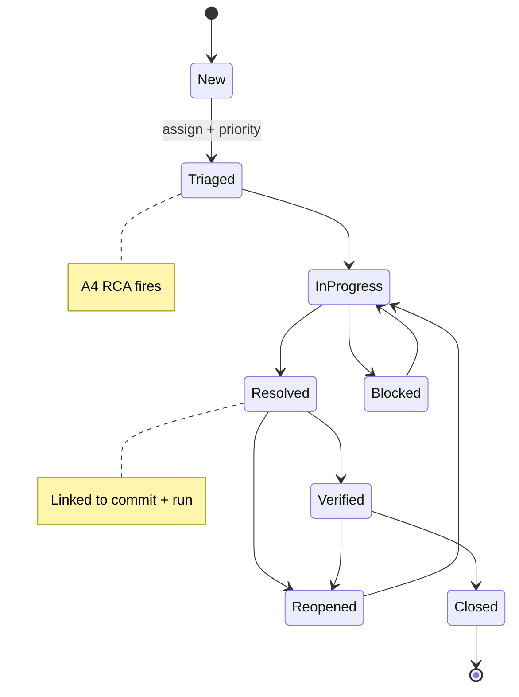

### 3.10 State Machine — Test Run

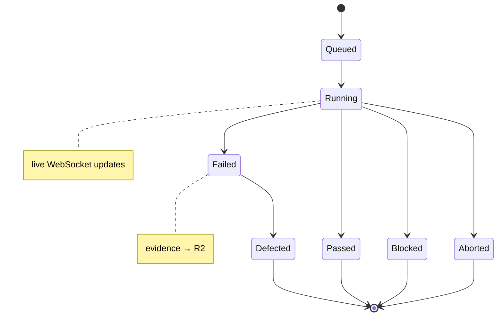

### 3.11 State Machine — Test Case (PM1)

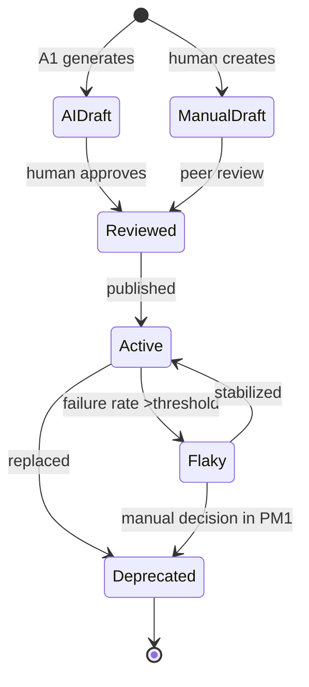

> **PM1 note:** "Flaky → Deprecated" requires manual decision. A7 Self-Healing automation deferred to PM2.

### 3.12 PM1 Agent Orchestration (LangGraph)

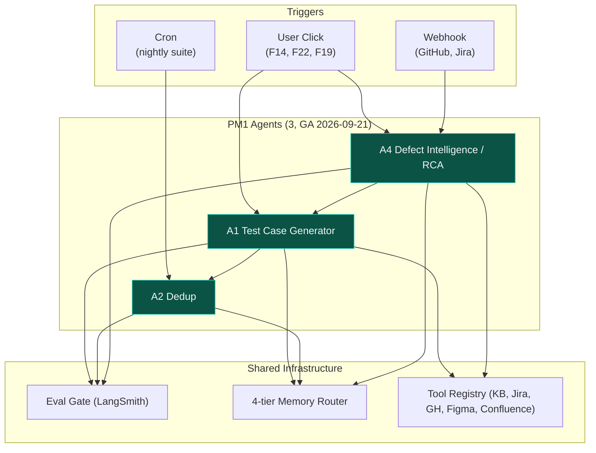

A1 is the central PM1 agent. A4 calls A1 for "what test would have caught this?". A2 runs immediately after every A1 generation and on every manual case save.

### 3.13 PII / Evidence Data Flow (PM1)

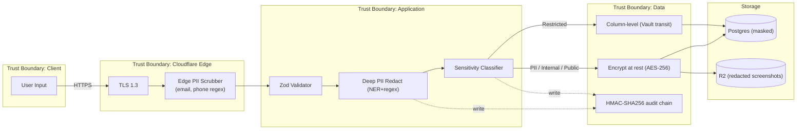

PII passes through 2 redact layers (edge + deep) before persistence. Every redact and classify event is HMAC-signed into audit_log (visible in F28).

---

## 4. PM1 Component Architecture (locked v2.0)

All components live inside the **single NestJS dyno** (Render free). No FastAPI, no separate worker process, no Redis tier.

```mermaid
graph LR
    subgraph Presentation
        FE["CO-001: Next.js 15 Frontend (Cloudflare Pages)"]
    end

    subgraph BackendCore["NestJS dyno (Render free)"]
        Gateway["CO-002: NestJS HTTP + WS Controllers"]
        Auth["CO-003: BetterAuth middleware"]
        RBAC["CO-004: RBAC Guards"]
        WS["CO-005: WebSocket Gateway (@nestjs/websockets)"]

        subgraph Domain["Domain services (TS modules)"]
            Proj["CO-006: Project Service"]
            Case["CO-007: Test Case Service"]
            Run["CO-008: Test Execution Service"]
            Defect["CO-009: Defect Service"]
            Doc["CO-010: Document Service"]
            KB["CO-011: Knowledge Base Service"]
            Report["CO-012: Report Service"]
            Search["CO-013: Search Service"]
        end

        subgraph AI["AI Layer (TS modules in NestJS)"]
            A1m["CO-014: A1 Generator module"]
            A2m["CO-015: A2 Dedup module"]
            A4m["CO-016: A4 RCA module"]
            LLMGW["CO-017: LLM Gateway (Groq → Gemini)"]
            EmbedSvc["CO-018: Embedding Service (@xenova/transformers, in-process)"]
        end

        AuditSvc["CO-A: Audit Log Service (HMAC-SHA256 chain)"]
    end

    FE --> Gateway
    Gateway --> Auth --> RBAC
    RBAC --> Domain
    Gateway --> WS
    Domain --> AI
    A1m --> LLMGW
    A4m --> LLMGW
    A2m --> EmbedSvc
    A1m --> EmbedSvc
    Domain --> AuditSvc
```

**18 components total** (CO-001 through CO-018 + CO-A audit) — down from v1.0's 20 due to FastAPI dyno + BullMQ worker collapse. PM2/PM3/PM4 components (CO-019 through CO-037) remain out of scope here and live in project-level ERD.

**Component reduction explained (v1.0 → v2.0):**
- CO-014 was "FastAPI Inference Service" → now "A1 Generator module" inside NestJS
- CO-015/016/017 (A1/A2/A4 LangGraph nodes) → now TS modules inside NestJS
- CO-018 (Eval Gate LangSmith) → moved out of production path entirely; DeepEval runs only on engineering Colab Free for golden-set runs
- CO-W (BullMQ Worker) → eliminated; async via inline + WebSocket
- New CO-017 (LLM Gateway) and CO-018 (Embedding Service) are TS modules, not separate dynos

---

## 5. PM1 Data Model — Core Entities

The 18 PM1 tables. Indexes, FKs, RLS policies, and migration scripts are detailed in the project ERD §"PM1 Core Tables (TB-001–TB-018)" and copied here for PM1 self-containment.

### TB-001 `workspace`
| Column | Type | Notes |
|---|---|---|
| id | UUID PK | |
| name | text | "Iksula" for the pilot |
| created_at | timestamptz | |
| created_by | UUID → user.id | seed-script user |
| settings | jsonb | retention defaults, branding |

### TB-002 `user`
| Column | Type | Notes |
|---|---|---|
| id | UUID PK | |
| workspace_id | UUID → workspace.id | |
| email | text UNIQUE | |
| display_name | text | |
| role | enum('Admin', 'Lead', 'QAEngineer', 'Stakeholder') | |
| organizational_label | text NULL | "Senior QA", "QA Lead / Manager" |
| password_hash | text | argon2id |
| activated_at | timestamptz NULL | |
| last_login_at | timestamptz NULL | |
| created_at | timestamptz | |

### TB-003 `project`
| Column | Type | Notes |
|---|---|---|
| id | UUID PK | |
| workspace_id | UUID → workspace.id | |
| key | text | e.g. "RET", "COM" |
| name | text | "Iksula Returns" |
| description | text | |
| created_by | UUID → user.id | |
| created_at | timestamptz | |

### TB-004 `project_member`
| Column | Type | Notes |
|---|---|---|
| project_id | UUID → project.id | |
| user_id | UUID → user.id | |
| role_override | enum NULL | per-project role override |
| PRIMARY KEY | (project_id, user_id) | |

### TB-005 `user_invitation`
| Column | Type | Notes |
|---|---|---|
| id | UUID PK | |
| workspace_id | UUID → workspace.id | |
| invited_email | text | |
| role | enum | |
| project_scope_json | jsonb | per-project assignments |
| invited_by | UUID → user.id | |
| token_hash | text | magic link token, hashed |
| expires_at | timestamptz | 7d for invites, 1h for resets |
| status | enum('pending', 'accepted', 'expired', 'revoked') | |
| accepted_at | timestamptz NULL | |

### TB-006 `requirement`
| Column | Type | Notes |
|---|---|---|
| id | UUID PK | |
| project_id | UUID → project.id | |
| key | text | e.g. "REQ-088" |
| title | text | |
| description | text | |
| epic_key | text NULL | parent epic |
| priority | enum('P0', 'P1', 'P2', 'P3') | |
| status | enum('draft', 'active', 'done', 'archived') | |
| sprint | text NULL | "Sprint 42" |
| source | enum('manual', 'jira', 'upload') | |
| source_ref | text NULL | Jira key or upload file id |
| created_by | UUID → user.id | |
| created_at | timestamptz | |
| updated_at | timestamptz | |

### TB-007 `test_case`
| Column | Type | Notes |
|---|---|---|
| id | UUID PK | |
| project_id | UUID → project.id | |
| key | text | e.g. "TC-RET-405" |
| title | text | |
| preconditions | text | |
| steps_json | jsonb | step-by-step |
| expected_result | text | |
| priority | enum('P0', 'P1', 'P2', 'P3') | |
| status | enum('ai_draft', 'manual_draft', 'reviewed', 'active', 'flaky', 'deprecated') | |
| confidence_score | float NULL | A1 confidence at draft time |
| ai_provenance_json | jsonb NULL | which agent + prompt version + KB chunks used |
| embedding | vector(384) | pgvector, BGE-small |
| created_by | UUID → user.id | |
| created_at | timestamptz | |
| updated_at | timestamptz | |

### TB-008 `test_case_link`
| Column | Type | Notes |
|---|---|---|
| test_case_id | UUID → test_case.id | |
| requirement_id | UUID → requirement.id | |
| PRIMARY KEY | (test_case_id, requirement_id) | |

### TB-009 `test_suite`
| Column | Type | Notes |
|---|---|---|
| id | UUID PK | |
| project_id | UUID → project.id | |
| name | text | |
| description | text | |
| owner_id | UUID → user.id | |
| status | enum('healthy', 'warning', 'stale', 'archived') | |
| created_at | timestamptz | |
| updated_at | timestamptz | |

### TB-010 `test_suite_member`
| Column | Type | Notes |
|---|---|---|
| suite_id | UUID → test_suite.id | |
| test_case_id | UUID → test_case.id | |
| display_order | int | |
| PRIMARY KEY | (suite_id, test_case_id) | |

### TB-011 `test_run`
| Column | Type | Notes |
|---|---|---|
| id | UUID PK | |
| project_id | UUID → project.id | |
| suite_id | UUID → test_suite.id NULL | |
| name | text | |
| triggered_by | enum('manual', 'webhook', 'cron') | |
| triggered_by_user | UUID → user.id NULL | |
| status | enum('queued', 'running', 'passed', 'failed', 'blocked', 'aborted') | |
| started_at | timestamptz NULL | |
| completed_at | timestamptz NULL | |
| environment | text | "staging", "prod-shadow" |

### TB-012 `test_run_result`
| Column | Type | Notes |
|---|---|---|
| id | UUID PK | |
| run_id | UUID → test_run.id | |
| test_case_id | UUID → test_case.id | |
| status | enum('passed', 'failed', 'blocked', 'skipped') | |
| duration_ms | int | |
| evidence_uri | text NULL | R2 key for screenshot/HAR/log bundle |
| failure_message | text NULL | |
| stack_trace | text NULL | |

### TB-013 `jira_connection`
| Column | Type | Notes |
|---|---|---|
| id | UUID PK | |
| project_id | UUID → project.id | |
| auth_method | enum('oauth_3lo') | PM1 = OAuth 3LO only; PM3 adds api_token / pat / custom_oauth |
| jira_base_url | text | |
| oauth_access_token_encrypted | text | Vault transit |
| oauth_refresh_token_encrypted | text | |
| oauth_expires_at | timestamptz | |
| status | enum('active', 'expired', 'revoked') | |
| last_sync_at | timestamptz NULL | |

### TB-014 `jira_issue`
| Column | Type | Notes |
|---|---|---|
| id | UUID PK | |
| jira_connection_id | UUID → jira_connection.id | |
| jira_key | text | "PAY-1842" |
| issue_type | text | "Story", "Bug" |
| status | text | mirrors Jira status |
| linked_defect_id | UUID → defect.id NULL | |
| linked_requirement_id | UUID → requirement.id NULL | |
| last_synced_at | timestamptz | |

### TB-015 `defect`
| Column | Type | Notes |
|---|---|---|
| id | UUID PK | |
| project_id | UUID → project.id | |
| key | text | "PAY-1472" |
| title | text | |
| description | text | |
| severity | enum('P0', 'P1', 'P2', 'P3') | |
| status | enum('new', 'triaged', 'in_progress', 'resolved', 'verified', 'closed', 'reopened', 'blocked') | |
| triggered_by_run_id | UUID → test_run.id NULL | |
| triggered_by_test_case_id | UUID → test_case.id NULL | |
| assignee_id | UUID → user.id NULL | |
| jira_issue_id | UUID → jira_issue.id NULL | |
| created_at | timestamptz | |
| resolved_at | timestamptz NULL | |

### TB-016 `rca_report`
| Column | Type | Notes |
|---|---|---|
| id | UUID PK | |
| defect_id | UUID → defect.id | |
| layer1_stack_json | jsonb | stack trace analysis + 90% confidence |
| layer2_env_json | jsonb | env diff + 80% |
| layer3_config_json | jsonb | feature flags + 60% |
| layer4_code_json | jsonb | commit diff + 50% |
| layer5_data_json | jsonb | data sample + 40% |
| top_hypothesis | text | ranked best guess |
| created_by_agent_run_id | UUID → agent_run.id | |
| created_at | timestamptz | |

### TB-017 `kb_document`
| Column | Type | Notes |
|---|---|---|
| id | UUID PK | |
| project_id | UUID → project.id NULL | NULL = workspace-scoped |
| title | text | |
| body_md | text | TipTap markdown |
| template_kind | enum (12 PM1 templates) | "test_plan", "test_strategy", etc. |
| pinned | bool | |
| author_id | UUID → user.id | |
| created_at | timestamptz | |
| updated_at | timestamptz | |

### TB-018 `kb_chunk`
| Column | Type | Notes |
|---|---|---|
| id | UUID PK | |
| document_id | UUID → kb_document.id | |
| chunk_text | text | |
| embedding | vector(384) | BGE-small-en-v1.5 |
| chunk_index | int | order within doc |
| metadata_json | jsonb | section, tags, etc. |

### Auxiliary tables (PM1)

- **`agent_run`** — every A1/A2/A4 invocation (status, latency, eval result, runId)
- **`audit_log`** — HMAC-SHA256 chained immutable rows (visible in F28)

### LLM Provider tables (added v2.1, supports F28m1 + F26m1)

#### TB-019 `llm_provider`
| Column | Type | Notes |
|---|---|---|
| id | UUID PK | |
| workspace_id | UUID → workspace.id | |
| provider_kind | enum('groq', 'gemini', 'openrouter', 'cerebras', 'openai', 'anthropic', 'kimi', 'mistral', 'together', 'fireworks', 'custom_oai') | extensible — new providers added by enum extension |
| display_name | text | e.g. "Groq" or user-overridden label |
| api_key_encrypted | text | Vault transit-encrypted (never logged) |
| endpoint_url | text | default per provider; editable for self-hosted/proxy |
| extra_config_json | jsonb | provider-specific (org_id for OpenAI, region for Vertex, etc.) |
| status | enum('connected', 'error', 'unverified') | |
| last_test_at | timestamptz NULL | |
| last_test_result | jsonb NULL | latency_ms, models_count, error_message |
| created_by | UUID → user.id | |
| created_at | timestamptz | |

#### TB-020 `llm_provider_model`
| Column | Type | Notes |
|---|---|---|
| id | UUID PK | |
| provider_id | UUID → llm_provider.id | |
| model_id | text | e.g. `openai/gpt-oss-120b` |
| display_name | text | e.g. "GPT-OSS 120B" |
| capability_json | jsonb | context_window, tok_per_sec, rpd_limit, tpm_limit, tags (PRODUCTION/PREVIEW/SPEECH), pricing |
| enabled_for_workspace | bool | user toggles in F28m1 |
| fetched_at | timestamptz | last sync from provider's `/v1/models` |
| UNIQUE | (provider_id, model_id) | |

#### TB-021 `agent_model_assignment`
| Column | Type | Notes |
|---|---|---|
| id | UUID PK | |
| workspace_id | UUID → workspace.id | |
| agent_kind | enum('A1', 'A2', 'A4') | A2 only uses embedding, no LLM assignment |
| role | enum('primary', 'long_context', 'fallback', 'fast_layer') | A4 uses 'primary' + 'fast_layer'; A1 uses 'primary' + 'long_context' + 'fallback' |
| model_pk | UUID → llm_provider_model.id | |
| activation_threshold_json | jsonb NULL | e.g. `{"prompt_tokens_gte": 100000}` for long_context routing |
| created_by | UUID → user.id | |
| created_at | timestamptz | |
| UNIQUE | (workspace_id, agent_kind, role) | |

> **RLS:** All three tables scoped by workspace_id. Provider config visible to Admin only; agent assignments visible to Admin + Lead.

---

## 6. PM1 API Contracts

25 endpoints. All REST/JSON, JWT auth, RBAC-checked. Full request/response schemas live in the project ERD §"API Contracts" — listed here by ID and purpose.

### Test Cases (EP-001–EP-005)
- **EP-001** `GET /projects/{id}/test-cases` — list (paginated, filterable)
- **EP-002** `POST /projects/{id}/test-cases` — manual create
- **EP-003** `GET /test-cases/{id}` — detail
- **EP-004** `PATCH /test-cases/{id}` — update
- **EP-005** `DELETE /test-cases/{id}` — soft-delete (deprecate)

### Integrations (EP-006–EP-010)
- **EP-006** `POST /projects/{id}/jira/connect` — OAuth 3LO start
- **EP-007** `GET /projects/{id}/jira/oauth/callback` — OAuth callback
- **EP-008** `POST /webhooks/jira` — inbound webhook (HMAC verify)
- **EP-009** `POST /webhooks/github` — CI signal inbound
- **EP-010** `POST /projects/{id}/slack/webhook` — outbound notification

### Bug Management / RCA (EP-011–EP-015)
- **EP-011** `POST /defects` — create
- **EP-012** `GET /defects/{id}` — detail
- **EP-013** `GET /defects/{id}/rca` — fetch + (re)compute RCA
- **EP-014** `POST /defects/{id}/jira` — push to Jira
- **EP-015** `PATCH /defects/{id}/status` — status change

### Reporting (EP-016–EP-019)
- **EP-016** `GET /projects/{id}/reports/templates` — list 4 PM1 templates
- **EP-017** `POST /projects/{id}/reports/generate` — async report build
- **EP-018** `GET /reports/{id}` — fetch generated report
- **EP-019** `GET /projects/{id}/dashboards/executive` — Prove-mode data (F25)

### Documents (EP-020–EP-025)
- **EP-020** `GET /kb/documents` — list (workspace + project scopes)
- **EP-021** `POST /kb/documents` — create
- **EP-022** `GET /kb/documents/{id}` — detail
- **EP-023** `PATCH /kb/documents/{id}` — update
- **EP-024** `POST /kb/search` — semantic search (pgvector)
- **EP-025** `POST /kb/documents/{id}/pin` — pin for project

### LLM Provider Config (EP-026–EP-029, added v2.1 — supports F28m1 + F26m1)
- **EP-026** `GET/POST /llm-providers` — list connected providers · create new (Admin only). POST body: `{provider_kind, api_key, endpoint_url?, extra_config?}`. POST writes to `audit_log`.
- **EP-027** `POST /llm-providers/{id}/test` — verify the API key against the provider's `/v1/models` endpoint. Returns `{status, latency_ms, models_count, error?}`. Used by F28m1's "Test connection" button.
- **EP-028** `GET /llm-providers/{id}/models` — fetch (and cache to `llm_provider_model`) available models from the provider. Refreshes if `fetched_at` > 24 h. Body: `[{model_id, display_name, capability_json, enabled_for_workspace}]`. Used by F28m1's model checkbox list.
- **EP-029** `GET/PUT /agents/{agent_kind}/model-config` — read/write per-agent model assignments (Admin + Lead). PUT body: `{primary, long_context?, fallback?, fast_layer?}` referencing `llm_provider_model.id`. Validates that referenced models are `enabled_for_workspace=true`. Used by F26m1's three dropdowns.

### WebSocket events (PM1)

- `agent_run.started` `{runId, agent, started_at}`
- `agent_run.complete` `{runId, agent, status, duration_ms, output_count}`
- `agent_run.failed` `{runId, agent, error_class}`
- `test_run.progress` `{runId, completed, total, latest_status}`
- `defect.rca_ready` `{defectId, top_hypothesis, layers}`

---

## 7. PM1 Agents — Engineering Spec

### A1 — Test Case Generator

| Field | Spec (locked v2.0) |
|---|---|
| Trigger | User clicks "✨ Generate tests" on F14 (requirement detail) or F16b (method chooser) |
| Inputs | requirement_id, optional KB hints, user clarification answers |
| Tools | KB Search (pgvector), Jira Read, Figma Read, Confluence Read |
| LLM (primary) | **Groq → `openai/gpt-oss-120b`** (production, 500 tok/s, 131K context, 1,000 RPD free) |
| LLM (long-ctx variant) | **Groq → `meta-llama/llama-4-scout-17b-16e-instruct`** (10M context, preview tier — for full PRD ingestion) |
| LLM (fallback) | **Gemini 2.5 Flash free** (1,500 RPD) when Groq returns 429/503 |
| Latency budget | p50 5s · p95 10s · timeout 30s with 1 retry (much faster than v1.0's 30s — Groq's LPU is 300+ tok/s) |
| Cost target | **$0/run** (Groq free tier) |
| Confidence model | Auto-approve at ≥80% confidence; show review chip 60–79%; require manual review <60% |
| Output | 5–15 test_case rows with status='ai_draft', confidence_score, ai_provenance_json |
| Eval gate | **DeepEval** (MIT, pytest-native) golden set: ≥80% test cases match expected structure (preconditions, steps, expected). Runs on engineering Colab Free, never blocks production traffic. |
| Acceptance criteria (PM1 GA) | ≥10 cases generated from a 3-page PRD in <10s · ≥80% auto-approved (confidence ≥80%) · zero PII leaks in output |

### A2 — Duplicate Detection

| Field | Spec (locked v2.0) |
|---|---|
| Trigger | On every test_case insert/update (sync hook + async backfill) |
| Inputs | new test case (title, steps, expected) |
| LLM | None (embedding-only) |
| Embedding model | **Qwen3-Embedding-0.6B** (Apache 2.0, 1024-dim, MTEB Code 80.68) — upgraded from BGE-small in v2.0 |
| Embedding runtime | **`@xenova/transformers` (ONNX Runtime, in-process WASM in NestJS)** |
| Latency budget | p50 50–80ms · p95 200ms (CPU-only, in-process — no network round-trip) |
| Confidence model | similarity = embedding_cosine × 0.5 + title_overlap × 0.3 + step_sequence_align × 0.2 |
| Thresholds | ≥90% red chip (likely duplicate) · 70–89% amber chip (similar) · <70% no chip |
| Output | duplicate_candidates with similarity scores |
| Acceptance criteria (PM1 GA) | latency <500ms · ≥60% true-duplicate detection · <5% false-positive rate |

### A4 — Defect Intelligence (5-Layer RCA)

| Field | Spec (locked v2.0) |
|---|---|
| Trigger | Defect created from failed run (auto) or "Run RCA" button on F22 (manual) |
| Inputs | defect, linked test_run, evidence (stack trace, HAR, screenshots), recent commits, env config, feature flags |
| Tools | GitHub Read (commits/diffs), Jira Read (linked issues), KB Search (similar defects via pgvector) |
| Layers | L1 Stack (90%) · L2 Env (80%) · L3 Config (60%) · L4 Code (50%) · L5 Data (40%) — confidence is canonical, locked |
| Execution | All 5 layers run in parallel via `Promise.all` in NestJS service |
| LLM (primary) | **Groq → `openai/gpt-oss-120b`** for full-context layers (L2, L3, L4) |
| LLM (fast layers) | **Groq → `openai/gpt-oss-20b`** for L1 stack-trace parsing (1,000 tok/s) |
| LLM (fallback) | **Gemini 2.5 Flash free** when Groq throttles |
| Latency budget | p50 8s · p95 15s · timeout 25s (much faster than v1.0's 30s — parallel layers + Groq speed) |
| Output | rca_report with 5 layer JSONs + top_hypothesis |
| Eval gate | **DeepEval** golden set of 50 historical defects with known root causes; A4 must rank correct cause in top-2 ≥70% of the time. Runs on engineering Colab Free. |
| Acceptance criteria (PM1 GA) | RCA latency <15s · top-2 accuracy ≥70% on golden set · zero false high-confidence hallucinations on holdout |

### Shared agent infrastructure (locked v2.0)

- **Eval Gate** — DeepEval (MIT) golden-set runs on engineering Colab Free (offline, weekly). No production-time eval gate at PM1 to keep latency low. Production runs are tracked via OTel + Grafana for drift detection.
- **Memory Router** — 3 tiers in PM1 (Episodic in Postgres / Semantic in pgvector / Evidence in R2). Working-memory tier (Redis) dropped because Groq's API is stateless per-call. PM3 adds Graphiti as 4th tier.
- **Guardrails** — PII redact (regex + lightweight NER via `@xenova/transformers`) + secret scanner (regex patterns for AWS keys, Stripe tokens, etc.) — runs on every input and output; violations write to audit_log
- **Tool Registry** — uniform TypeScript interface for KB Search, Jira Read, GitHub Read, Figma Read, Confluence Read — implemented as NestJS injectable services with rate-limit-aware retries

---

## 8. PM1 Infrastructure (locked v2.0 — all free tiers)

### 8.1 Postgres + pgvector (Neon free)

```sql
-- PM1 schema bootstrap (M0 milestone)
-- Run in Neon SQL editor or via Prisma migrate
CREATE EXTENSION IF NOT EXISTS pgvector;
-- Note: pgvectorscale NOT supported on Neon free; we use vanilla pgvector HNSW
-- TB-001 through TB-018 created via Prisma migrations
-- RLS policies on workspace_id and project_id
CREATE INDEX ON test_case USING hnsw (embedding vector_cosine_ops);
CREATE INDEX ON kb_chunk USING hnsw (embedding vector_cosine_ops);
-- Sessions stored in DB (BetterAuth Postgres adapter) — no Redis tier
```

**Neon free tier specs:**
- 0.5 GB storage / 100 CU-hours per month
- Scale-to-zero auto-suspend (~500 ms cold start on first query after idle)
- 1-day point-in-time recovery (free tier)
- Migration to Neon Launch tier ($19/mo for 3 GB) when storage outgrows

### 8.2 ~~Redis 7 (Upstash)~~ — DROPPED in v2.0

The Redis tier is eliminated for PM1. Replacements:
- **Sessions:** BetterAuth Postgres adapter (sessions in DB)
- **Rate limit:** in-memory token bucket per dyno (acceptable for single-dyno PM1; Postgres-backed if needed)
- **Job queues:** dropped (no BullMQ); A1/A4 run inline async with WebSocket completion event
- **Cache:** in-process LRU (`lru-cache` npm) for project/KB/user lookups; 1–5 min TTL
- **Pub/sub:** NestJS `EventEmitter2` for in-process events; WebSocket gateway for client push

If PM2 demands durable retry semantics, Valkey (BSD-3-Clause OSS Redis fork) added then. Not before.

### 8.3 Cloudflare R2 (free tier)

- Bucket: `qa-nexus-evidence-pm1`
- Path: `{workspace_id}/{project_id}/runs/{run_id}/{evidence_type}/{filename}`
- Free tier: 10 GB storage / 1M Class A ops / 10M Class B ops — plenty for pilot
- **Direct browser → R2 upload via presigned URLs** (no large files through 512 MB API dyno)
- Lifecycle: 365 d retention for PM1 (configurable per workspace in F28)
- Presigned URL validity: 5 min for upload, 15 min for download

### 8.4 LLM via Groq Free + Gemini Free fallback

**Primary chain:**
- A1 Test Generator → `openai/gpt-oss-120b` (1,000 RPD free)
- A1 long-ctx variant → `meta-llama/llama-4-scout-17b-16e-instruct` (10M context, preview)
- A4 RCA → `openai/gpt-oss-120b`
- A4 fast layers → `openai/gpt-oss-20b` (14,400 RPD free)

**Failover:** Gemini 2.5 Flash free tier (1,500 RPD) when Groq returns 429 or 503

**Gateway:** Hand-rolled in NestJS or `freellm` package (MIT). Retryable-error detection (429, 503, network) triggers fallback; auth/4xx errors do not.

**API keys:** Stored in Render env vars (encrypted at rest); loaded via `process.env`; never logged.

### 8.5 Embeddings (in-process via @xenova/transformers)

- **Model:** Qwen3-Embedding-0.6B (Apache 2.0, 1024-dim, MTEB Code 80.68)
- **Runtime:** ONNX Runtime via `@xenova/transformers` (Apache 2.0)
- **Footprint:** ~200 MB RAM, ~50 ms per embedding on Render's 0.5 vCPU
- **No separate service** — runs as a TypeScript module inside NestJS
- **Migration path:** if quality demands more, swap to Qwen3-Embedding-4B in same `@xenova` runtime (still free, just larger)

### 8.6 Observability (Grafana Cloud free)

- **OpenTelemetry SDK** in NestJS — traces + metrics + logs to Grafana Cloud (free tier: 50 GB logs / 10K series / 50 GB traces per month)
- **Better Stack free tier** for alerting + on-call (Slack integration)
- **UptimeRobot free tier** — pings `/health` every 5 min, keeps Render dyno warm during business hours, sends Slack alert if dyno is unreachable
- **Grafana dashboards:** SLO error budget, agent run rate, A1/A4 latency p95, free-tier quota usage (Groq RPD, Neon CU-hr, Render bandwidth)

### 8.7 Security

- TLS 1.3 only (Cloudflare-terminated, auto)
- JWT 15-min access + 7d refresh (BetterAuth)
- Argon2id password hashing
- API keys (Groq, Gemini, Resend, Jira) in Render env vars (encrypted at rest)
- HMAC-SHA256 audit chain (F28) — every state-changing op writes one chained row
- DPIA conducted at PM1 GA
- OpenBao (MPL 2.0 fork of HashiCorp Vault) added in PM2+ for proper secrets rotation

### 8.8 Hosting summary (locked v2.0 — all free)

| Layer | Provider | Free tier spec | Migration target if outgrown |
|---|---|---|---|
| Frontend | Cloudflare Pages | Unlimited bandwidth · 500 builds/mo | Already at scale ceiling unlikely to hit at PM1 |
| API + WebSocket | Render free (Hobby) | 750 hr/mo · 512 MB RAM · 0.5 CPU · sleeps 15min idle | Render Starter $7/mo (no sleep) |
| Postgres + pgvector | Neon free | 0.5 GB · 100 CU-hr/mo · scale-to-zero | Neon Launch $19/mo (3 GB) |
| Object storage | Cloudflare R2 free | 10 GB · 1M Class A · 10M Class B ops | $0.015/GB beyond — cheapest in industry |
| Email transactional | Resend free | 100/day · 3,000/month | Resend Pro $20/mo (50K/mo) |
| Keep-alive | UptimeRobot free | 50 monitors · 5-min interval | $0 sufficient |
| Observability | Grafana Cloud free | 50 GB logs · 10K series · 50 GB traces | Grafana Cloud Pro $19/mo |
| Source / CI/CD | GitHub + Actions | 2,000 min/mo private repos | Free for public repos forever |
| Backup automation | GitHub Actions cron → R2 | Within Actions budget | Same |
| LLM inference | Groq free + Gemini free | 1K-14.4K RPD per Groq model · 1.5K RPD Gemini | Groq Dev tier (CC required, 10× limits) → self-host Llama 4 Scout on RunPod A100 (~$106/mo) |

**Estimated PM1 monthly burn: $0** (entirely free tiers). When the pilot succeeds and the paid stakeholder commits funding, the cheapest paid stack is **~$30–60/month** (Render Starter + Neon Launch + UptimeRobot Pro).

**This replaces the v1.0 estimate of $1,500–2,500/mo all-in.** Saving: 100% for the pilot duration.

---

## 9. PM1 Milestones (M0 → M6)

Detailed week-by-week plans live in `../../Milestone/M0`–`M6/Milestone_Mxx_*.md`. Summary:

| Milestone | Weeks | GA Date | Headline Scope |
|---|---|---|---|
| **M0 — Setup & Infrastructure** | W1–W3 | 2026-05-18 | Repo bootstrap, CI/CD, Postgres + pgvector + Redis + R2 provisioned, BetterAuth, OTel + SigNoz, seed script, F06/F06b/F06c rendered |
| **M1 — Users & Roles** | W4–W5 | 2026-06-01 | RBAC (4 roles), F07 founder onboarding, F07b/c/d invited first-run, F08a/b/c Home, F09/F10 projects, F27/F27m1 Users & Roles + Invite |
| **M2 — Test Documents & KB** | W6–W7 | 2026-06-15 | Doc Catalog (12 templates), F12 upload, F13 imports, F15 KB with pgvector search, KB pinning |
| **M3 — Test Cases & A1 Generation** | W8–W11 | 2026-07-13 | F14 Requirements, F14m1/m2/m3 modals, F16a method chooser, F16b A1 Generate, F16c bulk import, F17 Library, **A1 + A2 agents shipped + eval gate** |
| **M4 — Runs, Defects & Jira** | W12–W14 | 2026-08-03 | F18/F18m1 Suites, F19 Run Console (live), F20 Run Results, F21 Defects Hub, F22 Defect Detail, **A4 5-Layer RCA shipped**, Jira 2-way sync (OAuth 3LO) |
| **M5 — Automation + Reports + MVP Launch** | W15–W17 | 2026-08-31 | F23 Reports Studio, F24 QA Value, F25 Executive Dashboard (Prove mode), F26 Agents, F28 Settings & Audit, internal pilot launch on Iksula Returns |
| **M6 — Full Reports & v1 GA** | W18 | **2026-09-21** | Polish, hardening, eval gate at ≥80% on all 3 agents, GA cut to second pilot project |

---

## 10. PM1 Acceptance Gates (binding, locked v2.0)

PM1 cannot ship to GA unless ALL of the following pass:

1. **41 of 41 UI frames** render at locked design tokens with no MD3 drift, no tertiary colors, no missing project switcher (already done — see PM1_UI_v2 inventory; v2.10 closure includes F28m1 + F26m1 for Day-0 LLM config).
2. **A1 eval** ≥80% golden-set match on test case structure (DeepEval).
3. **A2 eval** <5% false-positive duplicate rate, ≥60% true-duplicate detection.
4. **A4 eval** top-2 root-cause accuracy ≥70% on 50-defect golden set (DeepEval).
5. **NFR-001 page load** p50 <1.5s, p95 <3s on cold cache.
6. **NFR-002 API latency** p50 <200ms, p95 <500ms (excluding LLM calls).
7. **NFR-003 agent latency** **A1 <10s, A2 <500ms, A4 <15s at p95** (revised from v1.0 — Groq is much faster than self-hosted Gemma).
8. **NFR-014 RBAC** all 4 roles correctly gated on every endpoint (positive + negative tests).
9. **HMAC audit chain** verifies on F28 with chain integrity ≥99.95%.
10. **Pilot acceptance** 6 of 8 pilot users complete the "create requirement → generate tests → run → triage defect → push to Jira" flow without engineer intervention.
11. **Cost gate** monthly infrastructure spend = **$0** for the pilot duration (else trigger paid-tier review).
12. **Free-tier headroom check** — at PM1 GA, document remaining headroom on each free tier (Groq RPD, Neon CU-hr, Render bandwidth, Cloudflare R2 storage). If any is <50%, plan PM2 paid migration.

---

## 11. Decisions LOCKED in v2.0 (no longer open)

| ID | Decision | Locked value |
|---|---|---|
| Q-PM1-01 | Frontend hosting | **Cloudflare Pages free** |
| Q-PM1-02 | API hosting | **Render free Hobby** + UptimeRobot keep-alive |
| Q-PM1-03 | Postgres host | **Neon free** (0.5 GB, scale-to-zero) |
| Q-PM1-04 | Vector store | **Postgres + pgvector** (no pgvectorscale; not on Neon free) |
| Q-PM1-05 | Cache / Queue | **None** (sessions in Postgres, in-memory LRU, WebSocket pub/sub) |
| Q-PM1-06 | Object storage | **Cloudflare R2 free** with direct-upload presigned URLs |
| Q-PM1-07 | Email | **Resend free** 100/day · 3K/month |
| Q-PM1-08 | LLM primary | **Groq free** → `openai/gpt-oss-120b` |
| Q-PM1-09 | LLM long-context variant | **Groq free** → `meta-llama/llama-4-scout-17b-16e-instruct` |
| Q-PM1-10 | LLM fast layers | **Groq free** → `openai/gpt-oss-20b` |
| Q-PM1-11 | LLM fallback | **Gemini 2.5 Flash free** |
| Q-PM1-12 | Embedding model | **Qwen3-Embedding-0.6B** via `@xenova/transformers` (in-process) |
| Q-PM1-13 | Eval framework | **DeepEval** (MIT) on engineering Colab Free, never user-facing |
| Q-PM1-14 | Frontend stack | **Next.js 15 + React 19 + Tailwind 4 + shadcn/ui + Sonner** |
| Q-PM1-15 | Backend stack | **NestJS 10 single service** + Prisma 5 + BetterAuth + Zod |
| Q-PM1-16 | FastAPI service | **Dropped** for PM1 (revisit in PM2 if Python-specific needs emerge) |
| Q-PM1-17 | Observability | **Grafana Cloud free** + Better Stack free for alerting |
| Q-PM1-18 | CI/CD | **GitHub Actions** free 2,000 min/month |
| Q-PM1-19 | Backup | **Weekly pg_dump → R2** via GitHub Actions cron |
| Q-PM1-20 | Pilot user count | **8** — Akshay Panchal (QA Lead), Yogesh Mohite (Sr QA + Admin), Kishor Kadam, Nitin Gomle, Nadim Siddiqui, Govind Daware, Mohanraj K., Sagar Todankar (6 QA Engineers) |

## 11.5 Decisions still pending (small set)

| ID | Question | Owner | Deadline |
|---|---|---|---|
| Q-PM1-21 | Custom domain or use *.cloudflare-pages.dev for pilot | Eng Lead | M0 W3 |
| Q-PM1-22 | DR drill cadence — quarterly during pilot | Eng Lead | M5 |

---

## 12. Glossary (PM1-relevant only)

- **A1 / A2 / A4** — the three PM1 AI agents (Test Generator, Dedup, RCA)
- **C4** — Simon Brown's architecture diagram framework (L1=Context, L2=Container, L3=Component, L4=Code)
- **HMAC-SHA256 chain** — append-only log where each row's hash includes the previous row's hash; tampering detectable
- **Pattern A (deferred routing)** — F07 Step 2 data-source choice is wizard state only; routing fires AFTER Step 3 atomic commit
- **PM1** — Phase 1 of the QA Nexus program (= MVP = v1 GA, 18 weeks, 2026-04-27 → 2026-09-21)
- **Prove mode** — F25 Executive Dashboard variant with ivory canvas (#FAFAF8) and locked metrics for board / customer demos
- **RBAC** — role-based access control (4 roles in PM1: Admin, Lead, QA Engineer, Stakeholder)
- **RLS** — Postgres row-level security
- **5-Layer RCA** — A4's signature output: Stack (90%) → Env (80%) → Config (60%) → Code (50%) → Data (40%)

---

**End of QA Nexus PM1_ERD v1.0 — phase-scoped engineering specification.** Cross-reference with `PM1_PRD.md` for product scope and `../../ERD/ERD.md` for the full PM1–PM4 program ERD.
