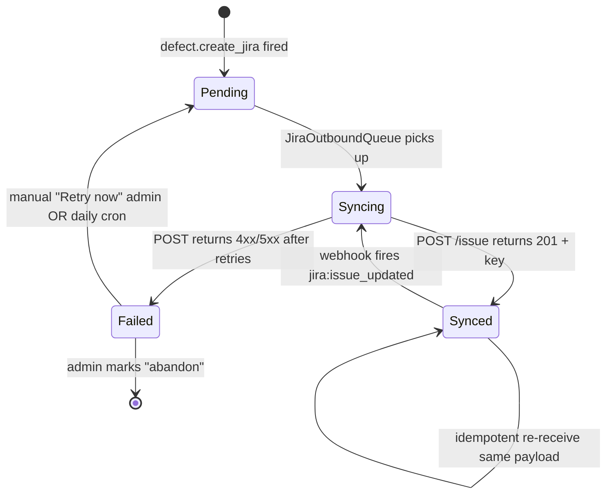

# ADR-020: Jira sync architecture — webhook-first + REST backfill, single-puller idempotency, QNT seed corpus

- **Status:** Draft (Day-21 PM 2026-05-18 — to be ratified Day-22 AM before BE+1 starts MS5-T0xx Jira wire-up Wed Day-23)
- **Date:** 2026-05-18
- **Deciders:** Yogesh Mohite (Admin), BE+1 (implementer), MAIN (planner)
- **Related:** PM1_ERD §3.7 (Jira 2-way sync sequence) · PM1_ERD §TB-013 `jira_connection` · PM1_ERD §TB-014 `jira_issue` · PM1_ERD §TB-015 `defect` · PR #162 (Jira webhook receiver, Day-19 P2) · PR #157 (jira-sync module scaffold, Day-19) · PR #146 (M4 v2 plan §6, Jira ingestion notes) · ADR-015 (runtime LLM config bridge — config-token pattern reused here) · ADR-018 (Resend HTTPS migration — same outbound-HTTPS-only constraint applies)
- **Supersedes:** none
- **Superseded by:** none

---

## Context

M4 shipped the webhook receiver half of 2-way Jira sync (PR #162 + scaffold #157). The inbound HMAC-verified payload path is live; the outbound `defect → Jira` create path is wired in `DefectsController` but not exercised end-to-end. M5 needs the full sync working against real Jira data so the pilot's three AI agents (Composer, Curator, Sherlock) can reason over actual ticket context, not stubs.

Six coupled decisions need locking before BE+1 starts MS5 Jira wire-up Wednesday Day-23:

1. **Ingestion topology** — webhook receiver alone is insufficient: it only fires on live events. We need a **REST backfill puller** to seed history (74 QNT tickets, then daily reconciliation pulls).
2. **QNT seed data flow** — the 74 fictional Iksula Returns tickets in `ybmohite.atlassian.net` (Yogesh's personal Atlassian Cloud free-tier instance, set up Day-18 per kickoff §6) need a one-time bulk ingest. This is the M5 demo dataset; later pilot users connect their own instances.
3. **Atlassian rate-limit budget** — Atlassian Cloud free tier caps REST requests at **~350/hour** per token (per Day-18 research note; Atlassian docs don't publish the exact value, this is the empirically-observed soft limit). Budget allocation per caller class.
4. **Composer / Curator / Sherlock data access patterns** — the agents read `jira_issue` rows, NOT the Jira REST API directly. This isolates LLM call cost from network rate-limit cost and lets Sherlock's `Promise.all` fan-out run without contending for the 350/hr budget.
5. **Sync state machine** — every defect ↔ Jira issue link has a sync state. We need explicit states for `pending` (queued for outbound create) / `syncing` (REST call in flight) / `synced` (mirrored) / `failed` (last attempt errored) so the retry pipeline + audit log are coherent.
6. **Idempotency** — both webhook events and REST puller results MUST be idempotent on replay (Atlassian retries failed webhook deliveries up to 5×; REST puller reconciliation runs daily). The `jira_issue.id` (UUID) + `jira_key` (text) + `jira_connection_id` natural-composite is the idempotency key.

Binding constraints:

- **Hard Rule 1 ($0/month)** — Atlassian Cloud free tier only. No paid webhooks, no Connect app marketplace ($25/mo). REST API basic auth via OAuth 2.0 3LO token (per ERD §TB-013 `auth_method = 'oauth_3lo'` enum-locked).
- **Stack lock §6 of kickoff doc** — NO BullMQ / Redis / ioredis. Retry queue uses `@nestjs/schedule` cron pattern (single-instance, in-memory + DB-persisted state).
- **Render Free dyno scale-to-zero** — outbound REST calls must tolerate cold-start (≤30s warm-up); cron jobs that run during the dyno-asleep window are skipped, not retried-forever.
- **CLAUDE.md Hard Rule 7** — every state-changing op writes to the HMAC-SHA256 chained `audit_log`. Jira sync events count.
- **PM1_ERD §TB-013 + §TB-014 schemas locked** — column shapes do not change in this ADR; we only specify the orchestration around them.

## Decision

### 1. Ingestion topology — webhook-first + REST backfill (NOT REST-poll-first)

```
Atlassian Cloud (ybmohite.atlassian.net)
        │
        ├── webhook PUSH (real-time, primary path) ──────────► /webhooks/jira ──► JiraSyncService ──► jira_issue upsert
        │                                                       (HMAC verify)
        │
        └── REST PULL (cron-backfill, secondary path) ◄─── @nestjs/schedule cron ◄── JiraBackfillService
                                                              (daily 03:00 IST)        (≤350 req/hr budget)
```

**Decision:** Webhook is the **primary** path. REST puller exists for:

- **One-time bulk seed** of QNT 74 tickets at workspace bootstrap (run once per `jira_connection`)
- **Daily reconciliation cron** to catch webhook deliveries that failed all 5 Atlassian retries (rare but possible — e.g., Render dyno was cold all night)
- **Manual "Resync now" admin action** from F28 Settings (future, not M5 scope)

**Why webhook-first:** real-time updates beat batched polling for UX. Composer / Curator / Sherlock all benefit from "user just commented on PAY-1842 30s ago" being visible without a polling lag. REST polling alone would require either tight polling (burns the 350/hr budget on no-op pulls) or loose polling (stale data the agents won't trust).

**Why REST puller still required:** webhook delivery isn't guaranteed. Atlassian retries up to 5× with backoff, but if our Render dyno is cold-start-sleeping for the full retry window (rare on UptimeRobot keep-alive but possible mid-deploy), events are lost. Reconciliation pull catches the gap.

### 2. QNT seed data flow

`ybmohite.atlassian.net` is the **PM1 development + demo Jira instance** — Yogesh's personal Atlassian Cloud free-tier account, set up Day-18, populated with **74 fictional Iksula Returns tickets** matching the Iksula data canon (RET-001 through RET-074, severities P0-P3, statuses spanning the 8-state defect machine per ERD §3.9). This is NOT the pilot data; pilot users connect their own Jira instances via OAuth 3LO. QNT serves as:

- **M5 close-gate demo corpus** — Composer / Curator / Sherlock all run against this seeded data during the M5 acceptance demo
- **Integration test fixture** — `apps/api/src/jira-sync/__tests__/` Cassettes recorded once against QNT, replayed offline thereafter (avoids burning Atlassian rate limit in CI)
- **Documentation reference** — every Jira sync example in PM1 onboarding docs uses RET-### keys

**Bootstrap flow:**

```
Day-23 (manual, MAIN runs once):
  1. Yogesh runs F07 Step 2 wizard, picks "Connect Jira", OAuth 3LO consents to ybmohite.atlassian.net
  2. F07 Step 3 atomic commit creates project "Iksula Returns" (key RET) + jira_connection row
  3. JiraSyncService.bootstrapBackfill(jira_connection_id) fires (Day-23 task; ASYNC, returns immediately)
  4. JiraBackfillService walks GET /rest/api/3/search?jql=project=RET&maxResults=50 with pagination
  5. For each page: Zod-validate, upsert jira_issue rows, emit `jira_issue.synced` audit row
  6. Emit `defect.bulk_imported` WebSocket event when done (F08b badge clears)
  Expected duration: ~5-8 min for 74 tickets (2 paginated pages, ~20 req each = 40 REST calls)
```

**Rate budget:** 40 calls / 1 hour = 11% of the 350/hr budget. Daily reconciliation cron later uses another ~10-20 calls. Combined steady-state is <20%.

### 3. Atlassian 350/hr rate-limit budget allocation

| Caller class                         | Steady-state allocation         | Burst tolerance        | Rationale                                                          |
| ------------------------------------ | ------------------------------- | ---------------------- | ------------------------------------------------------------------ |
| Webhook receiver                     | **0 req/hr** (receive only)     | n/a                    | Atlassian pushes; we never call back during webhook handling       |
| Bootstrap backfill                   | up to 100 req in 10 min, then 0 | one-time only          | 74 tickets × pagination = ~40 calls; budget headroom for 2 retries |
| Daily reconciliation cron            | ~20 req/hr at 03:00 IST         | n/a                    | Walk last-24-hour `updated >= -1d` query; small payload            |
| Outbound defect create (POST /issue) | up to 10 req/hr                 | 50 req/hr burst        | F22 "Create Jira" affordance; expected <10 fires/day in pilot      |
| Outbound defect comment sync         | up to 30 req/hr                 | 100 req/hr burst       | If pilot users heavily comment; rate-limit-aware queue             |
| Manual "Resync now" admin            | 50 req/hr max                   | full project re-pull   | Rare; admin-gated F28 action; rate-limited at controller           |
| **Total**                            | **≤210 req/hr (60%)**           | **≤350 req/hr (100%)** | Reserves 40% headroom for unforeseen growth                        |

**Enforcement:** wrap all outbound `axios` calls to Atlassian in a `JiraRateLimiter` interceptor that uses a token-bucket against `jira_connection.id`. On 429, exponential-backoff 1m → 2m → 4m → fail; on fail, surface to F28 Settings status badge + emit `jira.rate_limited` WebSocket event.

### 4. Composer / Curator / Sherlock data access patterns

**Binding rule:** the three AI agents NEVER call the Jira REST API directly. They read `jira_issue` rows via `JiraIssueService.findLinked(defect_id)`.

| Agent                                       | Jira data needed                                                                                                                | Access pattern                                                                                   |
| ------------------------------------------- | ------------------------------------------------------------------------------------------------------------------------------- | ------------------------------------------------------------------------------------------------ |
| **Composer** (A1 Scribe — test case author) | When generating tests from a requirement: linked Jira stories' titles + descriptions + acceptance criteria (custom field)       | `jira_issue.findByRequirement(req_id)`; field `customfield_10010` mapped to AC text at sync time |
| **Curator** (A3 — defect dedup)             | When deduping defects: existing `jira_issue.status` + `jira_issue.last_synced_at` to know if the dupe is still open             | `jira_issue.findByDefect(defect_id)` LEFT JOIN — no Jira fetch                                   |
| **Sherlock** (A4 — RCA)                     | When analyzing failures: linked tickets' titles + last-3 comments for context (`agent.code` + `agent.data` agents specifically) | `jira_issue.findByDefect(defect_id)` + `jira_comment` rows (TB-014b, M5 add)                     |

**Why this isolation matters:**

- **LLM call cost** is decoupled from **REST API rate limit** — Sherlock's `Promise.all` over 4 agents could otherwise burn 200 Atlassian calls during AC042 eval. With this rule: zero.
- **Offline development** — engineering can run Composer / Curator / Sherlock against `jira_issue` rows snapshotted from QNT without any live Atlassian dependency.
- **Audit chain integrity** — agent reads are NOT state-changing, so they don't write audit rows. Jira sync events DO write audit rows. Clean separation.

**Schema add for M5 (NOT in this ADR's scope but flagged):** `jira_comment` table (TB-014b) — `jira_issue_id` FK + `comment_id` PK + `author` + `body` + `created_at` + `synced_at`. Optional. Sherlock can degrade gracefully if absent.

### 5. Sync state machine — explicit on every defect ↔ jira_issue link



**State storage:** add `sync_state` enum column to `jira_issue` (M5 schema migration — `pending` / `syncing` / `synced` / `failed` / `abandoned`). Default `pending` for outbound rows; `synced` for inbound rows (which never enter `pending`).

**Transition audit:** every state change writes an `audit_log` row with `entity_type = 'jira_issue'` + `action = 'sync_state_change'` + before/after states in the JSON payload. Chains into the HMAC-SHA256 audit chain per Hard Rule 7.

### 6. Idempotency strategy — composite natural key

**Inbound (webhook):**

- Idempotency key = `(jira_connection_id, jira_issue.id)` — Atlassian's `issue.id` is permanent + globally unique within an instance
- On duplicate delivery: UPSERT `jira_issue` (Prisma `upsert` with `where: { jira_connection_id_jira_id: { ... } }` unique compound), then short-circuit if `payload.timestamp <= jira_issue.last_synced_at_ms` (older event arrived late, ignore)
- Audit row written ONLY on actual state change (no audit spam from idempotent re-receives)

**Outbound (defect → Jira create):**

- Idempotency key = `defect.id` — guaranteed unique within QA Nexus
- Before POST: check `jira_issue.linked_defect_id = defect.id` exists with `sync_state IN ('syncing', 'synced')`; if yes, return the existing `jira_key` (no duplicate Jira issue created)
- After POST 201: insert `jira_issue` row with the returned `jira_key` + `sync_state = 'synced'` in the same transaction as `defect.jira_issue_id` link update

**Backfill puller:**

- Same inbound idempotency — UPSERT on `(jira_connection_id, jira_id)` composite; the puller's REST results carry the same identity as a webhook event would

**Required DB constraint:**

```sql
CREATE UNIQUE INDEX jira_issue_natural_key
  ON jira_issue (jira_connection_id, jira_id);
```

(`jira_id` is Atlassian's `issue.id`, distinct from our `jira_issue.id` UUID PK; schema migration adds the `jira_id` column to TB-014 in M5.)

## Consequences

- **Predictable rate budget** — total Atlassian usage capped at 60% of the 350/hr free-tier limit under steady state. Headroom absorbs unforeseen growth without a paid-tier upgrade (Hard Rule 1).
- **Agents work offline** — Composer / Curator / Sherlock are functionally testable against a `jira_issue`-snapshot fixture with zero Atlassian dependency. CI runs are free + fast.
- **Audit chain stays clean** — sync state transitions are auditable; idempotent re-receives don't generate audit noise.
- **One-time QNT bootstrap** — Day-23 manual run; thereafter, daily reconciliation cron + webhook receiver maintain consistency without engineer intervention.
- **Webhook is primary, REST is fallback** — most events propagate in real-time; only cold-dyno-window events need reconciliation.
- **Outbound queue is in-memory + DB-persisted** — `@nestjs/schedule` cron picks up `sync_state = 'pending'` rows every 5 min (Hard Rule 5: no Redis / BullMQ). Failed rows accumulate visibly in F28 Settings.

## Alternatives considered

- **REST-poll-first (no webhook)** — rejected. Burns rate budget; UX feels stale; the webhook receiver is already shipped (#162) so there's no implementation savings.
- **Atlassian Connect app + Forge** — rejected. Connect requires paid marketplace listing for production ($25/mo Hard Rule 1 violation). Forge is free-tier but locks us into Atlassian's Node runtime (Hard Rule 5 stack-lock violation — we're Node 20 native on Render, not Forge's vendored Node).
- **Direct LLM-agent → Jira REST calls** — rejected. Each agent fan-out (4 Sherlock agents × `Promise.all`) would multiply REST traffic 4× during AC042 eval, blowing the 350/hr budget. The `jira_issue` snapshot pattern decouples LLM throughput from network rate-limit.
- **BullMQ for the outbound retry queue** — rejected (Hard Rule 5 ban-list). `@nestjs/schedule` cron over `sync_state = 'pending'` rows in Postgres achieves the same semantic at zero infrastructure cost.
- **Two separate ADRs (one per direction)** — rejected. Inbound + outbound share the same `jira_issue` table, same idempotency strategy, same rate-limit budget. Splitting would force cross-ADR coordination overhead for marginal clarity gain.
- **Real-time bidirectional CRDT sync** — rejected. Atlassian doesn't expose CRDT primitives; the operational complexity (last-write-wins conflict resolution + per-field merge) far exceeds the pilot's needs. Pilot uses last-write-wins on whole-row sync with `last_synced_at` ordering.

## Open questions (for Day-22 ratification meeting)

1. **`jira_comment` table in M5 schema migration — yes/no?** Sherlock's `agent.code` benefits but degrades gracefully without it. BE+1 decides based on M5 timeline pressure.
2. **F28 "Resync now" admin action — M5 or M6?** Out of M5 acceptance scope but a 1-day add. Yogesh decides priority vs other M5 hardening items.
3. **Webhook receiver rate-limiting** — currently unlimited. Should we cap inbound bursts (>50 events/min from a misconfigured Jira automation)? Probably yes for M5 hardening, but blast-radius is low (HMAC-verify + upsert is idempotent).
4. **OAuth 3LO token refresh** — TB-013 has `oauth_expires_at`. M5 needs the refresh flow wired; out of this ADR's scope but a known follow-up.
5. **QNT seed corpus growth** — 74 tickets is M5 demo scope. Should we double to 150 for stress-testing the agents' top-2 hit rate at scale? Yogesh decides.

---

**Ratification gate:** Yogesh + BE+1 review Day-22 AM. If green, BE+1 starts MS5 Jira wire-up Wed Day-23 against this design. If a sub-decision needs revisiting, this ADR amends in-place (single ADR, multiple drafts) rather than spawning ADR-021.
